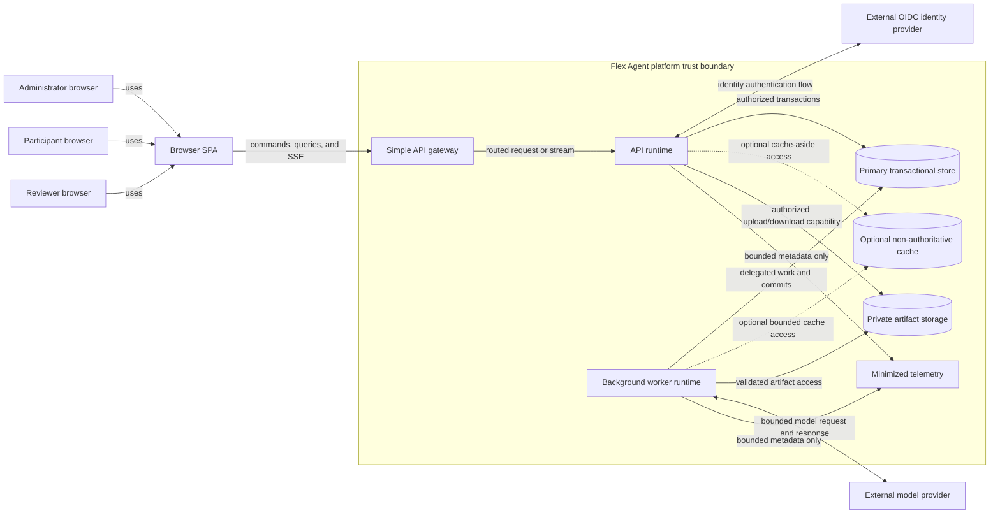

# MVP architecture

Approved technical realization baseline for the P0 assessment vertical slice.

## Document metadata

| Field | Value |
| --- | --- |
| **Status** | Approved |
| **Owner** | Architecture Lead |
| **Approvers** | Product Lead, Architecture Lead, Security/Privacy reviewer |
| **Consulted perspectives** | Business analysis, architecture, security/privacy, UI/UX, documentation |
| **Version** | 0.10 |
| **Last reviewed** | 2026-09-01 |
| **Governs** | MVP system boundaries, logical ownership, runtime flows, consistency boundaries, trust boundaries, deployment shape, recovery baseline, and architecture verification |

This document is **Approved** architecture authority. It does
not override product documents or feature specifications. Requirements govern
observable behavior. This document and the focused runtime contracts own the
live architecture and code-contract constraints. Prior versions are
recoverable from Git and are not the current architecture catalog. [MVP operational
defaults](../requirements/mvp-operational-defaults.md) govern intake,
authentication-session, lifecycle, and recovery defaults. Evaluation and
Review/Release realization live in their contracts; Session publication,
Invocation/Decision, next-timer, and the P0 output envelope live in the
[text Session runtime contract](session-runtime-contract.md). OSS component
and provider-profile defaults live in [operations](../operations/README.md).
Compatibility evidence and remaining delivery artifacts retain their stated
owners. The model-provider architecture is model-neutral; deployment-managed
profiles and Organization BYOK are supported without making a model part of
the product identity, while Organization model endpoints remain a separately
gated extension seam rather than an MVP requirement. Optional LGTM is
development-only, operator-pulled, and does not block MVP or production
architecture. Application stack facts (.NET 10/ASP.NET Core, React/Vite,
Npgsql/Dapper, Grate) are current architecture constraints here; workspace
and toolchain verification live in
[Workspace development](../contributing/workspace.md).

## Purpose and audience

This document gives architecture, backend, frontend, security, and testing
contributors one coherent technical frame for the MVP workflow:

> Configure assessment → assign Participant → upload Submission → conduct text
> examination → produce evidence-backed Evaluation → perform human review →
> release Result.

It defines the minimum useful architecture before implementation. It requires
an OSS-first self-hostable reference architecture and the selected
infrastructure families recorded as current [operations](../operations/README.md)
constraints.
This document does not itself select a programming language or web framework;
application-stack facts are listed below. Component-family or stack selection
does not certify a production deployment, a self-hosted model artifact, or
remove the evidence gates in this document and remaining operations or
verification owners.

## Governing sources

### Product and behavior

- [Concept model](../product/concept-model.md), especially configuration
  precedence, assessment fairness, the outcome chain, the resolved execution
  manifest, and product invariants.
- [MVP scope](../product/mvp-scope.md), especially the executable vertical slice
  and explicit non-goals.
- The seven approved P0 specifications:
  [authorization and isolation](../requirements/features/auth-resource-isolation.md),
  [resolved session configuration](../requirements/features/resolved-session-configuration.md),
  [assessment setup](../requirements/features/assessment-setup.md),
  [Submission and Attempts](../requirements/features/submission-attempts.md),
  [text Session lifecycle](../requirements/features/session-text-lifecycle.md),
  [Evidence and Evaluation](../requirements/features/evidence-evaluation.md), and
  [human review and Result Release](../requirements/features/review-result-release.md).

### Current constraint owners (architecture and code-contract)

| Constraint | Current owner |
| --- | --- |
| Separate immutable resolved configuration from append-only runtime manifest; canonicalization, digest, and terminal-seal procedures | [Session runtime contract](session-runtime-contract.md) |
| One in-process authorization kernel, enforcement adapters, trusted scope derivation, commit-time reauthorization, bounded service delegation | This document and [backend module architecture](backend-module-architecture.md) |
| Authoritative append-only audit in the primary transactional store; couple required audit to protected mutations | [Backend module architecture](backend-module-architecture.md) |
| Atomically create and bind the immutable cohort activation baseline, activate the Cohort, and accept required audit | This document |
| Atomically consume Attempt entitlement, bind exact Submission versions, freeze configuration, create the manifest and Session, and accept required audit | [Session runtime contract](session-runtime-contract.md) |
| MVP architecture baseline, SPA/API/gateway topology, OIDC direction, recovery targets, optional caching, deferred Kubernetes seam | This document |
| OSS-first, self-hostable, open-standard reference deployment with portable OCI runtimes and no mandatory cloud service | This document; operator pointers in [operations](../operations/README.md) |
| Bounded infrastructure and model-provider defaults, Compose profiles, evidence gates | [Operations](../operations/README.md) and verification |
| Session / Evaluation / Review-Release contract split; optional-broker and notification boundaries | The three `*-contract.md` files |
| .NET/React stack, JCS/RFC 8785, Npgsql/Dapper, Grate, workspace, verification gates | Stack facts in this document; workspace/toolchain in [workspace development](../contributing/workspace.md) |
| Durable-before-display participant-visible incremental Agent-response streaming, replay, cutoff, backpressure | [Session runtime contract](session-runtime-contract.md) |
| Trusted invocation, structured Decision, no-action, provenance; does not approve voice, tools, or configurable stages | [Session runtime contract](session-runtime-contract.md) |
| Agent next-timer replacement bounds; runtime owns schedule | [Session runtime contract](session-runtime-contract.md) |
| Decision envelope, P0 message-only compatibility, historical v1 reconstructable | [Session runtime contract](session-runtime-contract.md) |
| Worker timer-lane delegation and reauthorization | This document and Session runtime contract |
| Worker workload identity and bounded Invocation delegation | This document and Session runtime contract |
| Assessment source descriptors, activation coordinator, fail-closed sources | This document and backend module architecture |
| Enrollment request-limit vs PostgreSQL admission | [Backend module architecture](backend-module-architecture.md) |
| SPA Query, RHF/Zod, no Zustand/Tailwind/Axios; server remains authorization authority | [Frontend architecture](frontend-architecture.md) |
| Dual-build `web-legacy` topology | Historical only — do not restore |
| Single production SPA in `web/`, isolated design lab, no `web-legacy/` runtime | [Frontend architecture](frontend-architecture.md) |

## Scope

### In scope

- Campaign-form assessment administration with Cohorts and isolated Sessions.
- Selection of existing Agent and Harness revisions; no general library authoring.
- Stable memory with approved-memory reads disabled or pinned to one immutable
  snapshot at Cohort activation.
- Participant Enrollment, accommodations, Attempt control, direct text and
  approved attachment intake.
- Text-only Session execution with authoritative ordering, timing, reconnect,
  pause, termination, completion, and failure recovery.
- Evidence-backed Evaluation using frozen deterministic, Agent-assisted, or
  Agent-judgment modes.
- Human revision, Review decision, Result, explicit Release, correction lineage,
  and participant visibility.
- Authorization, activity/Participant/Session isolation, audit, lifecycle-policy
  hooks, observability, and reconstruction across the slice.

### Deferred

- Voice, participant-session tools, Dynamic memory, cross-participant learning,
  shared Sessions, advanced workflow authoring, Agent/Harness management,
  external assignment notifications, built-in appeals, bulk or scheduled
  Release, calibration analytics, and non-campaign activity forms.
- Multi-region active-active operation, independent microservices, distributed
  transactions, a remote authorization service, and a separately administered
  audit store unless later evidence justifies them.

## Confirmed architecture constraints

The following are not new proposals; they follow from approved sources:

1. Every protected record and operation has a trusted Organization and complete
   resource-ownership chain. Client-supplied scope is input, never authority.
2. Lower configuration scopes may narrow but cannot widen upper-scope policy or
   delegated capability.
3. Each Session uses an immutable resolved session configuration and an
   append-only resolved execution manifest with stable, independently verifiable
   identities.
4. Cohort activation and Attempt/Session start use atomic consistency
   boundaries: activation binds an immutable cohort baseline with required
   audit; Attempt start consumes entitlement, binds exact Submission versions,
   freezes configuration, creates the manifest and Session, and accepts
   required audit.
5. Audit-relevant and outcome history is append-only or equivalently protected;
   corrections create linked records rather than replacing history.
6. Submission bytes and other large protected content remain in their owning
   protected store. Domain records, manifests, Evidence, and audit use stable
   protected references and integrity metadata instead of unnecessary copies.
7. Evaluation, Human revision, Review decision, Result, and Release remain
   distinct records with explicit lineage and authorization.
8. Model output, participant content, and external-provider responses are
   untrusted data. They cannot authorize, select scope, change the rubric,
   replace deterministic facts, enable tools or learning, or release a Result.
9. Persisted times use UTC with an unambiguous authoritative order. Client clocks
   do not decide deadlines, message order, Attempt consumption, or Release.
10. Missing identity, policy, ownership, lifecycle, integrity, or required-audit
    data fails closed.
11. Worker timer-lane work uses bounded service delegation with commit-time
    reauthorization. Worker live Invocation uses portable workload identity
    and a bounded per-Session execution envelope. Host enablement remains
    default-off until operations qualification says otherwise.
12. The production SPA lives in `web/`. The design lab is isolated and never
    authorizes product routes or permissions. Dual-build `web-legacy` topology
    is not a current architecture.

## Approved MVP realization decisions

`AR-DEC-1`–`AR-DEC-27` are approved for MVP realization.

| ID | Decision | Rationale |
| --- | --- | --- |
| `AR-DEC-1` | Use a modular monolith for domain behavior, deployed as a stateless web/API runtime and a separately scalable worker runtime from the same versioned codebase. | Preserves strong in-process policy and transaction boundaries without premature service/network failure modes. |
| `AR-DEC-2` | Use one primary relational transactional store for authoritative metadata, state machines, immutable records, audit/outbox records, idempotency, ordering, and uniqueness. | Mutation-coupled audit, activation atomicity, and atomic Attempt start require strong shared consistency; relational constraints make those invariants explicit and testable. |
| `AR-DEC-3` | Use a transactional outbox plus a durable claimable work table for MVP background work; do not require an external broker initially. | Evaluation and notifications need durable asynchronous execution, but current scale does not justify another authoritative or operational boundary. |
| `AR-DEC-4` | Use request/response commands plus Server-Sent Events (SSE) for reconnectable text Session and status updates, with bounded polling as a deployment fallback. The authoritative state always remains queryable after reconnect. | Separates command acceptance from event delivery and prevents a transient connection from becoming workflow authority. |
| `AR-DEC-5` | Store attachment bytes in private Organization-scoped object storage behind quarantine, validation, integrity, and authorized-delivery adapters. | Keeps large untrusted content outside transactional rows while preserving exact immutable version bindings. |
| `AR-DEC-6` | Integrate one or more external OpenID Connect (OIDC) identity providers through a provider-neutral adapter. Use server-validated identity and an API-server-managed application session; do not store custom passwords or bind domain authorization directly to provider roles. | Provides a maintainable, extensible authentication boundary while keeping Organization and resource authorization application-owned. |
| `AR-DEC-7` | Put model access behind a provider-neutral adapter invoked only by delegated workers with bounded inputs, timeouts, retry budgets, cancellation handling, and manifest provenance. | Contains provider change and failure while preserving exact configured deployment identity and sensitive-data minimization. |
| `AR-DEC-8` | Run allowlisted deterministic evaluators in a restricted worker boundary with no participant code execution and no network egress by default. | Prevents participant content from turning internal evaluation into an implicit tool or code-execution capability. |
| `AR-DEC-9` | Start with one deployment region and one authoritative write primary; scale stateless runtimes horizontally and partition work fairly by Organization and Activity. | Matches MVP needs and avoids unresolved cross-region consistency, residency, and failover semantics. |
| `AR-DEC-10` | Resolve one approved, versioned lifecycle policy for each protected record class; Organization policy sets bounds and Activity policy may only narrow. | Implements the approved fail-closed lifecycle contract without hard-coding unapproved retention durations. |
| `AR-DEC-11` | Commit Release, exact Result binding, participant-visibility state, and required audit/outbox acceptance in one primary-store transaction; notifications remain asynchronous. | Prevents pre-release disclosure, contradictory visibility, and audit/Release divergence. |
| `AR-DEC-12` | Deliver a browser SPA backed by the stateless API server. The SPA owns presentation and transient UI state only; all protected workflow authority remains server-side. | Supports a responsive client without trusting browser state for authorization, timing, ordering, acceptance, Evaluation, or Release. |
| `AR-DEC-13` | Expose the SPA/API through one simple API gateway responsible for TLS, routing, coarse limits, correlation, security headers, and SSE-compatible connection handling. Keep domain authorization and workflow logic in the API server. | Establishes one controlled public ingress without moving product authority into infrastructure configuration. |
| `AR-DEC-14` | Make caching optional and non-authoritative. Redis may be selected later when measurements justify it; MVP correctness and sensitive commits must not depend on cache presence. | Preserves a safe optimization path without introducing premature consistency or isolation risks. |
| `AR-DEC-15` | Apply the approved single-region, multi-zone recovery and resilience baseline defined below, including redundant stateless runtimes, relational database failover, tested backups, and explicit RPO/RTO targets. | Makes recovery expectations measurable and avoids relying only on product or provider claims. |
| `AR-DEC-16` | Defer Kubernetes and isolated Agent execution. Keep workers container-ready, stateless, durable-work-driven, and free of Kubernetes concepts so a later scheduler adapter can run the same bounded work in Kubernetes Jobs or stronger sandboxes. | Preserves an evolution path for repository cloning, code execution, long processing, specialized resources, and Agent isolation without adding unused MVP infrastructure. |
| `AR-DEC-17` | Make the reference deployment OSS-first, self-hostable, and based on open contracts. The complete MVP must run without a mandatory cloud account or proprietary managed service; managed equivalents remain optional adapters. | Makes local, automated, and on-premises operation a first-class path while avoiding provider lock-in. |
| `AR-DEC-18` | Package application runtimes as portable OCI images with external machine-readable configuration, non-interactive bootstrap, health checks, migrations, synthetic test data, documented backup/restore, and component/license inventory. | Makes deployments reproducible for operators, CI, and coding Agents without embedding infrastructure state in the application. |
| `AR-DEC-19` | Apply the approved Submission limits, quarantine/cleanup, inert-link, and authorized-download defaults in the [MVP operational defaults](../requirements/mvp-operational-defaults.md#submission-intake-defaults). | Resolves intake resource and fail-closed behavior without selecting a scanner or parser product. |
| `AR-DEC-20` | Apply the approved OIDC flow, application-session, revocation, and MFA defaults in the [MVP operational defaults](../requirements/mvp-operational-defaults.md#oidc-and-application-session-defaults). | Resolves the authentication-session security posture while retaining a provider-neutral identity boundary. |
| `AR-DEC-21` | Apply the approved record-class lifecycle matrix and same-jurisdiction secondary recovery placement in the [MVP operational defaults](../requirements/mvp-operational-defaults.md#protected-data-lifecycle-defaults). | Replaces unspecified retention and recovery placement with explicit, testable defaults that deployments may only narrow through approved policy. |
| `AR-DEC-22` | Stream Agent responses incrementally to Participants through the durable-before-display fragment, first-fragment publication claim, replay, cutoff, and backpressure contract in the [Session runtime contract](session-runtime-contract.md). | Makes streaming an MVP and future foundation without trusting provider transport, SSE, the browser, or an external broker for transcript authority. |
| `AR-DEC-23` | Use the provider-neutral Agent Invocation → Agent Decision envelope → independent validation → authoritative domain-effect/no-domain-effect boundary from the Session runtime contract, as specialized by its P0 Decision envelope. Persist admitted minimized Invocations, keep trigger provenance trusted, represent no-action explicitly, link rather than nest Invocation identity into the Turn/publication hierarchy, and preserve durable-before-display streaming for every visible delta. | Supports non-message decision opportunities and future voice/tools/workflows without making model output authoritative or expanding P0 scope. |
| `AR-DEC-24` | When frozen Session policy enables it, use one primary-store-owned Agent timer lane with a default active-time cadence. Permit one optional next-timer recommendation on a successful Decision; independently validate it and replace the lane's next schedule revision under the next-timer replacement contract. | Adapts the next check without parallel timers, provider-native scheduling authority, or uncontrolled self-waking. |
| `AR-DEC-25` | Realize a successful Agent Decision as the P0 Decision envelope with a P0 compatibility profile: at most one Participant message output, no voice or extra audiences/actions except the optional next-timer request, runtime-owned output identity, and immutable historical v1 reconstruction. | Prepares coordinated later channels without changing text-only P0 or rewriting frozen contracts. |
| `AR-DEC-26` | Keep effective timing and Accommodation state in Participation and Submission. Assessment Configuration supplies a verified frozen baseline snapshot and exact frozen Organization-policy reference/values; Configuration supplies the exact current applicable Organization-policy version through narrow read and transaction-aware ports; Participation and Submission normalizes the accommodation contract, resolves the approved lifecycle policy, and applies one eligible replacement value per dimension. | Preserves one owner per durable state, Assessment source authority, current-policy narrowing, baseline immutability, and commit-time validation without cross-module SQL or making Assessment own downstream accommodation semantics. |
| `AR-DEC-27` | Preserve the existing strict `/v1/assessment` Enrollment and **My work** projections unchanged. Add parallel strict `/v2/assessment` Enrollment and **My work** routes whose canonical v2 projections separate baseline timing, effective timing, authoritative evaluation time, eligibility state, and minimized accommodation consequence. Serve both versions while the SPA migrates; v1 retirement requires a later explicit contraction. | Prevents `additionalProperties: false` and semantic compatibility breaks, supports mixed-version deployment, and keeps URL/API version aligned with response schema meaning. |

## System context and trust boundaries



Textual meaning:

- Browsers, client clocks, identifiers, content, and workflow claims are
  untrusted. The API runtime derives identity and scope from validated
  server-side state before every protected operation.
- The SPA owns presentation and transient interaction state only. It does not
  determine authorization, Session timing/order, acceptance, Evaluation, or
  Release.
- The gateway provides public ingress controls and SSE-compatible routing. It
  does not own domain authorization or workflow rules.
- The OIDC provider authenticates; it does not own Flex Agent permissions,
  Activity relationships, reviewer assignments, or Release visibility. Internal
  identity binds to stable issuer and subject, not mutable email alone.
- The model provider is an external sensitive-data disclosure boundary. Only
  the minimum authorized frozen context is sent; responses return as untrusted
  candidate content.
- Object storage possession never authorizes access. The application validates
  the complete parent chain before issuing a short-lived artifact capability.
- Workers authenticate as service identities and load durable, bounded
  delegations before protected reads or writes.
- A cache, when introduced, accelerates reads or bounded coordination but never
  authorizes a sensitive commit or replaces authoritative state.
- Telemetry contains stable correlation references and bounded categories, not
  credentials or raw Submissions, transcripts, prompts, Evidence, evaluations,
  reviewer notes, or Results.

## Container and deployment view

`AR-DEC-1`, `AR-DEC-12`, and `AR-DEC-13` use one client and two runtime roles
without creating multiple domain authorities:

| Runtime or store | Responsibilities | Must not become authoritative for |
| --- | --- | --- |
| Browser SPA | Responsive presentation, accessible interaction, transient form/composer state, command/query/SSE consumption | Authorization, Organization/resource scope, timers, ordering, acceptance, Evaluation, Release, or reconciliation truth |
| Simple API gateway | TLS, routing, coarse request/connection/rate limits, correlation, security headers, and SSE-compatible timeouts | Product permissions, workflow state, tenant trust, business validation, or protected-data filtering |
| API runtime | OIDC callback/application-session handling, command admission, authorization, scoped queries, upload/download orchestration, Session SSE, reconciliation endpoints | Client-provided ownership, cached read models, provider callbacks, or event delivery |
| Worker runtime | Model generation, evaluation, deterministic evaluator execution, validation/scanning orchestration, notification delivery, audit/read projection, lifecycle jobs, reconciliation | Human credentials, unbounded delegations, client payload scope, or external provider state |
| Primary transactional store | Authoritative state machines, relationships, immutable metadata, ordering, idempotency, atomic boundaries, audit/outbox, durable work claims | Large artifact bytes, secrets, or external-provider availability |
| Private artifact storage | Quarantined and accepted immutable Submission payloads and other policy-permitted protected artifacts | Authorization decisions, mutable aliases, lifecycle state, or evidence meaning |
| Optional cache | Cache-aside reads, bounded rate counters, shared application-session state when required, and short-lived coordination after explicit selection | Sensitive commit authorization, workflow authority, idempotency outcomes, ordering, Release visibility, or audit history |
| OIDC identity provider | Human authentication and upstream identity lifecycle | Organization scope, role capability, resource ownership, or workflow permission |
| Model provider | Bounded generation for Session and Evaluation work | Authorization, deterministic truth, rubric changes, lifecycle, or Result Release |

The web and worker runtimes should use the same versioned domain modules and
contracts. Deployment may scale them independently, but extracting a module to
an independent service requires evidence and an update to this architecture covering consistency,
authorization, versioning, failure, and migration.

### API gateway boundary

The gateway is the single public application ingress. It must preserve streaming
semantics, correlation, safe request-size limits, and the API's non-disclosing
error behavior. It may reject obviously invalid or abusive traffic, but every
protected API operation still authenticates and authorizes inside the API
runtime. Infrastructure headers, network location, and gateway routing are not
Organization or resource authorization evidence.

### OIDC and application-session boundary

The API uses OIDC Authorization Code flow and validates issuer, audience, state,
nonce, signature, time, and redirect binding according to the selected provider
contract. The API maps stable `(issuer, subject)` identity to an internal actor
and maintains the browser application session using secure server-validated
state. Provider roles or groups may be mapped only through explicit governed
configuration; they never become direct domain authorization.

The approved session uses Authorization Code flow with PKCE and server-side code
exchange, an opaque `HttpOnly`, `Secure`, `SameSite=Lax` application-session
cookie, a 30-minute idle limit, a 12-hour absolute limit, identifier rotation,
and bounded revocation. Administrator and Reviewer access requires MFA. The
complete requirements are in
[MVP operational defaults](../requirements/mvp-operational-defaults.md#oidc-and-application-session-defaults).
The provider product, invitation flow, and account-recovery experience remain
deployment and UI/UX decisions. They must preserve authorization-kernel enforcement and must not require
a custom password store.

Application user administration remains inside the IdentityAccess business
boundary. The external OIDC provider owns credentials, MFA enrollment and
authentication, and upstream account lifecycle. IdentityAccess owns internal
actors, exact provider-identity bindings, enabled state, Organization context,
capability grants, service delegations, application sessions, and trusted
lifecycle propagation. Resource-owning modules retain authority for their
resource relationships and workflow state—for example Activity/Cohort,
Enrollment, reviewer assignment, and Session ownership—and expose versioned
trusted inputs through owned ports to the authorization kernel. Provider roles
and groups never directly grant Flex Agent access.
A later invitation, membership, actor-administration, or provider-provisioning
journey must receive approved product and UI/UX requirements and may use a
Keycloak administration adapter; it does not justify a second module with
overlapping identity or authorization authority. See `STACK-DEC-26` and
`STACK-DEC-27` in [workspace toolchain gates](../contributing/workspace.md).

### Optional caching boundary

The MVP must operate correctly without Redis or another shared cache. If later
measurements justify caching, use cache-aside behavior with Organization and
resource scope in keys and relevant policy/relationship versions in sensitive
authorization accelerators. Ordinary cache failure falls back to the primary
store where safe. A security control that cannot safely fall back must fail
closed or use an explicitly approved durable alternative.

Raw Submissions, transcripts, Evidence, Evaluations, reviewer notes, Results,
credentials, and secrets are not cached by default. Cache introduction requires
load evidence, isolation tests, failure-mode tests, expiry/invalidation design,
and an architecture update naming the selected uses.

## OSS-first and on-premises portability

Under `AR-DEC-17`, `AR-DEC-18`, and
[OSS-first self-hostable deployment](mvp-architecture.md), the reference
deployment is the self-hosted path, not a cloud-provider-specific topology.

- The full MVP must run without a public cloud account or mandatory proprietary
  managed service. Cloud services may implement the same adapters when chosen
  by an operator.
- Application runtimes use pinned OCI images and do not keep authoritative state
  only on local container or node filesystems.
- OIDC, HTTP/SSE, relational semantics, S3-compatible artifact operations, OCI,
  and OpenTelemetry-compatible export form the initial portable integration
  contracts. Compatibility must still be verified against each certified
  implementation.
- Provider SDKs and resource identities stay behind adapters and never define
  domain authorization, durable workflow meaning, or portable exports.
- Configuration, migrations, health, synthetic seed data, backup/restore, and
  diagnostics must be machine-readable and non-interactive so people, CI, and
  coding Agents can reproduce the environment.
- The distribution must publish pinned component versions, license information,
  an SBOM, an upgrade path, and a bounded compatibility matrix.
- Local/test, on-premises production, and optional cloud profiles use the same
  application images and product contracts. Kubernetes is not required.

OSS-first is a selection preference, not permission to implement custom
identity, database, object-storage, cryptography, scheduler, or observability
infrastructure. Component health, license compatibility, security response,
data portability, and operational simplicity remain selection gates.

## Resilience and recovery baseline

The production MVP uses one region and one authoritative write primary, with
multi-zone resilience inside that region.

### Runtime resilience

- Run at least two stateless API instances and two worker instances across
  separate failure zones where the selected platform supports them.
- Use readiness/liveness checks, graceful shutdown, bounded request draining,
  automatic replacement, positive timeouts, jittered bounded retries, and
  Organization/Activity-aware backpressure.
- Do not require sticky application state on one API instance. Shared session
  state, if needed, must survive instance replacement without becoming domain
  authority.
- Recover an ordinary API or worker instance failure automatically within five
  minutes without losing committed state.

### Transactional-store resilience

- Use a supported relational deployment with synchronous standby and automatic
  failover across separate failure zones where available. It may be
  Organization-operated or an optional managed implementation of the same
  portable contract.
- Enable encrypted automated backups and point-in-time recovery, preserve
  database constraints and append-only protections in restore procedures, and
  test restoration rather than relying only on product or provider claims.
- Target zero acknowledged-transaction data loss for an ordinary database-node
  or availability-zone failure and restore service within 30 minutes.
- Target a regional-disaster RPO of no more than five minutes and RTO of no more
  than four hours. Meeting this target requires policy-permitted encrypted
  backup or transaction-log copies in a separate failure domain or secondary
  region within the same approved data jurisdiction.

Recovery copies use access, lifecycle, hold, deletion, and restore controls at
least as restrictive as the primary deployment. If approved residency or
lifecycle policy prohibits the copies needed for the regional target, the
system must record and approve the weaker achievable target; it must not claim
the four-hour/five-minute objective without evidence.

### Artifact and asynchronous-work resilience

- Accepted artifact storage uses immutable version identity, integrity digests,
  overwrite protection, policy-controlled disposition, and restoration checks
  that reconnect exact database metadata to exact object versions.
- An artifact does not become accepted before its payload and required metadata
  are durably associated. Replication follows the same residency and lifecycle
  policy as the owning protected content.
- Durable work uses at-least-once delivery, leases, safe redelivery, scoped
  idempotency, expected-version commits, positive timeouts, bounded retry,
  restricted failed-work state, and authorized reconciliation.
- Identity, model, scanner, storage, cache, notification, and telemetry failure
  must produce the safe degraded/fail-closed behavior defined by the owning
  protected boundary; no dependency failure may fabricate success or silently
  weaken authorization, audit, integrity, or Release visibility.

### Recovery verification

Before a production pilot, restore representative database and artifact backups
in an isolated environment; verify audit, activation, Attempt, Session,
Evaluation, Result, and Release lineage; recompute representative baseline and
configuration digests and manifest seals; exercise worker redelivery and
uncertain-response reconciliation; and record measured RPO/RTO evidence and
recovery ownership.

## Deferred isolated execution and orchestration

Kubernetes, per-Agent Pods, workspace cloning, participant-code execution,
long-running user-delegated Agent work, GPU pools, and stronger sandbox or
microVM runtimes are not MVP requirements.

The approved evolution constraint is intentionally small:

```text
MVP:    durable work record → disposable container-ready worker
Future: durable work record → scheduler adapter → Kubernetes Job or sandbox
```

- Background work has a durable identifier, scope, state, idempotency context,
  bounded delegation, inputs, outputs, timeout, and failure category.
- Workers remain stateless and disposable; authoritative workflow state and
  protected artifacts do not exist only in process memory or local disk.
- Work inputs and outputs use versioned authoritative records and protected
  artifact references.
- Model and Evaluation execution stay outside the web request process.
- Domain modules and work contracts contain no Kubernetes API objects, Pod
  names, namespaces, or scheduler-specific authority.
- Workers are container-ready, but the MVP does not build a general scheduler
  framework or Kubernetes cluster solely for future-proofing.

When repository cloning, code/test execution, specialized resources, long
processing, or stronger Agent isolation becomes approved scope, the owning
feature specification and a security-reviewed update to this architecture must define the workload
envelope, workspace and credential handling, network/secret/resource policy,
sandbox strength, progress/cancellation/checkpoint behavior, artifact
provenance, and external-action approval. Kubernetes may then implement the
scheduling adapter; it never becomes product authorization or durable workflow
authority by itself.

## Logical component boundaries

| Component | Owns | Depends on |
| --- | --- | --- |
| Identity adapter | Validated external identity and application-session binding | External identity provider |
| Authorization kernel | Versioned action/resource decisions, reason codes, trusted policy/relationship inputs | Authoritative relationships from owning components |
| Governance and lifecycle | Organization policy, exact current applicable policy selection, lifecycle-policy versions, capability bounds, policy resolution | Authorization kernel; Activity policy selections |
| Assessment configuration | Activity revisions, Tasks, Cohorts, readiness, immutable activation baseline and binding; verified frozen timing and policy snapshot port | Existing Agent/Harness revisions, governance, audit; activation atomicity and Assessment source authority |
| Participation and Submission | Enrollments, effective timing, normalized accommodation semantics and records, Attempt entitlement/state, intake metadata, Submission version lineage and validation state | Verified activated Cohort snapshot, current Organization policy, lifecycle resolver, artifact adapter, authorization, audit |
| Session resolution | Precedence resolution, immutable resolved configuration, configuration digest, initial and append-only manifest protocol | Cohort baseline, exact Submission binding, policies; resolved-configuration integrity and atomic Attempt start |
| Session execution | Canonical Session state, acknowledgments, ordered messages/turns, timing, pauses, transcript cutoff, terminal transition | Resolution, authorization, model adapter, audit/manifest |
| Evaluation | Evaluation request/invocation, Evidence set and locators, evaluator modes, immutable Evaluation and replacement lineage | Terminal Session, exact sources, model/deterministic adapters, authorization |
| Review and Release | Review case/assignment workflow, Human revision, Review decision, Result, Release, correction and current-visible lineage | Evaluation, Evidence, lifecycle, authorization, audit |
| Audit and projection | Logical audit stream, immutable outbox, idempotent read/audit projections, backlog and integrity monitoring | Mutation-owning components; mutation-coupled audit |
| External adapters | Artifact storage, malware/content validation, model provider, notification, telemetry, secrets | Versioned ports defined by owning components |

Components communicate through versioned commands, queries, and events. They do
not write another component's records directly except inside an explicitly
approved shared transaction coordinator such as activation atomicity or atomic Attempt start. Even there,
logical ownership and validation remain distinct.

## Data ownership and lifecycle

| Durable record | Authoritative owner | Mutation model | Physical class | Required scope and lineage |
| --- | --- | --- | --- | --- |
| Organization policy and lifecycle policy version | Governance and lifecycle | Versioned; prior versions retained | Primary store | Organization; effective time; predecessor/version |
| Membership, capability grant, service delegation | Authorization/governance | Versioned or state-transitioned; revocation retained | Primary store | Organization, actor/service, allowed actions and resource scope |
| Agent/Harness revision and memory snapshot reference | Pre-provisioned configuration boundary | Immutable revision/reference for MVP use | Primary store plus protected source store as needed | Organization and verified content identity |
| Activity revision and Task | Assessment configuration | Editable through new expected versions | Primary store | Organization and Activity lineage |
| Cohort and activation baseline | Assessment configuration | Cohort state transition; baseline immutable | Primary store | Organization, Activity, Cohort, source digests; activation atomicity |
| Enrollment, accommodation, Attempt entitlement/state | Participation and Submission | Explicit version/state transitions with audit; accommodation expiry may be derived and supersession appends | Primary store | Organization, Activity, Cohort, Participant, frozen/current policy versions, lifecycle policy, requester/approver and predecessor |
| Submission intake/version/item metadata | Participation and Submission | Append new version; accepted version immutable | Primary store | Organization, Activity, Participant, Task, validation and integrity identity |
| Submission payload bytes | Artifact adapter under Submission ownership | Quarantine then immutable accepted object; policy-governed disposition | Private object storage | Opaque storage key bound through metadata; never treated as authorization |
| Exact Submission binding | Participation/Attempt start contract | Immutable | Primary store | Attempt, Session and ordered exact versions; atomic Attempt start |
| Resolved session configuration | Session resolution | Immutable | Primary store | Organization through Session; source provenance and digest; resolved-configuration integrity |
| Resolved execution manifest | Session resolution | Ordered append then immutable terminal seal | Primary store with protected references | Session sequence, configuration digest, runtime provenance; resolved-configuration integrity |
| Session, acknowledgment, message, turn, timer/pause, transcript cutoff | Session execution | Versioned state and ordered append; terminal history immutable | Primary store; protected payload storage may be separate later | Organization, Activity, Participant, Attempt, Session and authoritative sequence |
| Evidence and Evaluation invocation/artifact | Evaluation | Evidence/provenance append; completed artifact immutable; replacement creates lineage | Primary store with protected source references | Session, exact source/version/locator, evaluator and procedure versions |
| Review case/assignment, Human revision, Review decision | Review and Release | Expected-version transitions; revisions/decisions immutable | Primary store | Evaluation candidate, reviewer assignment, actor, reason and predecessor |
| Result and Release | Review and Release | Immutable artifacts; correction creates new linked lineage | Primary store | Exact Review decision, Participant visibility, effective UTC time |
| Audit event and outbox item | Audit and projection | Append-only; correction appends | Primary store | Organization, actor/service, resource, action, reason, sequence, correlation |

Lifecycle enforcement acts on owning records and payloads; it does not rewrite
history to pretend a record never existed. When policy makes protected content
unavailable, authorized views expose a neutral unavailable/degraded state and
retain only the minimum policy-permitted reference and provenance.

## Consistency, ordering, and asynchronous work

### Transaction rules

1. A component commits its authoritative state and every `required_durable`
   audit event or immutable audit-outbox event together.
2. activation atomicity and atomic Attempt start shared transactions are mandatory special boundaries,
   not a general license for cross-component writes.
3. Idempotent commands store a scope, key, trusted request digest, state, and
   result reference. Equivalent retries return the existing result; mismatched
   reuse returns a conflict with no side effects.
4. Expected versions and database uniqueness constraints arbitrate concurrent
   non-equivalent commands. Client timestamps never choose a winner.
5. External calls do not remain inside an open database transaction. Admit work
   transactionally, execute it with a bounded delegation, then commit the
   validated outcome idempotently against current authoritative state.
6. Read models and notifications may lag; they never broaden authorization or
   override authoritative state. Sensitive commands re-read the write model.

### Ordering model

- Each Session has one authoritative monotonically increasing sequence for
  accepted lifecycle, message, turn, timing, and manifest-relevant records.
- A participant send commits its accepted message and response-slot identity
  before model generation begins.
- The first durable Agent-response fragment claims one visible generation
  attempt and stable Agent message for a response slot. Fragments append in
  contiguous fragment order and each receives an authoritative Session order.
  Every model attempt remains inspectable even when timed out, cancelled,
  invalid, late, incomplete, or superseded.
- Terminal transitions compete with every response-fragment publication through the same
  authoritative Session version/sequence boundary. Provider output arriving
  after the transcript cutoff may be recorded as provenance but cannot enter the
  terminal transcript.
- UTC timestamps support interpretation; the authoritative sequence and commit
  boundary establish order.

### Work and outbox protocol

Under `AR-DEC-3`, a work item contains a stable identifier, schema version,
Organization, resource reference, operation, idempotency context, delegation
reference, available-at time, attempt count, positive timeout, and bounded
failure category. It contains no reusable human credential or unnecessary raw
protected content.

Workers claim work with a lease, authenticate as their service identity, load
and revalidate the delegation and resource ownership, and commit outcomes by
idempotency key and expected version. Lost leases permit safe redelivery;
poisoned work moves to a restricted failed state with alerting and an authorized
reconciliation path. Backpressure and fair claiming prevent one Organization,
Activity, Session, provider outage, or oversized artifact from starving others.

## Effective timing and Accommodation contracts

The Assessment Configuration owner port returns a verified frozen snapshot,
not an eligibility decision. Its minimum contract contains Organization,
Activity, Cohort, baseline, Task, and digest identity; baseline verification
state; `starts_at_utc`, `ends_at_utc`, `deadline_utc`, `time_zone_id`,
`attempt_limit`, optional `per_attempt_duration_seconds`; and the exact frozen
Organization-policy source identity plus normalized accommodation-domain
values captured by activation.

The Configuration owner port resolves the exact current applicable
Organization-policy version at authoritative service time and can revalidate
that version inside the accommodation mutation's approved shared PostgreSQL
transaction capability. Its normalized `accommodation_policy.v1` result
contains:

- Organization, policy id/version/digest, effective interval, availability,
  and environment eligibility;
- the four known dimensions and whether each is enabled;
- for each enabled dimension, a typed permitted result range for routine
  accommodation plus a typed non-bypassable result range;
- whether a separately approved fairness-exception rule exists and its exact
  protected reference;
- a bounded reason-category allowlist;
- effective/expiry requirements and positive bounds; and
- no lifecycle duration, diagnosis, or free-text reason.

Source authoring may express relative allowances, but the owner port normalizes
them against the verified baseline into absolute UTC-instant or positive-
seconds result ranges before Submissions evaluates them. Unknown members,
unknown dimensions, missing bounds, missing reason categories, mutable aliases,
or synthetic-only Production values make positive mutation unavailable.

Participation and Submission resolves the permitted range as the intersection
of the frozen and current normalized ranges. A routine accommodation stores one
replacement value inside the routine range. A fairness exception may store a
value outside that routine range only when it remains inside every
non-bypassable range and the exact exception rule plus distinct approval are
current. A current-policy narrowing removes future effect without rewriting
the stored record.

Accommodation mutation uses a named coordinator and one primary-store
transaction shared only through owner-approved transaction handles. It reloads
Enrollment/baseline parentage, current policy, lifecycle policy, application
session, exact action grant, authentication strength, and—when applicable—the
different requester/approver relationship before committing Submissions state,
idempotency outcome, and required audit/outbox. Reads and future Attempt or
Submission commits independently re-evaluate authoritative timing; a DTO,
client clock, cached policy, or `permitted_actions` list is never authority.
Accommodation and decision history follows the 365-day Activity-closure class,
related audit metadata its 730-day class, and related idempotency outcomes their
90-day class; business expiry affects eligibility only and legal hold remains
authoritative.

## Critical runtime flows

### 1. Assessment activation

1. The administrator saves an expected Activity revision and requests readiness.
2. Readiness validates trusted source ownership, immutability, compatibility,
   Stable-memory restrictions, timing/rule bounds, and lifecycle configuration.
3. Activation deliberately reconfirms the action and revalidates authorization
   and every assumption inside the activation transaction.
4. One transaction records the activation attempt, immutable baseline and
   digest, unique Cohort binding, `Activated` transition, and required audit or
   audit-outbox event.
5. A lost response reconciles by scoped idempotency key and Cohort binding. No
   asynchronous projection is authoritative for activation.

### 2. Effective timing and Accommodation

1. Participation and Submission loads the authoritative Enrollment and asks
   Assessment Configuration for the verified frozen Cohort snapshot, including
   start/end/deadline/timezone, Attempt limit, optional duration, baseline
   digest, and exact frozen Organization-policy reference/effective values.
2. It asks Configuration, through an Organization-scoped owner port, for the
   exact current applicable policy and current availability. A protected
   mutation revalidates that policy through the same approved primary-store
   transaction capability; no Submissions SQL reads Configuration tables.
3. The domain maps Submission to `[start, deadline)` and Attempt start to
   `[start, end)`, then evaluates one current replacement value per enabled
   dimension against the intersection of frozen and current permitted result
   ranges. Server time determines eligibility and derived expiry.
4. A bounded grant, fairness-exception decision, revocation, or supersession
   reauthorizes the exact action and full resource chain, resolves lifecycle
   policy, commits immutable state/idempotency outcome, and accepts required
   audit/outbox in one transaction. A fairness decision also requires a
   different requester and approver.
5. Reads return explicit baseline/effective timing and evaluated-at state. An
   expired or current-policy-ineligible record has no new effect but remains
   historical; a missing or unverifiable owner returns unavailable rather than
   baseline-only authority.

### 3. Submission intake and Attempt/Session start

1. An authorized Participant creates an intake against trusted Enrollment, Task,
   frozen requirement, and current policy.
2. Bytes enter Organization-scoped quarantine. Bounded validation determines
   type, encoding, size/count, integrity, malware/content state, and supported
   reading capability without executing participant content.
3. Finalization transactionally creates an immutable accepted Submission
   version only after the payload and required metadata are durably associated.
4. Attempt start revalidates identity, scope, Enrollment, timing, entitlement,
   required accepted versions, capability compatibility, and audit availability.
5. the atomic Attempt-start transaction activates one Attempt, consumes one entitlement, binds
   exact Submission versions, freezes resolved configuration, creates the
   initial manifest and ready Session, and accepts required audit.
6. Participant interaction and model work begin only after the committed Session
   readiness state. Uncertain responses reconcile before another Attempt is
   offered.

### 4. Text Session turn and recovery

The following flow is approved for version 0.10 in the Session runtime contract, next-timer replacement, and
the P0 Decision envelope. Historical v1 `emit_message` maps to an accepted P0 `message` output.

```mermaid
sequenceDiagram
  participant P as Participant client
  participant W as Web/API runtime
  participant D as Primary store
  participant B as Worker runtime
  participant M as Model provider

  P->>W: Send message with idempotency key
  W->>D: Authorize and commit accepted message + response slot + Agent Invocation
  D-->>W: Authoritative sequence and status
  W-->>P: Accepted/rejected/reconciliation-required
  B->>D: Claim durable Invocation work
  B->>D: Revalidate delegation, scope, Session state
  B->>M: Bounded frozen-context Agent execution
  M-->>B: Untrusted Decision/control
  B->>D: Validate and commit Decision or execution outcome
  opt Valid Decision includes next-timer recommendation
    B->>D: Independently validate and replace one timer-lane revision
  end
  alt Decision is no_action
    B->>D: Terminalize response slot/Turn; publish no Agent Message
    D-->>W: Reconnectable resolved turn outcome
    W-->>P: Clear working state; no error or synthetic message
  else Decision includes a permitted P0 message output
  M-->>B: Ordered untrusted content deltas through qualified adapter
  loop Each participant-visible delta within bounds
    B->>B: Rolling validation
    B->>D: Commit exact fragment + claim/verify visible publisher
    D-->>W: Fragment event available after commit
    W-->>P: Reconnectable ordered fragment
  end
  B->>D: Commit complete or incomplete Agent-message outcome
  D-->>W: Outcome event available after commit
  W-->>P: Reconnectable outcome
  else Decision is rejected or execution fails
    B->>D: Commit bounded rejection/failure outcome; no prohibited effect
    D-->>W: Safe recoverable/terminal turn state
    W-->>P: Current permitted recovery without protected detail
  end
```

The diagram shows logical contract order, not a required provider wire protocol.
A qualified adapter may receive control and content in one interleaved provider
interaction, but it must buffer or otherwise withhold content from publication
until the communication Decision and its P0 `message` output are structurally
valid and currently accepted. Historical v1 `emit_message` is that same P0
profile.
No provider delta becomes participant-visible before its own durable-before-display streaming validation
and durable commit.

For the optional timer lane, a schedule worker later claims the exact due
revision, reauthorizes and revalidates the `Active` Session, then commits one
trusted timer trigger and one new Invocation. Pause suspends active delay;
terminal or revoked state cancels/expires the event. After the timer-triggered
Invocation terminalizes, the frozen default cadence resumes unless its
successful Decision contains another accepted replacement.

The server owns elapsed-time accounting, pause intervals, warning schedule, and
terminal cutoff. Reconnect uses the last acknowledged authoritative sequence and
returns current lifecycle, timer, and transcript deltas. A client connection,
cached timer, or provider callback cannot keep a Session active after revocation
or terminal state.

### 5. Terminalization and Evaluation

1. Completion, expiry, authorized termination, or unrecoverable abort enters the
   terminal command boundary using authoritative Session time, version, and
   sequence.
2. The boundary fixes the transcript cutoff, maps the Attempt outcome, appends
   required lifecycle/audit/manifest records, and seals the manifest under
   resolved-configuration integrity. It exposes no false terminal success when required persistence,
   audit, or sealing fails.
3. Only an eligible `Completed` Session transactionally creates or returns one
   Evaluation request and durable work item. Other terminal states route to the
   approved human operational path.
4. The worker resolves exact frozen sources, verifies Evidence locators and
   integrity, runs the frozen evaluator mode for every criterion, and validates
   the structured output. Model text cannot override deterministic output.
5. Evaluation completion atomically records the immutable Evaluation, Evidence
   set/seal, evaluator and model provenance, replacement lineage, manifest
   provenance, and required audit or equivalent approved consistency boundary.
6. A completed Evaluation creates or refreshes an eligible Review case without
   releasing any participant-visible Result.

### 6. Review, Result, and Release

1. Scoped Review queues query authorized assignments before materialization.
2. A Reviewer claims an expected Review-case version and inspects one exact
   Evaluation candidate, Evidence, lineage, and permitted configuration summary.
3. A Human revision, when present, is a new immutable artifact linked to the
   original Evaluation. It never changes the Evaluation.
4. The Review decision commits by expected case/candidate version and current
   authorization. Concurrent or stale decisions fail without side effects.
5. An approved decision produces one validated participant-facing Result. The
   Result allowlist excludes internal rationale, reviewer-only notes, hidden
   prompts, credentials, and other non-participant content.
6. Release is an explicit separately authorized command. Under `AR-DEC-11`, one
   transaction records the immutable Release, binds the exact Result, changes
   participant visibility, and accepts required audit/outbox state.
7. The authoritative participant read path enforces current identity, scope,
   release state, lifecycle, and exact current-visible lineage. Notification
   failure does not undo or duplicate Release.
8. A correction creates new linked Evaluation/review/decision/Result/Release
   artifacts and changes the current-visible pointer only through another
   authorized Release.

## UI/UX contract dependencies

This section does not define interaction design. It identifies authoritative
state that the architecture must expose so the approved
[Activity/Campaign journey](../ui-ux/flows/activity-campaign-journey.md) and its
downstream interaction specifications can cover the required journeys without
client-side inference.

| Surface | State contract the architecture must expose |
| --- | --- |
| Assessment setup | Saved expected revision, readiness checking, blocking issue with affected field/source, warning, exception approval required, confirmation, activating, activated, conflict, uncertain outcome, reconciliation, and immutable baseline/history reference |
| Enrollment and Submission | Assignment availability, deadline/timezone, entitlement, accommodation summary, fairness-exception request/approval-required/approved/rejected/reconciling state and current separately authorized actions, intake progress, quarantined/validating/rejected/accepted state, immutable version, capability compatibility, start eligibility, starting, active, exhausted, uncertain outcome, and recovery action |
| Text Session | Current lifecycle/stage, authoritative remaining time and warning state, message admission, Agent generation/publication, pause, reconnect and last sequence, permission change, completion confirmation, completing, completed, terminated, aborted, and safe recovery |
| Evaluation and review | Queued/running/delayed/failed/completed Evaluation, exact candidate version, Evidence integrity/availability, assignment, stale candidate/case, revision validation, decision confirmation, conflict, escalation, and reconstruction status |
| Result and Release | Pre-release neutral state, Result preview, release confirmation, pending/reconciling, released effective version/time, corrected current version, notification state, permission denial, and lawful unavailability |

Every protected command response and event must provide a stable state or reason
category, correlation/reference needed for reconciliation, currently permitted
actions, and a safe recovery path when one exists. The client must not infer
authorization, acceptance, timer outcome, Evaluation completion, or Release from
optimistic state, connection status, notification delivery, or elapsed client
time.

The approved UI/UX journey and downstream interaction specifications remain
responsible for information hierarchy, copy, focus, announcements, keyboard
behavior, 400 percent zoom/reflow, reduced motion, desktop/narrow layouts,
destructive confirmation, and preservation of user input on recoverable
failure. Architecture must make these states reachable and testable but must
not prescribe their visual design.

## Security and privacy model

| Threat or privacy harm | Primary controls | Required verification |
| --- | --- | --- |
| Cross-Organization, cross-Participant, or cross-Session object access | Trusted parent-chain resolution; scoped queries before materialization; authorization kernel at web, worker, event, and file boundaries | Wrong-scope matrix for identifiers, lists, counts, exports, files, queues, caches, and concurrent Sessions |
| Forged role, owner, workflow, timer, or Release claims | Server-derived identity/scope; current authoritative state; commit-time reauthorization; non-disclosing denials | Forged fields, guessed IDs, stale grants, revocation, workflow and pre-release access tests |
| Replay, duplicate command, and race | Scoped idempotency records, trusted request digests, expected versions, uniqueness constraints, reconciliation | Duplicate/concurrent/mismatched-key, multiple-device, lost-response, and fault-injection tests |
| Malicious upload, parser bomb, object-key substitution | Quarantine, allowlisted categories, positive size/count/resource limits, inert parsing, integrity metadata, parent-authorized delivery | Malicious file, archive/decompression, encoding, object substitution, signed-capability reuse, and cleanup tests |
| Prompt injection or model confused deputy | Treat content/model output as data; fixed system policy and scope; no participant-session tools; schema and Evidence validation | Injection attempts to change scope, rubric, deterministic facts, memory, tools, evaluator, or Release |
| Excessive model disclosure | Frozen minimum input contract, source allowlist, provider adapter, redaction/minimization, no secret propagation | Payload contract tests and telemetry/log leakage tests |
| Audit deletion or mutation | Mutation-coupled append, database constraints, separate capabilities, immutable backups, idempotent projection, verification | Update/delete rejection, missing/reordered/duplicate event, backup/restore, audit-failure gating |
| Unreleased or internal outcome disclosure | Separate Evaluation/Result/Release records, participant allowlist, atomic Release visibility, source reauthorization | Pre-release, wrong Participant, internal-field, correction, projection-lag, and export tests |
| Uncontrolled memory learning or secondary use | Stable mode, no writes/candidates, disabled or pinned approved-memory reads, explicit non-reuse controls | Memory-disabled write, cross-Participant retrieval, provider/training reuse, and manifest-policy tests |
| Excessive retention or dishonest deletion | Versioned lifecycle resolver, fail-closed missing/widening policy, data minimization, honest unavailability state | Policy bounds, effective-time, deletion/hold/export, missing policy, lawful unavailability, reconstruction tests |
| Resource exhaustion and noisy neighbor | Positive limits, bounded queues/leases/retries, per-scope fair claims, provider circuit state, rate limits | Saturation, retry storm, oversized transcript/artifact, provider outage, and recovery tests |

Encryption in transit and at rest, secret storage, backups, and privileged access
must use platform-managed capabilities. This architecture does not invent custom
cryptography, compliance claims, consent rules, or retention durations.

## Quality-attribute scenarios

| ID | Stimulus and environment | Required response and measurable criterion | Source |
| --- | --- | --- | --- |
| `QA-1` | A protected request targets another Organization, Participant, Session, assignment, or inaccessible identifier under normal or concurrent load. | Deny before disclosure or side effect; return the approved non-disclosing external behavior; record required bounded audit. | `REQ-AUTH-*`, `AC-AUTH-1`–`AC-AUTH-21` |
| `QA-2` | A permission or relationship is revoked while HTTP, cached, real-time, or delayed work exists. | New HTTP operations observe the authoritative change immediately; stale long-lived access terminates or revalidates within 60 seconds; delayed work revalidates before protected work and commit. | `PROP-4`, `AC-AUTH-12`; authorization-kernel enforcement |
| `QA-3` | Representative authorization runs with required state available inside the service boundary. | Authorization processing is no more than 50 ms at p95, excluding identity-provider redirects and end-user network latency. | `PROP-8`, authorization specification |
| `QA-4` | Assessment readiness/activation or resolved configuration/start runs with pre-versioned sources available. | Each authoritative operation completes in no more than 2 seconds at p95 under its approved preconditions; partial state is never exposed. | Assessment setup `PROP-4`; resolved configuration `PROP-7` |
| `QA-5` | Enrollment mutation, Attempt eligibility, or accepted-version metadata finalization runs with authoritative dependencies available. | Synchronous platform work completes in no more than 2 seconds at p95; transfer, scanning, external delivery, and end-user network time remain separate. | Submission/Attempts `PROP-5`, `AC-SUBM-27` |
| `QA-6` | A bounded active Session admits a message or reconnects after authenticated transport restoration. | Return authoritative admission or reconciliation state within 2 seconds at p95; model/provider and end-user network latency are separate. | Text Session `PROP-4`, `AC-SESS-27` |
| `QA-7` | Duplicate, concurrent, delayed, or late provider work competes with Session terminalization. | Preserve one authoritative order, allow at most one visible generation attempt per response slot, exclude new post-cutoff output while retaining authorized replay of pre-cutoff transcript content, and recover without duplicate transcript entries. | `REQ-SESS-8`–`REQ-SESS-41`, `REQ-SESS-55`–`REQ-SESS-60` |
| `QA-8` | An eligible bounded Evaluation is requested outside a declared provider-wide outage. | Return queued/running/existing status within 2 seconds at p95; at least 95 percent complete within 120 seconds; queue, provider, timeout, and retry outcomes remain separately observable. | Evidence/Evaluation `PROP-6`, `AC-EVAL-29` |
| `QA-9` | Bounded Review/Release work runs outside a declared platform-wide outage. | At least 95 percent of scoped reads and authoritative acknowledgments complete within 2 seconds; committed Release becomes visible through the authoritative participant path within 5 seconds at p95. | Review/Release `PROP-8`, `AC-REV-17` |
| `QA-10` | Process termination, dependency failure, audit failure, projection lag, or lost response occurs at a protected mutation. | Before commit, expose no success or partial authority; after commit, reconcile from idempotency and authoritative bindings without a second mutation or silent history loss. | Mutation-coupled audit, activation atomicity, atomic Attempt start, and P0 recovery ACs |
| `QA-11` | A Reviewer or auditor reconstructs a historical Session after source changes or lawful unavailability. | Verify recorded procedure versions, configuration/baseline digests, exact sources, ordered manifest, Evidence and outcome lineage; report unavailable/degraded sources honestly without substitution. | Resolved-configuration integrity, activation atomicity, `AC-RSC-18`–`AC-RSC-24`, `AC-EVAL-31` |
| `QA-12` | One Organization, Activity, Session, upload, transcript, or provider outage consumes excessive capacity. | Enforce positive bounds and fair backpressure so unrelated authorized work is not delayed without bound; expose bounded backlog/failure telemetry without protected content. | P0 performance and security requirements |

The `PROP-*` labels in the Source column refer to approved defaults inside the
named feature specifications; this document does not create new requirement
IDs.

## Observability and operations

Every command and asynchronous operation carries a correlation reference and
bounded dimensions: component, operation, outcome category, Organization-safe
partition reference, duration, retry/attempt, queue age, and dependency class.
Raw protected content and high-cardinality participant identifiers are excluded.

Minimum operational signals:

- Authorization decision latency, denial category, stale/revoked revalidation,
  and policy-version mismatch.
- Activation, start, message, terminal, Evaluation, decision, and Release command
  latency split into admission, authoritative commit, projection, external
  provider, and end-user delivery where applicable.
- Work backlog age/depth, fair-claim saturation, lease expiry, retry exhaustion,
  dead/failed work, provider circuit state, and reconciliation outcomes.
- Audit/outbox acceptance, projection lag, missing/duplicate/conflicting event,
  append rejection, and backup/verification findings.
- Digest, manifest append/seal, Evidence locator/integrity, reconstruction, and
  lawful-unavailability outcomes.
- Artifact quarantine, validation, rejection, cleanup, integrity, authorized
  delivery, and policy disposition using bounded categories only.

Alerts must point operators to protected diagnostic views; alert bodies, logs,
traces, metrics, screenshots, and support tools must not contain raw sensitive
content.

## Contract and schema rules

- Commands, events, provider requests/responses, canonical documents, work items,
  Evidence locators, audit events, and protected artifact metadata have explicit
  schema and procedure versions.
- Agent Invocation, trusted-trigger, Agent Decision, validation, and effect
  contracts have independent provider-neutral versions; provider-native control
  or streaming events never define domain authority.
- Next-timer recommendation, timer-lane policy, schedule revision, and trusted
  timer-trigger contracts are versioned independently; provider-native delayed
  jobs never define schedule or trigger authority.
- Readers reject unsupported major versions and never reinterpret historical
  records using current serializers, policies, or mutable aliases.
- Additive compatibility is permitted only when older consumers remain safe.
  Meaning-changing fields require a new version and migration/dual-read plan.
- The strict v1 Enrollment and **My work** projections keep their baseline
  timing meaning and remain available under `/v1/assessment`. Canonical v2
  projections are served under parallel `/v2/assessment` routes and contain
  separately versioned baseline timing, effective timing, evaluated-at,
  eligibility, and minimized accommodation-consequence objects. The API and SPA
  must support mixed deployment during migration; this slice does not contract
  or silently enrich v1.
- Database migrations preserve Organization scope, uniqueness, append-only
  history, exact version bindings, and rollback or forward-recovery semantics.
- Resolved-configuration and activation conformance fixtures are shared test assets and gate any
  implementation that produces or verifies their canonical artifacts.

## P0 traceability map

This map identifies the approved architecture owner for each feature. Existing
feature-spec traceability rows remain `Gap` until implementation and repeatable
verification evidence exist; architecture approval alone does not make a
requirement implemented.

| P0 specification | Architecture surfaces | Primary architecture verification |
| --- | --- | --- |
| Authorization and isolation | Identity adapter, authorization kernel, scoped repositories/adapters, service delegation, audit boundary | Positive/negative resource-action matrix across web, worker, query, event, cache, artifact, export, and concurrent Session paths |
| Resolved session configuration | Session-resolution component, versioned source registry, canonicalizer/digest, immutable configuration, manifest append/seal, reconstruction verifier | Precedence/property tests, conformance fixtures, drift/substitution tests, append concurrency, seal/tamper and degraded-source reconstruction |
| Assessment setup | Assessment configuration, readiness validator, Activity revision, Cohort, activation coordinator, lifecycle and policy resolver | Draft concurrency, source/fairness validation, activation atomicity atomic fault injection, idempotent reconciliation and cross-scope tests |
| Submission and Attempts | Participation/Submission, Assessment frozen-baseline port, Configuration current-policy port, lifecycle resolver, accommodation and entitlement model, artifact adapter, exact binding and start coordinator | Frozen/current-policy narrowing, timing-boundary and supersession races, distinct approval, lifecycle, v1/v2 compatibility, quarantine/validation, immutable versions, atomic Attempt start fault injection, capability and object-access tests |
| Text Session lifecycle | Session execution, ordered command/event protocol, approved Invocation/Decision envelope validation/effect boundary, P0 output profile, one-lane Agent timer scheduler, model adapter, server timer, terminal/seal coordinator, reconnect | Trusted/fake/duplicate/late triggers, envelope cardinality, schema-invalid execution outcome versus Decision rejection, independent output/action validation and partial rejection, empty-output inference rejection, voice/audience item rejection, no-action, default/accepted/rejected next timer, single-lane replacement, v1 dual-read, ordering/idempotency, multiple-device, pause/resume/expiry, provider late callback, revocation, recovery, manifest/audit failure and load tests |
| Evidence and Evaluation | Evaluation request/invocation, Evidence locator/verifier, evaluator-mode runner, model adapter, immutable completion/lineage | Exact-source and locator tests, injection, deterministic conflict, sandbox/egress limits, provider retry, replacement and completion atomicity tests |
| Human review and Result Release | Review case/assignment, candidate selector, revision/decision state machines, Result validator, atomic Release/current-visible resolver | Wrong-scope queue/case, stale/concurrent decision, content allowlist, pre-release denial, Release/audit/visibility fault injection, correction and lifecycle tests |

## Approved decision disposition

| Prior question | Approved disposition |
| --- | --- |
| `Q-ARCH-1` | Use the modular monolith and shared relational primary defined by `AR-DEC-1` and `AR-DEC-2`. |
| `Q-ARCH-2` | Use the database-backed work table and transactional outbox in `AR-DEC-3`; add a broker only after measured evidence and an architecture update. |
| `Q-ARCH-3` | Use request/response commands plus SSE, with bounded polling fallback, as defined by `AR-DEC-4`. |
| `Q-ARCH-4` | Use the private validation/quarantine/immutable artifact pattern in `AR-DEC-5`, the policy-controlled scanner adapter in [operations](../operations/README.md), and the approved intake defaults in `AR-DEC-19`. |
| `Q-ARCH-5` | Use the extensible provider-neutral OIDC and API-server application-session boundary in `AR-DEC-6`, Keycloak as selected by [operations](../operations/README.md), and the approved session defaults in `AR-DEC-20`. |
| `Q-ARCH-6` | Use the restricted deterministic-evaluator worker boundary in `AR-DEC-8`; stronger future code/Agent isolation is deferred under `AR-DEC-16`. |
| `Q-ARCH-7` | Use the versioned fail-closed lifecycle resolver in `AR-DEC-10` and the approved default policy matrix in `AR-DEC-21`. |
| `Q-ARCH-8` | Use the measurable resilience and recovery targets in `AR-DEC-15` and [Resilience and recovery baseline](#resilience-and-recovery-baseline). |
| `Q-ARCH-9` | Use the atomic Release and primary authoritative participant visibility path in `AR-DEC-11`. |
| `Q-ARCH-10` | Use the approved upload limits, timeouts, cleanup, and fail-closed validation behavior in `AR-DEC-19`. |
| `Q-ARCH-11` | Use the approved OIDC flow, application-session, MFA, and revocation behavior in `AR-DEC-20`. |
| `Q-ARCH-12` | Use the approved protected-record lifecycle matrix in `AR-DEC-21`. |
| `Q-ARCH-13` | Use encrypted secondary recovery copies in a separate failure domain or region within the same approved jurisdiction, as defined by `AR-DEC-21`. |
| `Q-ARCH-14` | Use the bounded component families, adapter boundaries, external operator responsibilities, and evidence gates approved in [operations](../operations/README.md). |
| `Q-ARCH-15` | Use Docker Engine and Docker Compose for local/CI and the synthetic-data-only single-host evaluation pilot; keep the production-pilot candidate orchestrator-neutral and defer Kubernetes/`kind` as defined by [operations](../operations/README.md). |

## Remaining architecture and delivery work

| Timing | Work still required | Status and interim direction |
| --- | --- | --- |
| Text Session implementation | Implement approved version 0.5 streaming, Invocation/Decision envelope, next-timer replacement, and P0 output-profile behavior through specification-driven TDD. | Approved architecture is complete in the current architecture contracts and the Session runtime contract. Preserve `AR-DEC-3`, `AR-DEC-4`, `AR-DEC-14`, `AR-DEC-22`–`AR-DEC-25`, and the Session runtime and backend-module contracts. |
| Evaluation implementation | Implement against the approved [Evidence and Evaluation execution contract](evaluation-execution-contract.md), covering Evidence locator/set-seal, evaluator provenance, deterministic isolation, invocation retry/completion, model trust, and replacement lineage. | Detailed architecture complete in the current architecture contracts; implementation and verification remain. Preserve `AR-DEC-7` and `AR-DEC-8`. |
| Review/Release implementation | Implement against the approved [Human review, Result, and Release contract](review-result-release-contract.md), covering Review case/candidate, Human revision, Review decision, Result/current-visible lineage, correction, atomic Release, and availability-only MVP notifications. | Detailed architecture complete in the current architecture contracts; implementation and verification remain. Preserve `AR-DEC-10` and `AR-DEC-11`. |
| Before Submission intake implementation | Pass the operations SeaweedFS and artifact-safety adapter gates; encode the approved limits, policy-controlled scanner mode, timeouts, cleanup, and failure behavior. | Component and adapter direction is approved; compatibility evidence remains blocking for the affected implementation. Policy is governed by `AR-DEC-19`, `REQ-OPS-1` through `REQ-OPS-8`, and the Submission specification. |
| Before authentication implementation | Pass the operations Keycloak contract gate and encode the approved application-session and MFA settings. | Component direction and observable behavior are approved; compatibility evidence remains blocking for acceptance. |
| Before model-provider implementation | Implement the provider-neutral adapter, provider-profile resolver, and `SecretSource` credential resolver; test deployment-default and Organization-BYOK scope, rotation/revocation, wrong-scope substitution, quota attribution, immutable provider/model identity, capability matching, and fail-closed no-fallback behavior. | The approved external target is one vendor-neutral OpenAI-compatible adapter, not Direct OpenAI or a product-default provider/model. Deterministic migration and review may complete without a selected live endpoint, but the adapter remains default-off. Each enabled deployment-managed, Organization-hosted, self-hosted, managed, or external profile must separately pass the operations quality, privacy, security, identity, capacity, license, and operational gates before real use. |
| Before enabling an Organization-owned model endpoint | Install and allowlist an exact OpenAI-compatible or approved native adapter profile and operator-approved endpoint binding; test canonical origin/base path, DNS resolution and rebinding, private/link-local/metadata destinations, redirects, TLS trust, egress, endpoint ownership, credential isolation, immutable identity, capability compatibility, quotas, failure behavior, and every cross-Organization or silent-fallback case. | Operator-installed Organization-hosted and on-premises endpoints are approved compatibility targets, but private routing remains disabled until this destination-policy gate passes. Organization self-service endpoint entry or executable-plugin installation remains deferred beyond MVP acceptance and requires a feature specification, threat model, and an update to the current architecture owner. |
| Before frontend implementation | Apply the approved [Activity/Campaign journey](../ui-ux/flows/activity-campaign-journey.md), [assessment Campaign setup interaction specification](../ui-ux/flows/assessment-campaign-setup.md), [Submission and Attempt interaction specification](../ui-ux/flows/submission-attempt.md), [Text Session interaction specification](../ui-ux/flows/text-session.md), [Evidence, Evaluation, and Human Review interaction specification](../ui-ux/flows/evidence-evaluation-human-review.md), [Result and Release interaction specification](../ui-ux/flows/result-release.md), and shared [design system](../ui-ux/design-system/README.md); then complete frontend verification. | The platform IA, P0 journey, all five P0 surface interaction specifications, and design-system v1.1 (Shipboard Terminal) are approved. Implementation and verification remain. `AR-DEC-12` defines authority, not visual interaction. The [frontend architecture](frontend-architecture.md) guide defines SPA Query, form, icon, transport, and server-backed table ownership without changing that authority or the Session runtime contract. |
| Before scaffold acceptance | Pass the workspace toolchain runtime, schema, RFC 8785, HTTP, PostgreSQL/Grate, module-boundary, supply-chain, and operability gates. | The stack and tooling direction are approved, including `JsonSchema.Net` and the separate vendored canonicalization project; exact version/source pins and executable compatibility evidence remain blocking for scaffold acceptance. |
| Before implementation acceptance | Publish resolved-configuration and activation conformance fixtures and versioned schemas for commands, events, canonical documents, work, Evidence locators, audit, and artifacts. | Required verification evidence. |
| Before production pilot | Implement and verify lifecycle enforcement, privileged access/secrets/encryption configuration, model-provider privacy and credential-isolation controls, same-jurisdiction secondary recovery, restore/failure-injection/load evidence, operational runbooks, upgrade/recovery procedures, and the component/SBOM inventory. | Approved policy exists; implementation and operational evidence remain production-pilot blockers. The single-host evaluation pilot is synthetic-data-only and cannot waive these gates. |
| After measured need | Select Redis/cache uses or an external broker. | Deferred; no MVP blocker and no authoritative behavior may depend on them. |
| Future approved feature | Add Kubernetes/sandbox scheduling for repository/code execution, long delegated work, specialized resources, or stronger Agent isolation. | Deferred by `AR-DEC-16`; return through a feature specification, threat model, and an update to the current architecture owner. |

## Open architecture questions

No open question is left without an interim default. The approved product and
requirements plus the Session runtime contract govern Invocation/Decision,
next-timer, and P0 output-envelope implementation; the verification gates
below remain mandatory.
`Q-ARCH-14`, `Q-ARCH-15`, `Q-OSS-1`, and `Q-OSS-2` are resolved by
[operations](../operations/README.md).
`Q-OSS-1` is resolved by certifying concrete provider deployment profiles
instead of selecting a normative model; exact profile qualification remains
delivery evidence, not an open architecture question. Workspace toolchain
gates resolve the former
`Q-STACK-1` and `Q-STACK-2` selections with `JsonSchema.Net` and a separate
project containing a pinned source snapshot of the RFC-listed C# canonicalizer.
Their schema and canonicalization evidence gates remain mandatory.

## Risks and verification gates

| Risk | Consequence | Gate before affected rollout |
| --- | --- | --- |
| Module boundaries exist only on paper | Cross-component writes and policy duplication erode invariants | Dependency tests and repository ownership checks; shared transactions exposed through named coordinators only |
| Shared store permits accidental cross-tenant queries | Severe confidentiality breach | Mandatory trusted scope at repository contracts, composite scope constraints/indexes, and full negative query/list/count tests |
| Background work acts on stale or forged scope | Cross-scope disclosure or mutation | Durable delegation lookup and reauthorization at claim and sensitive commit; tampered-work tests |
| Agent timer replacement accumulates, races, or exceeds policy | Invocation storm, unfair treatment, or post-cutoff work | One primary-store-owned lane and revision, active-time clock, minimum/maximum delay, cooldown and Invocation budgets, claim-time reauthorization, duplicate/concurrency and cutoff tests |
| Model or participant content changes system authority | Prompt injection, rubric manipulation, data disclosure, unauthorized Release | Fixed policy channels, structured validators, source allowlists, deterministic conflict tests, no participant-session tools |
| Partial Evaluation or Release becomes visible | Misleading review or unauthorized participant outcome | Atomic completion/Release boundary contracts and fault injection at every persistence/audit step |
| Lifecycle policy is implemented incorrectly | Excessive retention, premature deletion, or broken lineage | Approved record-class policy matrix, hold/dependency checks, and lifecycle integration tests before pilot data |
| Projection or event lag is mistaken for authority | Contradictory Session or Release state | Reconciliation endpoints, authoritative command/read paths, lag metrics, and degraded UI states |
| Sensitive content leaks into operations | Secondary disclosure through logs, traces, artifacts, or support | Telemetry schemas, automated redaction/leakage tests, restricted diagnostic access, artifact review |
| Provider credential scope or fallback is wrong | Cross-Organization billing, quota, privacy, or data disclosure | Trusted secret binding, frozen non-secret reference, wrong-scope/rotation tests, and fail-closed denial without fallback |

## Implementation readiness

The MVP architecture version 0.10 baseline is approved. Implementation readiness
is staged, not all-or-nothing:

1. Foundation, structured Agent Invocation/Decision, next-timer, and P0
   output-envelope work may proceed against the current Session runtime and MVP architecture contracts and
   `AR-DEC-1` through `AR-DEC-27`,
   subject to the stated schema, migration, security, and verification gates.
2. Text Session, Evaluation, and Review/Release implementations must conform to
   their current approved architecture contracts, including the Session runtime
   streaming contract for participant-visible publication.
3. Backend, frontend, security, and test plans must map each P0 requirement/AC
   group to implementation surfaces and repeatable verification using
   specification-driven TDD.
4. Effective timing and Accommodation implementation may proceed against
   `REQ-SUBM-50`–`REQ-SUBM-56`, `PROP-9`–`PROP-15`, and
   `AR-DEC-26`–`AR-DEC-27`. Production positive accommodations remain
   fail-closed until an exact current Organization policy supplies enabled
   dimensions, bounded result ranges, and a reason allowlist; synthetic
   Development/Testing policy values are not Production authority.
5. Frontend implementation must conform to the approved Activity/Campaign
   journey, the five approved P0 surface specifications including Text Session
   v0.5, and the approved shared design system. The Participant Text Session
   synthetic journey has Playwright evidence and production HTTP SSE is
   implemented; remaining P0 surfaces and OIDC-authenticated journeys remain
   outstanding.
6. Scaffold acceptance must pass the workspace toolchain runtime, schema, JCS, HTTP,
   PostgreSQL/Grate, module-boundary, supply-chain, and operability gates.
7. Production pilot remains blocked on lifecycle, identity, upload, provider
   privacy/credential isolation, recovery, security-operations, load, failure,
   restore, upgrade, SBOM, and runbook implementation evidence identified
   above. The synthetic single-host evaluation pilot is not a production
   substitute; the governing defaults themselves are approved.

Architecture approval authorizes detailed design and implementation planning; it
does not mark any P0 requirement implemented or production-ready.

## Related documents

- [Architecture documentation](README.md)
- [MVP operational defaults](../requirements/mvp-operational-defaults.md)
- [Documentation authority by concern](../README.md#authority-by-concern)
- [UI/UX documentation](../ui-ux/README.md)
- [Development harness](../contributing/development-harness.md)
