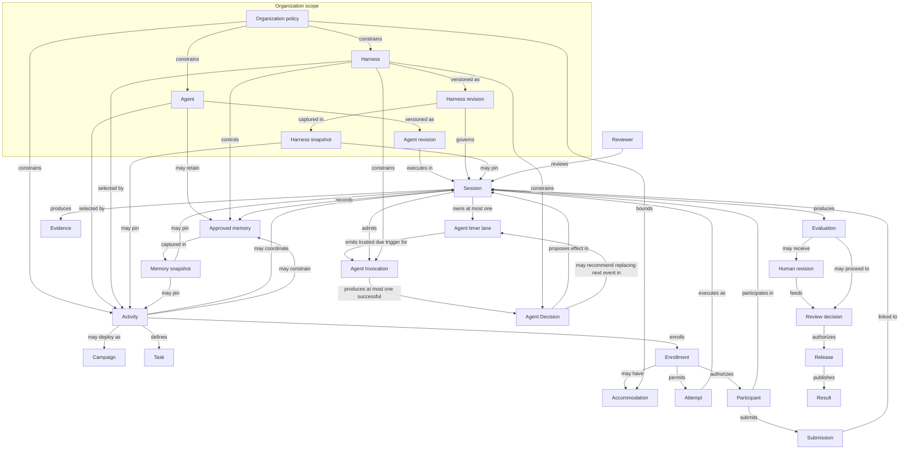

# Concept model

Canonical product concepts, relationships, lifecycles, and invariants for Flex Agent.

## Document metadata

| Field | Value |
| --- | --- |
| **Status** | Approved |
| **Owner** | Product Lead |
| **Approvers** | Product Lead, Architecture Lead |
| **Version** | 0.5 |
| **Last reviewed** | 2026-09-01 |
| **Related decisions** | `PROP-AGENT-1` in this document; structured Agent Invocation, Decision, next-timer, and P0 output-envelope meaning also appear in [MVP scope](mvp-scope.md) and the [text Session runtime contract](../architecture/session-runtime-contract.md) |

This document states current concept meaning. `PROP-AGENT-1` permits a
person-like persona and requires honest Agent identity without expanding the
MVP or enabling general Agent authoring, voice, human-likeness treatment, or
additional P0 effects. Canonical Agent Invocation, Invocation Trigger, Agent
Decision, Agent Output, requested-action, next-timer, and
presentation-versus-visibility semantics remain in force. Accommodation is
separate Enrollment-scoped state; it does not permit mutation of a Cohort
baseline or create Participant self-service. Observable system behavior remains
governed by feature specifications. This Phase 3 rewrite is recoverable beside
the previous Git version and is **not** the Phase 4 authority cutover.

## Purpose

Flex Agent separates **who the AI is**, **how it operates**, **what activity is running**, and **each isolated interaction**. These concepts are related but intentionally distinct.

## Canonical vocabulary

| Term | Definition |
| --- | --- |
| **Organization** | Tenant boundary for isolation, policy, authorization, and data ownership |
| **Agent** | Reusable AI identity: knowledge defaults, capabilities, communication behavior, and evaluation approach |
| **Agent revision** | Versioned, inspectable state of an agent at a point in time |
| **Harness** | Governed operating instructions: workflow, policy constraints, allowed capability subset, and evaluation procedure |
| **Harness revision** | Versioned, inspectable state of a harness at a point in time |
| **Harness snapshot** | Immutable capture of harness revision content or immutable references with content hashes |
| **Activity** | Generic execution context that binds agent, harness, tasks, participants, and rules for a class of work |
| **Campaign** | Managed multi-participant activity form with shared deadlines, cohorts, and comparable outcomes |
| **Task** | Work expected from a participant within an activity |
| **Enrollment / participation** | A participant's authorized relationship to an activity |
| **Accommodation** | An authorized, policy-bounded, reason-coded participant-specific adjustment linked immutably to one Enrollment and its original Cohort baseline without changing that baseline |
| **Attempt** | A controlled execution attempt; in the MVP, typically maps to one session |
| **Session** | One isolated execution between a resolved configuration and a participant or authorized role |
| **Agent Invocation** | Structured, versioned execution input supplied to the resolved Agent when reasoning is required; identifies a trusted trigger and authorized, purpose-bound context |
| **Invocation Trigger** | Typed, versioned reason an Agent Invocation was admitted, established from trusted platform state or a trusted adapter rather than model-authored content |
| **Agent Decision** | Structured recommendation produced by a successful Agent Invocation; becomes an effect only after governing Harness, workflow, authorization, and runtime validation |
| **Agent Output** | Typed presentation recommendation inside an Agent Decision, such as a Participant message; identity, order, and effective audience are runtime-owned |
| **Requested action** | Typed control or effect the Agent asks the Harness/runtime to consider, independently of presentation outputs |
| **Participant** | Person taking part in a session under activity or authorization rules |
| **Reviewer** | Authorized human who inspects evidence, evaluations, and outcomes |
| **Submission** | Versioned participant-provided material linked to an activity or session |
| **Knowledge source** | Curated reference content used by an agent or harness |
| **Memory candidate** | Proposed reusable learned information awaiting approval |
| **Approved memory** | Retained information available under a defined scope and policy |
| **Memory snapshot** | Immutable approved-memory state frozen at activity or cohort activation for fair assessment |
| **Harness change proposal** | Suggested controlled-process change to a harness |
| **Calibration example / dataset** | Reviewed evaluation reference material |
| **Session working context** | Temporary, nonpersistent context for the current interaction |
| **Evidence** | Material linked to evaluation and audit (submissions, transcripts, tool results, playback records) |
| **Evaluation** | Internal structured, evidence-backed judgment of session outcomes |
| **Human revision** | Authorized human adjustment to an evaluation, preserving the original output |
| **Review decision** | Authorized reviewer approval, rejection, or escalation of an evaluation, with or without human revision |
| **Result** | Participant-facing outcome released after review |
| **Release** | Audited transition from internal evaluation to visible result |
| **Resolved session configuration** | Frozen effective configuration used by a session |
| **Resolved execution manifest** | Complete record of versions, policies, and references needed to reconstruct and explain a session |

## Core concepts

### Organization

An **organization** (tenant) is the top-level isolation and policy boundary. Organization policy sets non-bypassable limits across all agents, harnesses, activities, and sessions within that organization.

### Agent

A **reusable AI identity** configured and managed by an administrator.

The agent represents the durable conceptual entity that participants interact with. It defines role, capabilities, knowledge defaults, behavioral expectations, and decision-making approach **independently of any single activity or session**.

An agent may define:

- Name and identity
- Role and responsibilities
- Persona and communication style
- Behavioral instructions
- Domain knowledge and reference material defaults
- Available skills and tools (capability declarations)
- Tool-use principles and default procedures
- Interaction and questioning approach
- Safety and operational boundaries
- Escalation behavior
- Evaluation or decision-making behavior defaults
- Evidence requirements and output format defaults
- Confidence and uncertainty behavior
- Human-review requirement defaults
- Default memory mode and memory eligibility controls

The same agent may be used across many activities while retaining a recognizable role and consistent operating identity.

Persona describes the Agent's conversational character and communication
behavior; it does not change the Agent into a Participant or human actor.

An Agent operates through structured decision opportunities rather than only a
chat request/response loop. Given a trusted situation and authorized context,
the Agent recommends semantic next behavior. It may recommend a bounded delay
for the next event on an enabled system timer lane, but it does not schedule or
wake itself, grant authority, mutate Session or workflow state directly, or
make its own output a trusted platform fact.

#### Person-like persona and honest identity boundary

**Approved decision `PROP-AGENT-1`:** An Agent may express a distinctive,
person-like persona through its name, language, manner, social presence, and
communication style. Participant-facing presentation must remain honestly
attributable to an Agent and must not misrepresent the Agent as an actual human
or impersonate a real person. Persona content or presentation cannot establish
human identity, organizational authority, professional credentials, or another
trusted role.

Fictional or person-like conversational personas are permitted. Agent identity
must remain discernible wherever authorship could be ambiguous. Real-person
impersonation and photographic human representation are not enabled by default;
any later voice or human-likeness treatment requires an owning approved
specification and must preserve this honest-identity boundary.

This decision does not add general Agent authoring to the MVP. The MVP may
select an existing pre-provisioned Agent revision under its current scope. The
P1 Agent-library specification owns persona authoring, revision, preview,
validation, and identity-presentation requirements for future implementation.

### Harness

A **governed operating environment** that surrounds an agent with instructions, procedures, policies, workflows, validation behavior, memory controls, and evaluation mechanisms for a particular class of activities.

The harness may contain:

- System and role-specific instructions
- Persona guidance and knowledge source bindings
- Allowed skills, tool definitions, and tool permissions (subset of agent capabilities)
- Workflows, session stages, and transition rules
- Rubrics, evaluation procedures, and evidence requirements
- Policies, safety constraints, and validation rules
- Output schemas and completion requirements
- Escalation and human-review rules
- Conversation protocols and voice/interruption policies
- Time-management behavior, memory controls, and learning policies

The agent defines the reusable AI identity. The harness defines the controlled operating environment in which that agent performs a structured activity. They are related but not interchangeable.

### Activity

An **activity** is the generic execution context above individual sessions. It binds an agent, a harness, tasks, participants, limits, rules, and session requirements for a class of work.

Activities may take different deployment forms:

| Form | Meaning |
| --- | --- |
| **Campaign** | Managed multi-participant activity with shared deadlines, cohorts, and comparable outcomes |
| **Direct activity** | Individually initiated session without a full campaign wrapper |
| **Embedded activity** | Activity embedded in another product or workflow |
| **API activity** | Activity triggered programmatically |

A campaign is one activity deployment mechanism, not the limit of the platform model.

An activity may configure:

- Activity type, description, and selected agent/harness
- Current harness revision or pinned harness snapshot
- Memory mode and override rules within permitted bounds
- Tasks, participant population, and cohorts
- Start/end dates, deadlines, duration, and attempt limits
- Submission requirements and activity-specific instructions
- Rubric, scoring, conversation, and follow-up rules
- Tool permissions, voice and interruption policies
- Completion, escalation, human-review, and result-release rules
- Data-retention and consent requirements

Activity configuration extends or constrains the selected agent and harness without redefining the agent's underlying identity. A **campaign** is the managed multi-participant activity form used in the assessment MVP. Activity-specific settings must not silently modify the reusable agent or its base harness. See [Effective configuration resolution](#effective-configuration-resolution).

### Session

One **isolated interaction** between a resolved configuration and:

- One participant
- An authorized reviewer
- Another permitted session role

**Shared multi-participant sessions** (multiple participants in one real-time session) are deferred beyond the assessment MVP. For the MVP, "group" means an administrative **cohort** whose members each receive individual isolated sessions. See [Group and cohort semantics](#group-and-cohort-semantics).

The session is the concrete execution unit in which conversation, tools, workflow, submissions, evidence, and outcomes are recorded.

Each session may contain identifiers, participant and cohort membership, agent and activity references, resolved harness state and snapshot reference, memory mode and policy, submitted work and attachments, text and voice transcripts, workflow state, timing and attempt data, tool executions, interaction events, evidence, evaluation data, human revisions, release status, and audit history.

Many sessions may run concurrently under the same activity or agent. Conversational state, participant information, attachments, tools, working context, evidence, and outcomes must remain isolated unless an activity explicitly permits controlled group interaction in a future release.

Every session resolves against an activity definition. Deployment form (campaign, direct, embedded, or API) affects administration and enrollment, not session isolation rules.

### Agent Invocation, Invocation Trigger, and Agent Decision

An **Agent Invocation** is one semantic decision opportunity within a resolved
Session. It identifies why reasoning is required and supplies only the
authorized, purpose-bound context permitted by the frozen configuration. An
invocation is not a model-provider request: one invocation may require bounded
provider attempts, and provider failure may end the invocation without an Agent
Decision.

An **Invocation Trigger** is the typed, versioned reason the runtime admitted an
invocation. Conceptual trigger families include participant input, interaction
signals, workflow events, timer events, tool results, and system events. These
families do not enable their corresponding capabilities. The MVP uses only the
subset required by approved text Session behavior; voice, tools, richer
workflow triggers, and general proactive behavior remain deferred.

An **Agent Decision** is one structured semantic recommendation produced by a
successful invocation. It is an envelope: one explicit disposition, zero or more
typed **Agent Outputs**, and zero or more typed **requested actions**. Empty
output or action collections are never inferred as intentional no-action. Exact
wire schemas are architecture concerns.

Current P0 text execution uses a restricted compatibility profile: zero or one
Participant `message` output, no `voice` output, no reviewer or runtime-only
presentation output, and only the already-approved optional next-timer
requested action. The runtime validates and effects each output and requested
action independently; a prohibited item has no effect and does not void an
otherwise valid sibling item or fabricate no-action. Voice-only, coordinated
voice plus message, richer message kinds, and additional actions remain
later-release capabilities.

Presentation kind and authorized visibility are independent. Effective audience
is derived from trusted Harness, workflow, and runtime context. Model-authored
audience, identity, or scope labels cannot establish who may see an output.
Evidence, Evaluation, reviewer notes, scores, concise audit explanations, and
hidden chain-of-thought are not ordinary Participant messages.

Voice and message are different semantic presentations, not duplicate text and
audio encodings of the same content. Message is persistent and inspectable.
Voice, when later approved, is conversational, interruptible, and
TTS-independent in intent. Only playback-confirmed spoken content counts as
heard. This meaning does not enable voice in the current release.

A small extensible decision vocabulary may include participant-visible
communication, intentional no action, a tool request, a workflow-transition
proposal, or escalation. Those later actions remain disabled until an owning
approved requirement permits them.

A successful Agent Decision may also include one optional **next-timer
recommendation**: a requested positive relative delay for the next event on an
enabled Session timer lane. The runtime independently validates the request and,
when accepted, replaces rather than adds to the one pending next event. The
runtime remains scheduler and trigger authority. If no request is accepted, the
frozen system cadence remains or resumes.

The governing relationship is:

```text
trusted trigger + authorized resolved context
  -> Agent Invocation
  -> Agent Decision envelope
  -> independently validated outputs and requested actions
  -> Harness/workflow/authorization/runtime validation
  -> permitted authoritative effect, rejected/suppressed request, or no
     participant-visible/workflow/tool effect
```

The Agent recommends; the governed platform decides what is permitted and makes
authoritative effects real. Model-authored content cannot establish trigger
provenance, authorize an effect, widen a capability, change frozen
configuration, override timing, enable memory, execute a tool, transition the
workflow, release a Result, or create another trusted system fact.

An intentional **no-action** decision is a successful semantic outcome, not a
provider failure, timeout, cancellation, policy rejection, absence of a
Participant message, or an accepted control such as a next-timer replacement.
When an existing Participant Turn owns an Agent response opportunity, the
runtime must record an explicit terminal outcome even though no Agent Message is
published. "No action" means no requested participant-visible, workflow, tool,
or other primary domain effect; it does not omit the authoritative bookkeeping
needed to record the Decision and terminalize the Invocation, response slot, and
Turn. An accepted requested action may coexist with `no_action` only when that
action is independently validated and is not itself a participant-visible
presentation.

An Agent Invocation is not a Turn. A **Turn** is a conversational interaction
unit; an invocation is a decision opportunity. A Participant Turn may end with
no Agent Message, a non-conversational invocation need not create a Turn, and a
permitted non-Participant trigger may later create an Agent-initiated Turn.
Agent-initiated behavior always begins with a governed trusted trigger and is
not an uncontrolled continuously running Agent process. The current P0 text
workflow normally admits an Invocation for each eligible accepted Participant
message, but that is not a universal platform invariant for every future
workflow or input type.

An enabled timer lane has one default cadence and at most one pending next
event. A timer-triggered Invocation may recommend another bounded delay; the
accepted recommendation replaces that one next event, and the default cadence
resumes after it fires unless a later successful Decision replaces it again.
Pause and terminal Session authority always take precedence.

### Participant

A person taking part in a session under activity enrollment or authorization rules.

### Enrollment / participation

An **enrollment** records a participant's authorized relationship to an activity, including permitted attempts, deadlines, cohort membership, and release visibility rules.

An **accommodation** is separate state attached to one Enrollment. It records an
authorized participant-specific difference from the original Cohort timing
baseline under an exact approved policy and bounded reason category. It never
edits the Activity, Cohort, baseline, or another Participant's rules. Expiry,
revocation, supersession, or later policy narrowing can stop the accommodation
from affecting new decisions while its fairness-relevant history remains
inspectable under the applicable lifecycle policy. A value outside the
pre-approved bounds is a fairness exception, not an ordinary accommodation,
and requires the separately authorized approval governed by the owning feature
specification.

### Attempt

An **attempt** is a controlled execution try within enrollment limits. In the MVP, an attempt typically maps to one session. Attempt limits, timing, and outcome linkage are recorded for audit.

### Task

A **task** defines work expected from a participant: instructions, required submissions, time expectations, and completion criteria within an activity.

### Submission

A **submission** is versioned participant-provided material (text, files, or other permitted artifacts) linked to a task, activity, or session. Submissions are preserved for evaluation and audit; later versions do not silently replace earlier ones.

### Reviewer

An authorized human who inspects evidence, evaluations, session configuration, and outcomes; may approve, adjust, or release results when permitted.

### Knowledge, memory, and learning artifacts

These concepts must not be conflated.

| Concept | Meaning |
| --- | --- |
| **Knowledge source** | Curated reference content configured for an agent or harness |
| **Memory candidate** | Proposed reusable learned information awaiting approval |
| **Approved memory** | Retained information available under a defined scope and policy |
| **Harness change proposal** | Suggested controlled-process change to a harness |
| **Calibration example / dataset** | Reviewed evaluation reference material |
| **Session working context** | Temporary, nonpersistent context for the current interaction |

**Memory policy dimensions** (configured independently; Dynamic/Stable are convenient presets):

| Dimension | Meaning |
| --- | --- |
| Read permission | Who and what may retrieve memory |
| Proposal/write permission | Who may propose or write memory |
| Approval requirement | Whether administrative approval is required |
| Reuse scope | Organization, activity, participant, or session boundaries |
| Retention period | How long memory is retained |
| Source eligibility | Which interaction sources may produce memory |

Two primary memory mode presets exist at product level:

| Mode | Meaning |
| --- | --- |
| **Dynamic** | Agent may learn from approved sources subject to memory policies and administrative controls |
| **Stable** | No new long-term learning from the current interaction; configured identity, knowledge, and approved existing memory remain in use |

Memory mode may be configured at agent, harness, activity, or session level within resolution rules. Each session must record the exact memory mode and policy used.

Participant information must not be reused across unrelated participants, sessions, activities, or organizations unless explicitly permitted.

### Evidence

Material linked to evaluation and audit: submissions, conversation references, tool results, interruption and playback records, and other administrator-configured artifacts.

Evidence references should point to stable locations within submitted or recorded material whenever possible.

An Agent Decision may be referenced when a governing evaluation or audit policy
makes it relevant, but it is not automatically Evidence and does not become
participant-visible transcript content merely because the Agent produced it.

### Evaluation, review decision, result, and release

These form a distinct chain; they must not be treated as the same object.

```text
Evidence → Evaluation → Review decision → Release → Result
              ↑
       Human revision (optional)
```

| Concept | Meaning |
| --- | --- |
| **Evaluation** | Internal structured, evidence-backed judgment organized by rubric criterion or another configured decision framework |
| **Human revision** | Optional authorized human adjustment that preserves the original agent-generated evaluation |
| **Review decision** | Authorized reviewer outcome that approves, rejects, or escalates an evaluation for release, whether or not a human revision occurred |
| **Result** | Participant-facing outcome approved for visibility |
| **Release** | Audited transition that makes a result visible to the permitted audience |

A reviewer must be able to **approve and release an evaluation unchanged**. Human revision is optional, not required before release.

Evaluations maintain an auditable connection between the configured rubric, participant submission, conversation transcript, tool results, collected evidence, criterion-level rationale and evidence references, scores or decisions, and provisional feedback. The system should support uncertainty rather than forcing false precision.

The product requires **inspectable justification**, not storage or exposure of hidden model chain-of-thought.

## Effective configuration resolution

Agent, harness, activity, and session layers overlap in several areas (tools, knowledge, evaluation behavior, evidence requirements, output formats, human-review rules, memory behavior). Without explicit resolution rules, different authors will assign the same responsibility to different concepts.

### Configuration precedence stack

Settings combine in this order. Upper layers set boundaries; lower layers may narrow or supply permitted parameters within those boundaries. **Session** records the frozen result; it does not define new policy.

```text
Organization policy
       ↓ constrains
     Agent
       ↓ constrains
    Harness
       ↓ constrains
    Activity  (campaign is one managed multi-participant form)
       ↓ resolves and freezes at session start
    Session
```

| Step | Layer | Role in resolution |
| --- | --- | --- |
| 1 | **Organization** | Non-bypassable tenant limits on isolation, memory, tools, retention, and authorization |
| 2 | **Agent** | Reusable identity, capability declarations, knowledge defaults, communication behavior, evaluation defaults |
| 3 | **Harness** | Workflow and policy constraints, allowed capability subset, evaluation procedure, harness revision or snapshot reference |
| 4 | **Activity** | Activity-specific parameters within the harness permitted schema: tasks, enrollments, cohorts, deadlines, attempt limits, fairness freezing at activation |
| 5 | **Session** | Resolved session configuration and resolved execution manifest frozen at session start |

Direct, embedded, and API activities use the same precedence stack. Campaign is optional as a deployment form; when used, it is an **activity** configured for managed multi-participant administration.

### Responsibility by layer

| Layer | Owns |
| --- | --- |
| **Organization policy** | Non-bypassable limits across all lower scopes |
| **Agent** | Reusable identity, capability declarations, knowledge defaults, communication behavior, evaluation defaults |
| **Harness** | Workflow and policy constraints; allowed capability subset; evaluation procedure; harness snapshots |
| **Activity** | Activity-specific parameters within the harness's permitted schema; participant population; deadlines; cohort rules |
| **Session** | Frozen resolved configuration; does not define new policy |

### Governing rule

> Lower scopes may narrow permissions or supply permitted parameters, but may not widen capabilities beyond an explicitly delegated upper-scope boundary.

### Conflict resolution

When two layers conflict at configuration time:

1. **Reject configuration** when the conflict cannot be resolved within permitted bounds.
2. **Use the most restrictive value** when both values are valid but incompatible, unless an authorized override is recorded.
3. **Require an authorized override** when a less restrictive value is intentionally needed; the override must be audited with actor, reason, and timestamp.

At session start, the system resolves and freezes the effective configuration. Later changes to agent, harness, or activity definitions do not alter the meaning of an in-progress or completed session.

## Group and cohort semantics

| Term | MVP meaning | Deferred |
| --- | --- | --- |
| **Cohort** | Administrative grouping whose members each receive individual isolated sessions with comparable configuration | — |
| **Shared session** | — | Multiple participants in one real-time session with shared transcript and attribution |

The assessment MVP supports cohorts for fair comparison and administration. Shared multi-participant sessions introduce attribution, consent, interruption, scoring, privacy, and transcript-ownership complexity and are deferred.

## Assessment fairness constraints

Assessment is the first product experience. Flexible platform behaviors can undermine fairness unless explicitly constrained.

For assessment activities, the default policy is:

- **Stable memory** during the active assessment period — no new persistent learning from assessment interactions
- **No cross-participant learning** from assessment interactions
- **Frozen configuration** at activity or cohort activation: resolved agent revision, harness revision or snapshot, model, knowledge sources, tools, workflow, and evaluation configuration
- **Frozen decision policy** for behaviorally material trigger families,
  permitted Agent decisions, Agent-initiated communication, intentional
  no-action, optional next-timer replacement, and bounded chaining that could
  affect comparable treatment
- **Frozen approved-memory reads** for cohort fairness. Stable mode alone is not sufficient when approved memory could change between participants. For cohort assessment, the activity must either:
  - **Disable approved-memory reads**, or
  - **Pin an immutable memory snapshot** frozen at cohort activation
- **Material changes create a new activity version or cohort** rather than silently affecting in-flight participants
- **Adaptive follow-up** constrained by a versioned fairness policy
- **Exceptions** explicitly authorized and audited

Harness snapshots must pin immutable content or immutable references with content hashes. A snapshot that references a mutable knowledge base or tool configuration without a hash is not sufficient for historical reconstruction. Memory snapshots must pin the exact approved-memory revision or content hashes used for retrieval.

## Concept relationships



**Ownership summary:**

| Concept | Owns |
| --- | --- |
| Organization | Tenant isolation, organization-wide policy, authorization boundaries |
| Agent | Reusable identity, capability declarations, knowledge defaults, default memory mode |
| Harness | Operating procedures, workflows, allowed tools, policies, rubrics, snapshots |
| Activity | Activity rules, tasks, participants, limits, selected agent/harness configuration |
| Enrollment | Participant relationship, permitted-attempt context, and linked accommodation history without ownership of the frozen Cohort baseline |
| Session | Isolated execution, trusted invocation admission, authoritative effects, events, evidence, evaluation, and exact resolved configuration used |

## Resolved execution manifest

Exact LLM outputs may not be reproducible because models, providers, external tools, and nondeterministic generation can change. The product reliably promises:

- **Configuration reconstructability** — what was configured and permitted
- **Evidence traceability** — what material supported judgments
- **Historical explainability** — why outcomes were produced or revised
- **Versioned behavior** — which revisions were in effect
- **Auditable revisions** — who changed what and when
- **Event replay** where technically possible from recorded events

Every session must record a **resolved execution manifest** containing at minimum:

- Agent revision
- Harness revision or snapshot identifier
- Activity revision (and campaign reference when applicable)
- Model provider, model identifier, and deployment version
- Knowledge-source versions or content hashes
- Tool definitions and versions
- Policies and workflow version
- Agent Invocation contract version and permitted trigger/decision policy when
  behaviorally material
- Evaluation rubric version
- Memory read/write policy
- Memory snapshot identifier when approved-memory reads are enabled
- Retrieved approved-memory references or content hashes used during the session
- Relevant generation parameters
- Tool inputs and recorded results

This manifest, together with the event log and evidence references, allows administrators and reviewers to determine exactly why the agent behaved in a particular way. Later changes to agent, harness, activity, tools, policies, or memory do not alter the historical meaning of a completed session.

## Workflow model

Text and voice are **interaction surfaces**. A configurable workflow determines how the activity progresses and what the agent, participant, tools, and reviewers may do at each stage.

The workflow may determine current session stage, which trusted triggers may
create Agent decision opportunities, permitted decisions and actions, response
opportunity policy, required information, submission requirements, question and
tool permissions, evidence recording, evaluation timing, pause and completion
rules, output requirements, result release, and whether memory updates may be
proposed. The Agent may recommend a transition; the workflow remains
authoritative for whether it is legal and whether it occurs.

Workflows are defined primarily by the harness and may be extended or constrained by activity configuration. Different activity types may share the same agent, harness, session, voice, evidence, memory, and audit foundations while using different workflows.

## Harness mutability and snapshots

The harness is **mutable** and may improve over time through controlled, auditable changes — not uncontrolled self-modification.

Important harness states can be saved as immutable **harness snapshots** capturing instructions, workflows, tools, knowledge references (with hashes), rubrics, policies, memory controls, and related metadata at a point in time. Snapshots support audit, comparison, backup, restoration, and controlled rollout.

An activity may use the current approved harness, a pinned snapshot, a testing version, or a restored historical configuration. Each session must record the exact harness state used in its resolved execution manifest.

## Session state and events

The system maintains one canonical session state and event log used by workflow execution, tool orchestration, evaluation, human review, audit, and result generation.

Events may include Session lifecycle, authentication, instructions,
submissions, admitted Agent Invocations and their outcomes, accepted/rejected
Agent Decisions and resulting effects, speech and playback, interruptions, tool
execution, evidence recording, workflow transitions, timing, evaluation, human
review, Result release, and memory or Harness improvement proposals. Raw
high-frequency signals, invocation records, participant-visible transcript,
Evidence, audit records, and operational telemetry remain distinct; policy may
retain minimized provenance or stable protected references instead of copying
complete sensitive payloads.

Audit-relevant history cannot be silently overwritten; previous versions remain inspectable. Recorded times have unambiguous ordering and timezone interpretation for audit and fairness analysis.

## Voice interaction model (product level)

The platform supports **natural, interruptible streaming conversation** rather than rigid push-to-talk or unrestricted simultaneous full-duplex voice.

The platform must distinguish:

| Category | Meaning |
| --- | --- |
| **Generated** | Content produced by the agent |
| **Sent** | Content sent for playback |
| **Played** | Content actually played to the participant |
| **Cancelled** | Content cancelled before playback |
| **Interrupted** | Content interrupted during playback |
| **Playback-confirmed portion** | Content the participant was likely exposed to, based on an auditable technical proxy (for example, client playback acknowledgement and final playback offset) |

Only the **playback-confirmed portion** should be treated as conversation input for continuity, transcript accuracy, evaluation fairness, and audit. Playback does not prove that a person heard content; the product records the technical proxy explicitly.

The future Interaction Controller owns real-time interaction mechanics such as
voice floor management, speech timing, silence measurement, interruption
detection, and playback control. The Agent owns semantic judgment about how to
react when the runtime supplies permitted minimized interaction facts. The
product contract is: voice is interruptible; playback progress is tracked;
Agent continuation uses only the playback-confirmed portion; interruption and
cancellation are auditable; and a raw controller signal does not itself become
an Agent decision or authoritative workflow effect. Authoritative
implementation choices belong in architecture documentation and ADRs.

## Product invariants

These invariants apply across concepts and must be preserved in requirements, UI/UX, architecture, and implementation:

- Enforce organization, activity-scope, participant, and session isolation
- Record a resolved execution manifest and resolved session configuration for every session
- Audit-relevant history cannot be silently overwritten; previous versions remain inspectable
- Distinguish generated, sent, played, interrupted, cancelled, and playback-confirmed voice content
- Link evaluations and human revisions to stable evidence; preserve original outputs
- Distinguish evaluation, human revision, review decision, result, and release
- Never allow uncontrolled memory learning, harness self-modification, or result release
- Recorded times have unambiguous ordering and timezone interpretation
- Explicit authorization at every sensitive boundary
- Participant data must not be reused for agent learning unless explicitly permitted
- Lower configuration scopes may narrow but not widen capabilities beyond delegated upper-scope boundaries
- Agent Decisions remain untrusted recommendations until independently
  validated; trusted trigger provenance cannot originate solely from
  model-authored content
- Distinguish Agent Invocation, Agent Decision, Agent Output, requested action,
  conversational Turn, Agent Message, and authoritative effect; intentional
  no-action is explicit and is not inferred from missing presentation
- Runtime-owned output identity, Session order, and derived audience cannot
  originate solely from model-authored content
- Govern Agent-initiated behavior through trusted platform triggers and bounded
  policy rather than uncontrolled self-waking execution
- Treat an Agent next-timer request as a non-authoritative recommendation that
  can replace only one enabled, policy-bounded next event

## Related documents

- [Product documentation hub](README.md)
- [Product overview](overview.md)
- [MVP scope](mvp-scope.md)
- [Requirements](../requirements/README.md)
- [Architecture](../architecture/README.md)
