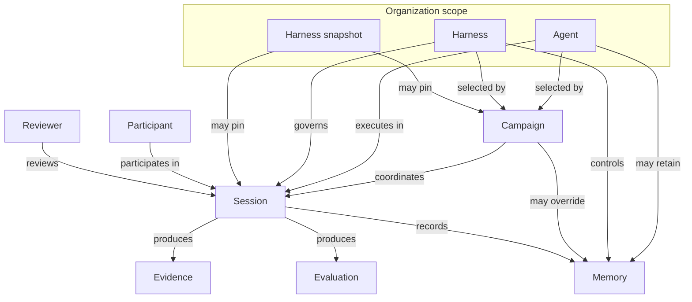

# Concept model

Canonical product concepts, relationships, lifecycles, and invariants for Flex Agent.

## Status

**Draft.** Defines domain meaning for requirements, UI/UX, and architecture authors. Normative system behavior is governed by approved feature specifications.

## Purpose

Flex Agent separates **who the AI is**, **how it operates**, **what activity is running**, and **each isolated interaction**. These concepts are related but intentionally distinct.

## Canonical vocabulary

| Term | Definition |
| --- | --- |
| **Agent** | Reusable AI identity: knowledge, capabilities, behavior, and evaluation approach |
| **Harness** | Governed operating instructions: workflow, tools, policies, memory controls, and evaluation procedures |
| **Campaign** | Structured activity configuration: participants, limits, rules, and selected agent/harness |
| **Session** | One isolated execution between a configured agent and a participant or authorized role |
| **Participant** | Person taking part in a session |
| **Reviewer** | Authorized human who inspects evidence, evaluations, and outcomes |
| **Memory** | Administratively controlled agent learning and retention |
| **Evidence** | Material linked to evaluation and audit (submissions, transcripts, tool results) |
| **Evaluation** | Structured, evidence-backed assessment of session outcomes |

## Core concepts

### Agent

A **reusable AI identity** configured and managed by an administrator.

The agent represents the durable conceptual entity that participants interact with. It defines role, capabilities, knowledge, behavioral expectations, and decision-making approach **independently of any single campaign or session**.

An agent may define:

- Name and identity
- Role and responsibilities
- Persona and communication style
- Behavioral instructions
- Domain knowledge and reference material
- Available skills and tools
- Tool-use principles and default procedures
- Interaction and questioning approach
- Safety and operational boundaries
- Escalation behavior
- Evaluation or decision-making behavior
- Evidence requirements and output formats
- Confidence and uncertainty behavior
- Human-review requirements
- Default memory mode and memory eligibility controls

The same agent may be used across many activities while retaining a recognizable role and consistent operating identity.

### Harness

A **governed operating environment** that surrounds an agent with instructions, procedures, policies, workflows, tools, validation behavior, memory controls, and evaluation mechanisms for a particular class of activities.

The harness may contain:

- System and role-specific instructions
- Persona guidance and knowledge sources
- Skills, tool definitions, and tool permissions
- Workflows, session stages, and transition rules
- Rubrics, evaluation procedures, and evidence requirements
- Policies, safety constraints, and validation rules
- Output schemas and completion requirements
- Escalation and human-review rules
- Conversation protocols and voice/interruption policies
- Time-management behavior, memory controls, and learning policies

The agent defines the reusable AI identity. The harness defines the controlled operating environment in which that agent performs a structured activity. They are related but not interchangeable.

### Campaign

A **structured activity configuration** that coordinates an agent, a harness, participants, tasks, limits, rules, and session requirements.

Campaigns are especially useful for activities involving multiple participants, shared deadlines, common instructions, standardized workflows, or comparable outcomes.

A campaign may configure:

- Activity type, description, and selected agent/harness
- Current harness or pinned harness snapshot
- Memory mode and override rules
- Tasks, participant population, and groups
- Start/end dates, deadlines, duration, and attempt limits
- Submission requirements and campaign-specific instructions
- Rubric, scoring, conversation, and follow-up rules
- Tool permissions, voice and interruption policies
- Completion, escalation, human-review, and result-release rules
- Data-retention and consent requirements

Campaign configuration extends or constrains the selected agent and harness without redefining the agent's underlying identity. Campaign-specific settings should not silently modify the reusable agent or its base harness.

Although campaigns are a central coordination model for the MVP, the platform architecture should not assume every future agent interaction must belong to a large participant campaign.

### Session

One **isolated interaction** between a configured agent and:

- One participant
- An explicitly configured participant group
- An authorized reviewer
- Another permitted session role

The session is the concrete execution unit in which conversation, tools, workflow, submissions, evidence, and outcomes are recorded.

Each session may contain identifiers, participant and group membership, agent and campaign references, harness state and snapshot reference, memory mode and policy, submitted work and attachments, text and voice transcripts, workflow state, timing and attempt data, tool executions, interaction events, evidence, evaluation data, outcome, confidence, human-review flags, release status, and audit history.

Many sessions may run concurrently under the same campaign or agent. Conversational state, participant information, attachments, tools, working context, evidence, and outcomes must remain isolated unless an activity explicitly permits controlled group interaction.

### Participant

A person taking part in a session under campaign or authorization rules.

### Reviewer

An authorized human who inspects evidence, evaluations, session configuration, and outcomes; may approve, adjust, or release results when permitted.

### Memory

**Administratively controlled agent learning and retention.**

Memory is not an opaque model capability. Administrators inspect, approve, edit, archive, and delete memories according to policy.

Two primary memory modes exist at product level:

| Mode | Meaning |
| --- | --- |
| **Dynamic** | Agent may learn from approved sources subject to memory policies and administrative controls |
| **Stable** | No new long-term learning from the current interaction; configured identity, knowledge, and approved existing memory remain in use |

Memory mode may be configured at agent, harness, campaign, or session level. Each session must record the exact memory mode and policy used.

Memory categories have different privacy, retention, approval, and reuse requirements:

- Agent-level operational memory
- Domain knowledge
- Participant-specific memory (when explicitly permitted)
- Campaign-specific context
- Session-only working context
- Harness improvement proposals
- Evaluation calibration data

Participant information must not be reused across unrelated participants, sessions, campaigns, or organizations unless explicitly permitted.

### Evidence

Material linked to evaluation and audit: submissions, conversation references, tool results, interruption and playback records, and other administrator-configured artifacts.

Evidence references should point to stable locations within submitted or recorded material whenever possible.

### Evaluation

A **structured, evidence-backed, auditable** assessment of session outcomes — organized by rubric criterion or another configured decision framework — rather than an unrestricted chat response.

Evaluations maintain an auditable connection between the configured rubric, participant submission, conversation transcript, tool results, collected evidence, criterion-level reasoning, scores or decisions, and final feedback. The system should support uncertainty rather than forcing false precision.

Human changes to evaluations preserve the original agent-generated output and create an auditable revision.

## Concept relationships

**Ownership summary:**

| Concept | Owns |
| --- | --- |
| Agent | Reusable identity, capabilities, default behavior, default memory mode |
| Harness | Operating procedures, workflows, tools, policies, rubrics, snapshots |
| Campaign | Activity rules, participants, limits, selected agent/harness configuration |
| Session | Isolated execution, events, evidence, outcome, and exact configuration used |

## Authoritative session configuration

Every session must record the exact operating configuration used during execution:

- Agent configuration
- Harness state and harness snapshot when applicable
- Campaign configuration
- Memory mode and permissions
- Tool availability
- Workflow definition, evaluation rules, interaction and safety policies
- Validation rules and output schema

This record allows administrators and reviewers to determine exactly why the agent behaved in a particular way and ensures later changes to agent, harness, campaign, tools, policies, or memory do not alter the historical meaning of a completed session.

## Workflow model

Text and voice are **interaction surfaces**. A configurable workflow determines how the activity progresses and what the agent, participant, tools, and reviewers may do at each stage.

The workflow may determine current session stage, permitted actions, required information, submission requirements, question and tool permissions, evidence recording, evaluation timing, pause and completion rules, output requirements, result release, and whether memory updates may be proposed.

Workflows are defined primarily by the harness and may be extended or constrained by campaign configuration. Different activity types may share the same agent, harness, session, voice, evidence, memory, and audit foundations while using different workflows.

## Harness mutability and snapshots

The harness is **mutable** and may improve over time through controlled, auditable changes — not uncontrolled self-modification.

Important harness states can be saved as immutable **Harness Snapshots** capturing instructions, workflows, tools, knowledge, rubrics, policies, memory controls, and related metadata at a point in time. Snapshots support reproducibility, audit, comparison, backup, restoration, and controlled rollout.

A campaign may use the current approved harness, a pinned snapshot, a testing version, or a restored historical configuration. Each session must record the exact harness state used.

## Authoritative session state and events

The system maintains one canonical session state and event log used by the main agent, interaction control, workflow execution, tool orchestration, evaluation, human review, audit, and result generation.

Events may include session lifecycle, authentication, instructions, submissions, speech and playback, interruptions, tool execution, evidence recording, workflow transitions, timing, evaluation, human review, result release, and memory or harness improvement proposals.

The state model should support append-only event recording where appropriate, with derived current state calculated from validated events.

## Voice interaction model (product level)

The MVP uses **natural, interruptible streaming conversation** rather than rigid push-to-talk or unrestricted simultaneous full-duplex voice.

The platform must distinguish:

| Category | Meaning |
| --- | --- |
| Generated | Content produced by the agent |
| Sent | Content sent for playback |
| Played | Content actually played to the participant |
| Cancelled | Content cancelled before playback |
| Interrupted | Content interrupted during playback |
| Heard-likely | Content the participant likely heard |

Only content actually played should be treated as heard by the participant. This distinction matters for conversation continuity, transcript accuracy, evaluation fairness, and auditability.

## Interaction Controller (proposed)

**Proposed:** A separate **Interaction Controller** manages real-time conversational behavior (floor management, speech timing, interruption detection, playback control, pacing) distinct from the main conversational agent, which owns semantic understanding, reasoning, tool use, question generation, evidence interpretation, and evaluation.

This separation is a **technical design proposal** for real-time voice behavior. Authoritative implementation choices belong in architecture documentation and ADRs once requirements define the behavioral contract.

## Product invariants

These invariants apply across concepts and must be preserved in requirements, UI/UX, architecture, and implementation:

- Enforce organization, campaign, participant, and session isolation
- Record exact agent, harness, campaign, memory, tool, workflow, and policy state per session
- Prefer append-only events and immutable snapshots for audit-relevant history
- Distinguish generated, sent, played, interrupted, cancelled, and heard-likely voice content
- Link evaluations and human revisions to stable evidence; preserve original outputs
- Never allow uncontrolled memory learning, harness self-modification, or result release
- Use UTC internally and explicit authorization at every sensitive boundary
- Participant data must not be reused for agent learning unless explicitly permitted

## Related documents

- [Product documentation hub](README.md)
- [Product overview](overview.md)
- [MVP scope](mvp-scope.md)
- [Requirements](../requirements/README.md)
- [Architecture](../architecture/README.md)
