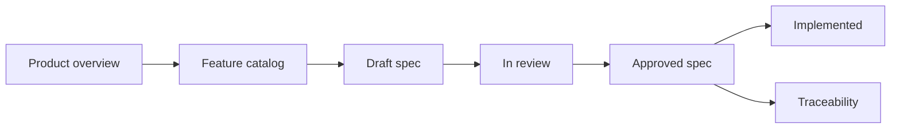

# Requirements

Requirements hub for Flex Agent. This area governs what the product must do, who may do it, and how success is verified.

## Status

**Scaffold only.** No feature specifications are approved yet. The catalog below identifies candidate areas derived from the [product overview](../overview-idea.md); catalog entries are not requirements until captured in an approved spec.

## Requirements lifecycle

1. **Discover** — Identify behavior from product overview, stakeholder input, or gaps in existing specs.
2. **Draft** — Author a feature spec using the [feature spec template](../templates/feature-spec.md) with stable IDs.
3. **Review** — Validate scope, actors, journeys, failure states, security/privacy, and testability.
4. **Approve** — Mark the spec `Approved`; it becomes authoritative for implementation.
5. **Implement and verify** — Map requirements to implementation and automated/manual verification.
6. **Maintain** — Update status to `Implemented` or supersede when behavior changes.

## ID conventions

| ID pattern | Use |
| --- | --- |
| `REQ-<area>-<n>` | Normative business rule or requirement |
| `AC-<area>-<n>` | Testable acceptance criterion (Given/When/Then) |
| `Q-<n>` | Open question blocking or informing a decision |
| `PROP-<n>` | Proposed default requiring explicit approval |

**Area codes** (examples): `AGENT`, `HARNESS`, `CAMP`, `SESS`, `SUBM`, `CONV`, `VOICE`, `TOOL`, `EVAL`, `REV`, `MEM`, `AUDIT`.

## Approval expectations

An approved feature specification must include:

- Status, owner, and source references
- Problem and measurable outcome
- Actors, permissions, and resource scope
- In scope / out of scope
- User journeys and state transitions
- Business rules with stable `REQ-*` IDs
- Data, evidence, and audit requirements
- Quality requirements (UX, performance, security, privacy)
- Acceptance criteria with stable `AC-*` IDs
- Edge and failure cases
- Dependencies, rollout, and observability
- Open questions and labeled proposals
- Traceability matrix

Specs without testable acceptance criteria are not ready for approval.

## MVP feature-spec catalog

Candidate specifications for the first MVP (AI-assisted assessment and examination). Priority reflects suggested authoring order, not implementation sequence.

| Priority | Candidate spec | Overview source | Owner | Spec status |
| --- | --- | --- | --- | --- |
| P0 | Agent configuration and identity | [Agent](../overview-idea.md#agent), [Memory modes](../overview-idea.md#agent-memory-modes) | TBD | Not started |
| P0 | Harness configuration and snapshots | [Harness](../overview-idea.md#harness), [Snapshots](../overview-idea.md#harness-snapshots-backup-and-restoration) | TBD | Not started |
| P0 | Campaign setup and participant management | [Campaign](../overview-idea.md#campaign) | TBD | Not started |
| P0 | Session lifecycle and workflow | [Session](../overview-idea.md#participant-session), [Workflow model](../overview-idea.md#workflow-model) | TBD | Not started |
| P0 | Participant submissions and attachments | [Submissions](../overview-idea.md#submissions-and-attachments) | TBD | Not started |
| P1 | Text conversation | [Product vision](../overview-idea.md#product-vision) | TBD | Not started |
| P1 | Voice interaction and interruption | [Voice model](../overview-idea.md#voice-interaction-model), [Interaction Controller](../overview-idea.md#interaction-controller) | TBD | Not started |
| P1 | Tool execution and permissions | [Tool execution](../overview-idea.md#tool-execution) | TBD | Not started |
| P1 | Evidence collection | [Evaluation model](../overview-idea.md#evaluation-model), [Session state](../overview-idea.md#authoritative-session-state) | TBD | Not started |
| P1 | Structured evaluation | [Evaluation model](../overview-idea.md#evaluation-model) | TBD | Not started |
| P2 | Human review and result release | [Human review](../overview-idea.md#human-review) | TBD | Not started |
| P2 | Memory governance | [Memory management](../overview-idea.md#agent-memory-management), [Improvement cycle](../overview-idea.md#harness-and-memory-improvement-cycle) | TBD | Not started |
| P2 | Audit and reproducibility | [Audit](../overview-idea.md#audit-and-reproducibility), [Authoritative session configuration](../overview-idea.md#authoritative-session-configuration) | TBD | Not started |

### Explicitly out of catalog scope (deferred)

The following overview capabilities are **not** cataloged as MVP specs unless explicitly promoted:

- Unrestricted full-duplex voice, video, multi-agent collaboration
- Public agent/tool marketplaces, visual workflow builders
- Automated proctoring, biometric verification, advanced cheating detection
- Complex billing, large-scale workforce scheduling
- Fully autonomous result release or harness self-modification

See [Deferred features](../overview-idea.md#deferred-features) in the product overview.

## Actor capabilities (reference)

High-level capability lists from the overview inform future specs but are not approved requirements:

- [MVP administrative capabilities](../overview-idea.md#mvp-administrative-capabilities)
- [MVP participant capabilities](../overview-idea.md#mvp-participant-capabilities)
- [MVP reviewer capabilities](../overview-idea.md#mvp-reviewer-capabilities)

## Feature specifications

Approved and draft feature specs live under [features/](features/README.md).

## Related documents

- [Documentation home](../README.md)
- [Product overview](../overview-idea.md)
- [Feature spec template](../templates/feature-spec.md)
