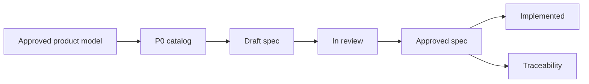

# Requirements

Requirements hub for Flex Agent. This area governs what the product must do, who may do it, and how success is verified.

Product meaning — concepts, relationships, and scope boundaries — lives under [approved product documentation](../product/README.md). Requirements implement observable behavior derived from that model; they do not redefine canonical concepts.

## Status

**Ready for P0 authoring.** Product baseline v0.1 is approved. No feature specifications are approved yet. Author the P0 specs below before implementation.

## Requirements lifecycle

1. **Discover** — Identify behavior from [concept model](../product/concept-model.md), [MVP scope](../product/mvp-scope.md), stakeholder input, or gaps in existing specs.
2. **Draft** — Author a feature spec using the [feature spec template](../templates/feature-spec.md) with stable IDs.
3. **Review** — Validate scope, actors, journeys, failure states, security/privacy, and testability.
4. **Approve** — Mark the spec `Approved`; it becomes authoritative for implementation.
5. **Implement and verify** — Map requirements to implementation and automated/manual verification.
6. **Maintain** — Update status to `Implemented` or supersede when behavior changes.

## ID conventions

| ID pattern | Use |
| --- | --- |
| `REQ-<area>-<n>` | Normative business rule or requirement |
| `AC-<area>-<n>` | Testable acceptance criterion (Given/When/Then) |
| `Q-<n>` | Open question blocking or informing a decision |
| `PROP-<n>` | Proposed default requiring explicit approval |

**Area codes** (examples): `AUTH`, `ORG`, `ACT`, `ENRL`, `SESS`, `SUBM`, `CONV`, `EVAL`, `REV`, `REL`, `FAIR`, `AGENT`, `HARNESS`, `VOICE`, `TOOL`, `MEM`, `AUDIT`.

## Approval expectations

An approved feature specification must include:

- Status, owner, and source references
- Problem and measurable outcome
- Actors, permissions, and resource scope
- In scope / out of scope
- User journeys and state transitions
- Business rules with stable `REQ-*` IDs
- Data, evidence, and audit requirements
- Quality requirements (UX, performance, security, privacy)
- Acceptance criteria with stable `AC-*` IDs
- Edge and failure cases
- Dependencies, rollout, and observability
- Open questions and labeled proposals
- Traceability matrix

Specs without testable acceptance criteria are not ready for approval.

## P0 authoring order

Author these seven specifications **in this order**. Each spec file should be created under [`features/`](features/README.md) using the [feature spec template](../templates/feature-spec.md).

| Order | P0 specification | Spec file | Product source | Status |
| --- | --- | --- | --- | --- |
| 1 | Authorization and isolation | [`auth-resource-isolation.md`](features/auth-resource-isolation.md) | [Organization](../product/concept-model.md#organization), [Product invariants](../product/concept-model.md#product-invariants) | Not started |
| 2 | Resolved session configuration | [`resolved-session-configuration.md`](features/resolved-session-configuration.md) | [Configuration precedence](../product/concept-model.md#configuration-precedence-stack), [Resolved execution manifest](../product/concept-model.md#resolved-execution-manifest) | Not started |
| 3 | Assessment setup | [`assessment-setup.md`](features/assessment-setup.md) | [Activity](../product/concept-model.md#activity), [Assessment fairness](../product/concept-model.md#assessment-fairness-constraints), [MVP slice](../product/mvp-scope.md#mvp-validation-slice) | Not started |
| 4 | Submission and attempts | [`submission-attempts.md`](features/submission-attempts.md) | [Enrollment](../product/concept-model.md#enrollment--participation), [Submission](../product/concept-model.md#submission), [Attempt](../product/concept-model.md#attempt) | Not started |
| 5 | Text session lifecycle | [`session-text-lifecycle.md`](features/session-text-lifecycle.md) | [Session](../product/concept-model.md#session), [Workflow model](../product/concept-model.md#workflow-model) | Not started |
| 6 | Evidence and evaluation | [`evidence-evaluation.md`](features/evidence-evaluation.md) | [Evidence](../product/concept-model.md#evidence), [Evaluation chain](../product/concept-model.md#evaluation-review-decision-result-and-release) | Not started |
| 7 | Human review and result release | [`review-result-release.md`](features/review-result-release.md) | [Review decision and release](../product/concept-model.md#evaluation-review-decision-result-and-release) | Not started |

### P0 assessment setup scope

`assessment-setup.md` covers assessment activity creation and cohort activation only. It must **not** become a general agent or harness management specification.

**In scope for P0 assessment setup:**

- Select an existing agent and harness (or pre-provisioned assessment defaults)
- Supply assessment-required parameters: task, rubric binding, deadlines, attempt limits, cohort rules, fairness freezing, and memory-snapshot or no-read policy
- Activate a cohort with frozen configuration

**Out of scope for P0 assessment setup** (deferred to P1):

- Creating or editing reusable agent libraries
- Creating or editing reusable harness libraries, comparison, or restoration workflows
- General-purpose agent or harness administration UI

### Authoring instructions

1. Copy the [feature spec template](../templates/feature-spec.md) into the spec file path for the current order item.
2. Link the catalog entry and governing product sections in **Status and source**.
3. Map behavior to the [MVP executable workflow](../product/mvp-scope.md#mvp-executable-workflow).
4. Mark status `Draft` until review completes; `Approved` only with testable `AC-*` IDs.
5. Do not start P2 capabilities (voice, tools, dynamic memory, harness self-improvement) until all P0 specs are approved.

### Deferred from P0 (P1/P2)

| Priority | Candidate spec | When |
| --- | --- | --- |
| P1 | Agent library and general configuration | Reusable agent authoring beyond assessment-required selection |
| P1 | Harness library and general configuration | Reusable harness authoring beyond assessment-required selection |
| P2 | Voice interaction and interruption | After MVP slice works |
| P2 | Tool execution and permissions | After MVP slice works |
| P2 | Harness snapshots, comparison, and restoration | After MVP slice works |
| P2 | Memory governance (dynamic mode) | After MVP slice works |

## Actor capabilities (reference)

High-level capability lists inform future specs but are not approved requirements:

- [MVP scope — Actor capability themes](../product/mvp-scope.md#actor-capability-themes)

## Feature specifications

Approved and draft feature specs live under [features/](features/README.md).

## Related documents

- [Documentation home](../README.md)
- [Product documentation](../product/README.md)
- [Concept model](../product/concept-model.md)
- [MVP scope](../product/mvp-scope.md)
- [Product overview](../product/overview.md)
- [Feature spec template](../templates/feature-spec.md)
