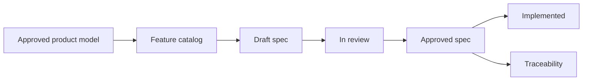

# Requirements

Requirements hub for Flex Agent. This area governs what the product must do, who may do it, and how success is verified.

Product meaning — concepts, relationships, and scope boundaries — lives under [approved product documentation](../product/README.md). Requirements implement observable behavior derived from that model; they do not redefine canonical concepts.

## Status

**Placeholder catalog complete; P0 authoring in progress.** Product baseline v0.1 is approved. Nineteen feature-spec placeholders exist under [`features/`](features/README.md). None are approved requirements yet. Author P0 specs in order before implementation.

Placeholder files are scaffolds only. They do not govern behavior until reviewed, populated with stable `REQ-*` and `AC-*` IDs, and marked `Approved`.

## Requirements lifecycle

1. **Discover** — Identify behavior from [concept model](../product/concept-model.md), [MVP scope](../product/mvp-scope.md), stakeholder input, or gaps in existing specs.
2. **Draft** — Author a feature spec using the [feature spec template](../templates/feature-spec.md) with stable IDs.
3. **Review** — Validate scope, actors, journeys, failure states, security/privacy, and testability.
4. **Approve** — Mark the spec `Approved`; it becomes authoritative for implementation.
5. **Implement and verify** — Map requirements to implementation and automated/manual verification.
6. **Maintain** — Update status to `Implemented` or supersede when behavior changes.

## ID conventions

| ID pattern | Use |
| --- | --- |
| `REQ-<area>-<n>` | Normative business rule or requirement |
| `AC-<area>-<n>` | Testable acceptance criterion (Given/When/Then) |
| `Q-<n>` | Open question blocking or informing a decision |
| `PROP-<n>` | Proposed default requiring explicit approval |

**Area codes** (examples): `AUTH`, `ORG`, `ACT`, `ENRL`, `SESS`, `SUBM`, `CONV`, `EVAL`, `REV`, `REL`, `FAIR`, `AGENT`, `HARNESS`, `VOICE`, `TOOL`, `MEM`, `AUDIT`.

## Approval expectations

An approved feature specification must include:

- Status, owner, and source references
- Problem and measurable outcome
- Actors, permissions, and resource scope
- In scope / out of scope
- User journeys and state transitions
- Business rules with stable `REQ-*` IDs
- Data, evidence, and audit requirements
- Quality requirements (UX, performance, security, privacy)
- Acceptance criteria with stable `AC-*` IDs
- Edge and failure cases
- Dependencies, rollout, and observability
- Open questions and labeled proposals
- Traceability matrix

Specs without testable acceptance criteria are not ready for approval.

## Feature catalog overview

| Tier | Count | Product alignment | When to author |
| --- | --- | --- | --- |
| **P0** | 7 | [MVP validation slice](../product/mvp-scope.md#mvp-validation-slice) | Now — before implementation |
| **P1** | 2 | Foundation expansion after MVP slice | After P0 approval |
| **P2** | 5 | [Next release](../product/mvp-scope.md#next-release-explicitly-deferred-from-mvp) | After MVP slice works end to end |
| **P3** | 5 | [Later release](../product/mvp-scope.md#later-release) | After P2 capabilities are approved |

**Tier mapping:** P2 corresponds to product **Next release**; P3 corresponds to product **Later release**. P1 is an interstitial foundation tier for reusable agent and harness authoring not covered by the MVP executable workflow.

## P0 authoring order

Author these seven specifications **in this order**. Each spec file lives under [`features/`](features/README.md).

| Order | P0 specification | Spec file | Boundary | Product source | Status |
| --- | --- | --- | --- | --- | --- |
| 1 | Authorization and isolation | [`auth-resource-isolation.md`](features/auth-resource-isolation.md) | Who may access what at org, activity, cohort, and session scope | [Organization](../product/concept-model.md#organization), [Product invariants](../product/concept-model.md#product-invariants) | Placeholder |
| 2 | Resolved session configuration | [`resolved-session-configuration.md`](features/resolved-session-configuration.md) | Frozen effective config and execution manifest at session start | [Configuration precedence](../product/concept-model.md#configuration-precedence-stack), [Resolved execution manifest](../product/concept-model.md#resolved-execution-manifest) | Placeholder |
| 3 | Assessment setup | [`assessment-setup.md`](features/assessment-setup.md) | Campaign activity creation and cohort activation with frozen configuration | [Activity](../product/concept-model.md#activity), [Assessment fairness](../product/concept-model.md#assessment-fairness-constraints), [MVP slice](../product/mvp-scope.md#mvp-validation-slice) | Placeholder |
| 4 | Submission and attempts | [`submission-attempts.md`](features/submission-attempts.md) | Enrollment, attempt authorization, and versioned submission preservation | [Enrollment](../product/concept-model.md#enrollment--participation), [Submission](../product/concept-model.md#submission), [Attempt](../product/concept-model.md#attempt) | Placeholder |
| 5 | Text session lifecycle | [`session-text-lifecycle.md`](features/session-text-lifecycle.md) | Isolated text examination from authorized start through completion | [Session](../product/concept-model.md#session), [Workflow model](../product/concept-model.md#workflow-model) | Placeholder |
| 6 | Evidence and evaluation | [`evidence-evaluation.md`](features/evidence-evaluation.md) | Evidence collection and internal structured evaluation | [Evidence](../product/concept-model.md#evidence), [Evaluation chain](../product/concept-model.md#evaluation-review-decision-result-and-release) | Placeholder |
| 7 | Human review and result release | [`review-result-release.md`](features/review-result-release.md) | Human review gate, optional revision, and audited result release | [Review decision and release](../product/concept-model.md#evaluation-review-decision-result-and-release) | Placeholder |

### P0 assessment setup scope

`assessment-setup.md` covers assessment activity creation and cohort activation only. It must **not** become a general agent or harness management specification.

**In scope for P0 assessment setup:**

- Select an existing agent and harness (or pre-provisioned assessment defaults)
- Supply assessment-required parameters: task, rubric binding, deadlines, attempt limits, cohort rules, fairness freezing, and memory-snapshot or no-read policy
- Activate a cohort with frozen configuration

**Out of scope for P0 assessment setup:**

- Creating or editing reusable agent libraries (P1)
- Creating or editing reusable harness libraries (P1)
- Harness snapshot comparison and restoration (P2)
- General-purpose agent or harness administration UI

### P0 authoring instructions

1. Open the placeholder file for the current order item.
2. Replace placeholder content using the [feature spec template](../templates/feature-spec.md).
3. Link the catalog entry and governing product sections in **Status and source**.
4. Map behavior to the [MVP executable workflow](../product/mvp-scope.md#mvp-executable-workflow).
5. Mark status `Draft` until review completes; `Approved` only with testable `AC-*` IDs.
6. Do not start P1–P3 capabilities until all P0 specs are approved.

### P0 concerns covered within existing specs

These observable outcomes do **not** warrant separate P0 specs. Author them inside the owning spec above:

| Concern | Owner spec |
| --- | --- |
| Consent and instructions | `session-text-lifecycle.md` |
| Admin session pause/terminate | `session-text-lifecycle.md` |
| Session failure/recovery | `session-text-lifecycle.md` |
| Audit export permissions | `auth-resource-isolation.md` or `review-result-release.md` |
| Participant appeal (when supported) | `review-result-release.md` |

## P1 — Foundation expansion

Author after all P0 specs are approved.

| Order | Specification | Spec file | Boundary | Product source | Status |
| --- | --- | --- | --- | --- | --- |
| 8 | Agent library and general configuration | [`agent-library-configuration.md`](features/agent-library-configuration.md) | Reusable agent authoring: identity, knowledge defaults, capabilities, evaluation defaults, revisions | [Agent](../product/concept-model.md#agent), [MVP slice](../product/mvp-scope.md#mvp-validation-slice) | Placeholder |
| 9 | Harness library and general configuration | [`harness-library-configuration.md`](features/harness-library-configuration.md) | Reusable harness authoring: workflow, rubric, policies, stable memory controls | [Harness](../product/concept-model.md#harness), [Workflow model](../product/concept-model.md#workflow-model) | Placeholder |

## P2 — Next release

Author after the MVP validation slice works end to end. Aligns with [Next release](../product/mvp-scope.md#next-release-explicitly-deferred-from-mvp).

| Order | Specification | Spec file | Boundary | Product source | Status |
| --- | --- | --- | --- | --- | --- |
| 10 | Interruptible voice interaction | [`voice-interaction-interruption.md`](features/voice-interaction-interruption.md) | Streaming voice, interruption, playback-confirmed continuity, auditable cancellation | [Voice interaction model](../product/concept-model.md#voice-interaction-model-product-level), [Next release](../product/mvp-scope.md#next-release-explicitly-deferred-from-mvp) | Placeholder |
| 11 | Tool execution and permissions | [`tool-execution-permissions.md`](features/tool-execution-permissions.md) | Permitted tool execution with authorization, audit, and manifest recording | [Harness tools](../product/concept-model.md#harness), [Resolved execution manifest](../product/concept-model.md#resolved-execution-manifest) | Placeholder |
| 12 | Workflow stage configuration | [`workflow-stage-configuration.md`](features/workflow-stage-configuration.md) | Configurable stages, transitions, and permitted actions beyond MVP workflow depth | [Workflow model](../product/concept-model.md#workflow-model), [Next release](../product/mvp-scope.md#next-release-explicitly-deferred-from-mvp) | Placeholder |
| 13 | Harness snapshot comparison and restoration | [`harness-snapshots-comparison-restoration.md`](features/harness-snapshots-comparison-restoration.md) | Compare, restore, and roll out immutable harness snapshots | [Harness mutability and snapshots](../product/concept-model.md#harness-mutability-and-snapshots) | Placeholder |
| 14 | Dynamic memory mode governance | [`memory-governance-dynamic-mode.md`](features/memory-governance-dynamic-mode.md) | Enable Dynamic memory mode with administrative policy controls | [Knowledge, memory, and learning artifacts](../product/concept-model.md#knowledge-memory-and-learning-artifacts), [Next release](../product/mvp-scope.md#next-release-explicitly-deferred-from-mvp) | Placeholder |

## P3 — Later release

Author after P2 capabilities are approved. Aligns with [Later release](../product/mvp-scope.md#later-release).

| Order | Specification | Spec file | Boundary | Product source | Status |
| --- | --- | --- | --- | --- | --- |
| 15 | Memory candidates and learning approval | [`memory-candidates-learning-approval.md`](features/memory-candidates-learning-approval.md) | Propose, review, and approve reusable learned artifacts | [Memory candidate](../product/concept-model.md#knowledge-memory-and-learning-artifacts), [Later release](../product/mvp-scope.md#later-release) | Placeholder |
| 16 | Harness improvement proposals | [`harness-improvement-proposals.md`](features/harness-improvement-proposals.md) | Controlled harness change proposals with review and rollout | [Harness change proposal](../product/concept-model.md#knowledge-memory-and-learning-artifacts), [Later release](../product/mvp-scope.md#later-release) | Placeholder |
| 17 | Shared multi-participant sessions | [`shared-multi-participant-sessions.md`](features/shared-multi-participant-sessions.md) | Multiple participants in one real-time session with attribution and privacy controls | [Group and cohort semantics](../product/concept-model.md#group-and-cohort-semantics), [Later release](../product/mvp-scope.md#later-release) | Placeholder |
| 18 | Calibration and analytics | [`calibration-analytics.md`](features/calibration-analytics.md) | Calibration datasets and advanced outcome analytics | [Calibration example / dataset](../product/concept-model.md#knowledge-memory-and-learning-artifacts), [Later release](../product/mvp-scope.md#later-release) | Placeholder |
| 19 | Alternative activity deployment forms | [`activity-deployment-forms.md`](features/activity-deployment-forms.md) | Direct, embedded, and API-triggered activities beyond campaign form | [Activity](../product/concept-model.md#activity), [Later release](../product/mvp-scope.md#later-release) | Placeholder |

## Actor capabilities (reference)

High-level capability lists inform future specs but are not approved requirements:

- [MVP scope — Actor capability themes](../product/mvp-scope.md#actor-capability-themes)

## Feature specifications

Approved and draft feature specs live under [features/](features/README.md).

## Related documents

- [Documentation home](../README.md)
- [Product documentation](../product/README.md)
- [Concept model](../product/concept-model.md)
- [MVP scope](../product/mvp-scope.md)
- [Product overview](../product/overview.md)
- [Feature spec template](../templates/feature-spec.md)
