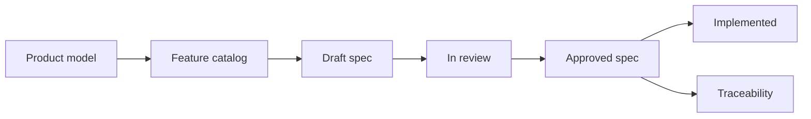

# Requirements

Requirements hub for Flex Agent. This area governs what the product must do, who may do it, and how success is verified.

Product meaning — concepts, relationships, and scope boundaries — lives under [product documentation](../product/README.md). Requirements implement observable behavior derived from that model; they do not redefine canonical concepts.

## Status

**Scaffold only.** No feature specifications are approved yet. The catalog below identifies candidate areas derived from [MVP scope](../product/mvp-scope.md) and the [concept model](../product/concept-model.md); catalog entries are not requirements until captured in an approved spec.

## Requirements lifecycle

1. **Discover** — Identify behavior from [concept model](../product/concept-model.md), [MVP scope](../product/mvp-scope.md), stakeholder input, or gaps in existing specs.
2. **Draft** — Author a feature spec using the [feature spec template](../templates/feature-spec.md) with stable IDs.
3. **Review** — Validate scope, actors, journeys, failure states, security/privacy, and testability.
4. **Approve** — Mark the spec `Approved`; it becomes authoritative for implementation.
5. **Implement and verify** — Map requirements to implementation and automated/manual verification.
6. **Maintain** — Update status to `Implemented` or supersede when behavior changes.

## ID conventions

| ID pattern | Use |
| --- | --- |
| `REQ-<area>-<n>` | Normative business rule or requirement |
| `AC-<area>-<n>` | Testable acceptance criterion (Given/When/Then) |
| `Q-<n>` | Open question blocking or informing a decision |
| `PROP-<n>` | Proposed default requiring explicit approval |

**Area codes** (examples): `AUTH`, `ORG`, `ACT`, `ENRL`, `SESS`, `SUBM`, `CONV`, `EVAL`, `REV`, `REL`, `FAIR`, `AGENT`, `HARNESS`, `VOICE`, `TOOL`, `MEM`, `AUDIT`.

## Approval expectations

An approved feature specification must include:

- Status, owner, and source references
- Problem and measurable outcome
- Actors, permissions, and resource scope
- In scope / out of scope
- User journeys and state transitions
- Business rules with stable `REQ-*` IDs
- Data, evidence, and audit requirements
- Quality requirements (UX, performance, security, privacy)
- Acceptance criteria with stable `AC-*` IDs
- Edge and failure cases
- Dependencies, rollout, and observability
- Open questions and labeled proposals
- Traceability matrix

Specs without testable acceptance criteria are not ready for approval.

## MVP feature-spec catalog

Candidate specifications for the first MVP validation slice (AI-assisted assessment and examination). Priority reflects suggested **authoring order** for an end-to-end participant-to-result experience, not implementation sequence.

Agent and harness configuration appear only at the minimum level required to support the slice. Advanced editors, reusable libraries, comparison, and restoration are deferred.

| Priority | Candidate spec | Source | Owner | Spec status |
| --- | --- | --- | --- | --- |
| P0 | Authorization and resource isolation | [Concept model — Organization](../product/concept-model.md#organization), [Product invariants](../product/concept-model.md#product-invariants) | TBD | Not started |
| P0 | Resolved execution configuration and audit baseline | [Resolved execution manifest](../product/concept-model.md#resolved-execution-manifest), [Effective configuration resolution](../product/concept-model.md#effective-configuration-resolution) | TBD | Not started |
| P0 | Minimal assessment activity setup | [Concept model — Activity](../product/concept-model.md#activity), [MVP validation slice](../product/mvp-scope.md#mvp-validation-slice) | TBD | Not started |
| P0 | Participant enrollment, assignment, and submission | [Enrollment](../product/concept-model.md#enrollment--participation), [Submission](../product/concept-model.md#submission) | TBD | Not started |
| P0 | Session lifecycle and text examination | [Session](../product/concept-model.md#session), [Workflow model](../product/concept-model.md#workflow-model) | TBD | Not started |
| P0 | Evidence and structured evaluation | [Evidence](../product/concept-model.md#evidence), [Evaluation](../product/concept-model.md#evaluation-human-revision-result-and-release) | TBD | Not started |
| P0 | Human review and result release | [Result and release](../product/concept-model.md#evaluation-human-revision-result-and-release) | TBD | Not started |
| P0 | Assessment fairness and configuration freezing | [Assessment fairness](../product/concept-model.md#assessment-fairness-constraints) | TBD | Not started |
| P1 | Minimal agent configuration | [Agent](../product/concept-model.md#agent) | TBD | Not started |
| P1 | Minimal harness configuration | [Harness](../product/concept-model.md#harness) | TBD | Not started |
| P2 | Voice interaction and interruption | [Voice interaction model](../product/concept-model.md#voice-interaction-model-product-level) | TBD | Not started |
| P2 | Tool execution and permissions | [MVP scope — Next release](../product/mvp-scope.md#next-release-explicitly-deferred-from-mvp) | TBD | Not started |
| P2 | Harness snapshots, comparison, and restoration | [Harness mutability](../product/concept-model.md#harness-mutability-and-snapshots) | TBD | Not started |
| P2 | Memory governance (dynamic mode) | [Knowledge, memory, and learning artifacts](../product/concept-model.md#knowledge-memory-and-learning-artifacts) | TBD | Not started |

### Explicitly out of catalog scope (deferred)

The following capabilities are **not** cataloged as MVP specs unless explicitly promoted:

- Unrestricted full-duplex voice, video, multi-agent collaboration
- Public agent/tool marketplaces, visual workflow builders
- Automated proctoring, biometric verification, advanced cheating detection
- Complex billing, large-scale workforce scheduling
- Fully autonomous result release or harness self-modification

See [MVP scope — Explicit non-goals](../product/mvp-scope.md#explicit-non-goals-deferred).

## Actor capabilities (reference)

High-level capability lists inform future specs but are not approved requirements:

- [MVP scope — Actor capability themes](../product/mvp-scope.md#actor-capability-themes)

## Feature specifications

Approved and draft feature specs live under [features/](features/README.md).

## Related documents

- [Documentation home](../README.md)
- [Product documentation](../product/README.md)
- [Concept model](../product/concept-model.md)
- [MVP scope](../product/mvp-scope.md)
- [Product overview](../product/overview.md)
- [Feature spec template](../templates/feature-spec.md)
