# Flex Agent activity journey and MVP campaign information architecture

## Document metadata

| Field | Value |
| --- | --- |
| **Status** | Approved |
| **Owner** | Product Lead |
| **Approvers** | Product Lead, UI/UX reviewer, Architecture Lead, Security/Privacy reviewer |
| **Version** | 0.3 |
| **Prepared date** | 2026-08-09 |
| **Approved date** | 2026-08-09 |
| **Last amended** | 2026-08-20 |
| **Approval reference** | v0.3 confirms the fail-closed MVP behavior for zero or multiple eligible Organization contexts; supersedes v0.2 |
| **Audience** | Product, design, engineering, security/privacy, QA, and implementation reviewers |
| **Governs** | Platform-level Activity information architecture; end-to-end assessment Campaign journey for P0; capability-scoped navigation; cross-surface state handoffs; and shared interaction principles |

This approved UI/UX contract is authoritative for its interaction concerns. It
uses **must** for normative behavior and remains subordinate to approved
product meaning, observable feature requirements, and technical architecture
within their respective areas of authority.

## Purpose and outcomes

Flex Agent is a generic Activity platform. Its information architecture must
remain suitable for Campaign, direct, embedded, and API-triggered Activity
forms without implying that every Activity is an assessment or Campaign. The
P0 implementation supports one form and use case: an assessment Campaign.

The P0 journey must give each authorized actor a coherent path through the
approved assessment Campaign workflow:

> Configure assessment → assign participant → submit work → conduct text
> Session → evaluate Evidence → review outcome → Release Result

This document establishes the journey and information hierarchy shared by the
later surface-specific interaction specifications. It is successful when:

- an actor can identify the current Activity or work-item state, the primary next action,
  and any safe recovery action without understanding the internal architecture;
- transitions between administrator, Participant, Reviewer, and service-owned
  work do not imply permissions or outcomes that have not committed;
- the interface distinguishes draft, accepted, active, completed, evaluated,
  approved, and released states rather than collapsing them;
- navigation, lists, counts, deep links, and status messages reveal only the
  resources and workflow facts currently authorized for that actor;
- the same journey remains understandable and operable with keyboard and
  assistive technology, at 400 percent zoom, and at narrow viewport widths; and
- each journey stage and shared interaction rule traces to approved acceptance
  criteria.

## Authority and upstream sources

| Concern | Governing source |
| --- | --- |
| Product meaning and MVP boundary | [Concept model](../product/concept-model.md), [MVP scope](../product/mvp-scope.md), and [Product overview](../product/overview.md) |
| Authentication, authorization, isolation, and denial | [Authorization and isolation](../requirements/features/auth-resource-isolation.md) |
| Frozen Session configuration and manifest | [Resolved Session configuration](../requirements/features/resolved-session-configuration.md) |
| Assessment draft, readiness, and cohort activation | [Assessment setup](../requirements/features/assessment-setup.md) |
| Enrollment, Attempt, and Submission behavior | [Submission and attempts](../requirements/features/submission-attempts.md) |
| Text examination behavior | [Text Session lifecycle](../requirements/features/session-text-lifecycle.md) |
| Evidence and internal Evaluation behavior | [Evidence and Evaluation](../requirements/features/evidence-evaluation.md) |
| Human review, Result, and Release behavior | [Human review and Result Release](../requirements/features/review-result-release.md) |
| Intake, application-session, lifecycle, and recovery defaults | [MVP operational defaults](../requirements/mvp-operational-defaults.md) |
| SPA/server authority and runtime behavior | [MVP architecture](../architecture/mvp-architecture.md), especially `AR-DEC-4` and `AR-DEC-12` |

This document organizes approved behavior into a user experience. It defines a
platform-level Activity navigation model while limiting the detailed P0 journey
to the approved assessment Campaign. It does not create general Agent or
Harness management, external invitations, voice, tools, Dynamic memory, shared
Sessions, automated Release, participant appeals, or non-Campaign Activity
forms.

## Platform and P0 boundary

The canonical hierarchy is:

```text
Activity
├── Campaign (managed multi-participant Activity form)
│   └── Assessment Campaign (P0 use case)
├── Direct Activity (deferred)
├── Embedded Activity (deferred)
└── API-triggered Activity (deferred)
```

**Activity** is therefore the durable platform and navigation term.
**Campaign** is the only Activity form implemented in P0, and **assessment** is
the first Campaign use case. The detailed journey below does not imply that
future Activities must use a Campaign wrapper or assessment behavior.

Reusable Agent and Harness authoring remains P1 under the approved
[requirements catalog](../requirements/README.md#p1-foundation-expansion).
The P0 assessment Campaign selects an existing Agent revision and Harness
revision or immutable snapshot. Agent and Harness creation are reusable
foundation journeys, not mandatory steps in every Campaign:

```text
Create or revise Agent (P1) ────┐
                                ├──> Create Activity/Campaign
Create or revise Harness (P1) ──┘            │
                                             └──> Run isolated Sessions
```

The platform IA may reserve **Agents** and **Harnesses** as planned modules, but
P0 must not expose incomplete authoring controls or imply that those modules
are implemented.

## Experience principles

### `UX-MVP-1` — Show the next permitted action

Each primary surface must state the current server-confirmed status, the next
permitted action, and the consequence of that action. When no action is
permitted, it must state whether the actor should wait, retry, contact an
authorized administrator, or consider the workflow terminal.

### `UX-MVP-2` — Keep authority visible and honest

The browser may show transient states such as editing, uploading, sending, or
reconnecting, but it must not present them as committed workflow outcomes.
Success appears only after the server returns or replays the authoritative
state. Client clocks, cached pages, optimistic placeholders, query parameters,
and real-time connection state must not be represented as authorization,
ordering, acceptance, timing, Evaluation, or Release authority.

### `UX-MVP-3` — Separate outcome-chain states

The interface must keep Evidence, Evaluation, Human revision, Review decision,
Result, and Release distinct. In particular:

- a completed Session does not imply a completed Evaluation;
- a completed Evaluation is internal and does not imply approval;
- a Human revision does not imply a Review decision;
- an approved Review decision does not imply Release; and
- a Result becomes participant-visible only after its Release commits.

### `UX-MVP-4` — Protect context by default

Lists, counts, search choices, notifications, errors, loading placeholders,
breadcrumbs, and deep links must be scoped before display. Denials must avoid
confirming inaccessible resource existence. Sensitive content must not flash
before authorization resolves, and internal identifiers, prompts, credentials,
provider details, storage locations, reviewer notes, or another Participant's
data must not appear in participant-facing states.

### `UX-MVP-5` — Preserve recoverable work

Recoverable draft configuration, local Submission selection, direct-text input,
Session composer text, Human revision input, and bounded reasons should remain
available after validation or transient failure when doing so is safe and
authorized. The interface must clearly distinguish locally retained work from
server-saved or accepted work.

### `UX-MVP-6` — Make status perceivable without one sensory channel

Status, severity, progress, selection, timing, warning, and completion must use
text and structure in addition to color. Core actions must not depend on hover,
drag, animation, sound, or pointer precision. Focus, accessible names,
announcements, reading order, and reduced-motion behavior are specified in each
owning interaction specification.

## Actors, jobs, and protected boundaries

Navigation is based on current server-confirmed capabilities and resource
relationships, not a role label alone.

| Actor or service | Primary MVP job | Journey boundary |
| --- | --- | --- |
| Activity administrator | Configure an assessment, activate a fair cohort, assign Participants, monitor permitted Session status, and manage bounded review/release work | Cannot edit reusable Agent/Harness sources through assessment setup, change an activated baseline, infer raw-content access from administration, or bypass separate Release authority |
| Participant | Discover an active assignment, provide permitted Submission material, use an eligible Attempt, complete an isolated text Session, and view an own released Result | Cannot access setup internals, another Participant, internal Evaluation/review state, hidden configuration, or unreleased Result content |
| Assigned Reviewer | Inspect the exact assigned case, Evaluation, Evidence, Submission and transcript locations, optional Human revision, and record a Review decision | Cannot browse a general repository, change frozen sources, mutate the Evaluation, inspect an unassigned case, or Release without separate current authority |
| Release-authorized actor | Verify the exact approved decision and participant-facing Result, then explicitly Release it | Approval does not itself grant Release; Release cannot edit the Result or widen its audience |
| Platform services | Resolve, validate, persist, evaluate, reconcile, audit, and publish server-owned workflow state | Service identity and trusted scope remain required; an event, browser value, identifier, or model output is not authority |

An account with more than one permitted job may see more than one destination,
but every destination and action remains independently authorized. The
interface must not offer a role-impersonation control that suggests a visual
role switch changes server permissions.

## End-to-end journey

```mermaid
flowchart LR
  subgraph admin["Activity administrator"]
    A1["Create assessment Campaign draft"] --> A2["Review readiness"]
    A2 --> A3["Activate cohort"]
    A3 --> A4["Assign Participant"]
  end

  subgraph participant["Participant"]
    P1["Discover assignment"] --> P2["Submit work"]
    P2 --> P3["Review instructions and start Attempt"]
    P3 --> P4["Complete text Session"]
  end

  subgraph services["Platform services"]
    S1["Seal terminal handoff"] --> S2["Produce Evidence-backed Evaluation"]
  end

  subgraph reviewer["Assigned Reviewer / Release-authorized actor"]
    R1["Inspect assigned case"] --> R2["Approve, revise, reject, or escalate"]
    R2 --> R3["Preview exact Result"]
    R3 --> R4["Explicitly Release"]
  end

  subgraph result["Participant"]
    P5["View released Result"]
  end

  A4 --> P1
  P4 --> S1
  S2 --> R1
  R4 --> P5
```



Text equivalent: an Activity administrator prepares and activates an immutable
cohort baseline, then assigns a Participant. The Participant discovers the
assignment, submits required material, acknowledges instructions, starts one
authorized Attempt, and completes an isolated text Session. Platform services
seal the terminal handoff and create an internal Evidence-backed Evaluation.
An assigned Reviewer inspects the exact case and records a decision, optionally
using a Human revision. A separately authorized actor explicitly releases the
exact participant-facing Result. Only then can the Participant view it.

### Journey-stage summary

| ID | Stage | Primary actor | Entry state | Primary outcome | Owning detailed specification |
| --- | --- | --- | --- | --- | --- |
| `JRN-MVP-1` | Configure and activate assessment Campaign | Activity administrator | No Campaign draft or an editable draft/cohort | One activated cohort with an immutable baseline, or a recoverable draft with actionable blockers | [Assessment Campaign setup interaction specification](assessment-campaign-setup.md) |
| `JRN-MVP-2` | Assign Participant | Activity administrator | Activated cohort | One active Enrollment visible to the authorized Participant | [Submission and Attempt interaction specification](submission-attempt.md) |
| `JRN-MVP-3` | Submit work and start Attempt | Participant | Active Enrollment | Exact accepted Submission versions and one atomically started Attempt, or a safe non-consuming failure | [Submission and Attempt interaction specification](submission-attempt.md) |
| `JRN-MVP-4` | Conduct text Session | Participant; authorized Session controller for exceptional control | Active Session | Immutable terminal Session state and transcript cutoff | [Text Session interaction specification](text-session.md) |
| `JRN-MVP-5` | Produce and inspect Evaluation | Platform services; assigned Reviewer | Eligible completed Session handoff | Immutable internal Evaluation with exact Evidence, or an honest pending/failure/review-required state | [Evidence, Evaluation, and Human Review interaction specification](evidence-evaluation-human-review.md) |
| `JRN-MVP-6` | Review and decide | Assigned Reviewer | Eligible selected Evaluation and active assignment | Immutable `Approved`, `Rejected`, or `Escalated` Review decision; optional Human revision remains separate | [Evidence, Evaluation, and Human Review interaction specification](evidence-evaluation-human-review.md) |
| `JRN-MVP-7` | Release and view Result | Release-authorized actor; Participant | Exact approved decision and valid Result | One auditable Release; Participant can view only the released Result | [Result and Release interaction specification](result-release.md) |

## Journey details

### `JRN-MVP-1` — Configure and activate assessment Campaign

1. The Activity administrator opens **Activities** and starts a new assessment
   Campaign. The create flow identifies `Campaign` as the Activity form and
   `Assessment` as the configured type/use case.
2. The interface creates or loads a server-owned draft and presents only
   permitted existing Agent/Harness sources and assessment parameters.
3. The administrator saves, leaves, and resumes the draft. The page labels
   unsaved local changes, saved draft revision, stale conflict, and validation
   results distinctly.
4. **Readiness** summarizes the candidate task, timing, Attempts, source
   revisions, model, knowledge, text workflow, rubric, review gate, Stable
   memory behavior, and disabled capabilities. Blocking issues and warnings are
   separate, linked to the affected category, and safe to disclose.
5. **Activate cohort** is deliberate and shows the material values that become
   immutable. The confirmation explains that later material change requires a
   new Activity revision and cohort.
6. During validation, the interface does not imply that readiness or a pending
   request guarantees activation. It reconciles an uncertain response from the
   current server state.
7. Success shows the activated baseline summary and **Assign Participants** as
   the next permitted action. Failure preserves the permitted draft and gives a
   recovery path without exposing secrets or inaccessible source facts.

Key alternate states: empty source selection, incomplete draft, invalid or
cross-scope source, stale revision, capability widening, invalid memory state,
validating, audit/persistence failure, duplicate/concurrent activation,
permission loss, activated, and new-cohort-required.

Trace: `AC-ACT-1`–`AC-ACT-27`, `AC-AUTH-4`–`AC-AUTH-5`,
`AC-AUTH-7`–`AC-AUTH-13`, `AC-AUTH-20`, and `AC-AUTH-22`.

### `JRN-MVP-2` — Assign Participant

1. From an activated cohort, the Activity administrator opens **Participants**
   and chooses an authorized Participant identity from the same Organization.
2. The interface shows the frozen cohort relationship and does not suggest that
   assignment changes the activation baseline.
3. A successful operation creates one active Enrollment. Duplicate equivalent
   requests reconcile to the existing Enrollment; conflicts show the current
   safe state.
4. The Participant discovers the assignment in **My work**. External
   invitation channels are not required for MVP and never grant access.
5. Suspension, revocation, or closure removes prohibited next actions without
   deleting history or exposing the assignment to another Participant.

Key alternate states: no activated cohort, no permitted Participant choices,
duplicate Enrollment, cross-scope identity, suspended, revoked, closed,
permission loss, and delivery side-effect failure.

Trace: `AC-ACT-12`, `AC-SUBM-1`–`AC-SUBM-4`, `AC-SUBM-19`,
`AC-SUBM-24`, `AC-SUBM-29`, and `AC-AUTH-2`–`AC-AUTH-5`.

### `JRN-MVP-3` — Submit work and start Attempt

1. The Participant opens an assignment and sees the Task, named timezone,
   deadline/cutoff, Attempt entitlement, Submission requirements, permitted
   direct-text and `.txt`/`.md` categories, current accepted versions, and the
   next permitted action.
2. Local selection and direct-text editing are visibly uncommitted. Receiving,
   validating, rejected, cancelled, and accepted-version states remain distinct.
3. A successful intake shows the immutable accepted version and whether the
   configured Agent is permitted and able to inspect that material. Later
   versions preserve earlier history.
4. Before start, the Participant sees the effective Attempt consequence,
   timing, exact required Submission readiness, and required instructions or
   acknowledgments.
5. **Start Attempt** enters a pending state until configuration, manifest,
   Session, exact Submission binding, entitlement consumption, and required
   audit commit atomically. The UI reconciles timeout or duplicate requests
   instead of offering a blind second start.
6. Pre-commit failure leaves entitlement unconsumed and presents the safe next
   action. Post-commit failure preserves the consumed Attempt and directs the
   Participant or administrator to the approved retry-entitlement workflow.

Key alternate states: no accepted version, unsupported or unsafe material,
receiving, validating, validation timeout, rejected, accepted, new version,
too early, expired, exhausted, accommodation or additional approval required,
missing Agent reading capability, starting, uncertain/reconciling, active,
aborted, suspended/revoked, and permission loss.

Trace: `AC-SUBM-5`–`AC-SUBM-19`, `AC-SUBM-21`–`AC-SUBM-24`,
`AC-SUBM-26`–`AC-SUBM-32`, `AC-RSC-1`–`AC-RSC-14`, `AC-RSC-22`,
and `AC-AUTH-2`–`AC-AUTH-4`.

### `JRN-MVP-4` — Conduct text Session

1. After committed readiness, the Participant enters the Session and sees the
   authoritative lifecycle state, effective remaining time, transcript, and
   exact bound Submission summary permitted for display.
2. Composer text remains a local draft until deliberate send. A pending
   placeholder must be visually and programmatically distinct from an accepted
   message and replaced by the server-confirmed ordered message state.
3. The Agent response streams token by token only from exact fragments committed
   before display. The growing message remains one stable transcript item and
   ends explicitly as complete or incomplete. If participant-visible work
   status is enabled by frozen policy, it remains distinct from the streamed
   answer and hidden reasoning.
4. A failed Agent turn preserves the accepted Participant message and offers a
   bounded retry/recovery state without asking the Participant to retype it.
5. On connection loss, **Reconnecting** does not claim the Session or timer is
   paused. Reconnection reauthorizes and restores server state, transcript
   order, timer facts, pending turn status, and any terminal outcome.
6. An authorized pause prevents new sends/generations and states whether time
   continues under the frozen policy. Resume and administrative termination
   remain separate authorized actions.
7. Completion is deliberate and confirms consequence. Normal completion or
   configured expiry ends as `Completed`; administrative termination ends as
   `Terminated`; unrecoverable failure ends as `Aborted`. Every terminal view
   avoids implying an Evaluation, score, or Result.

Key alternate states: connecting, active, sending, Agent working, Agent
streaming, stream incomplete, retryable-before-visibility, linked continuation,
offline/reconnecting, paused, authorization loss, completing, completed,
terminated, aborted, time warning, expiry, duplicate send, stale control, and
post-terminal command.

Trace: `AC-SESS-1`–`AC-SESS-32`, `AC-RSC-12`–`AC-RSC-17`,
`AC-AUTH-11`, `AC-AUTH-19`–`AC-AUTH-20`, and `AR-DEC-4`.

### `JRN-MVP-5` — Produce and inspect Evaluation

1. After an eligible `Completed` Session handoff, the assigned review workspace
   may show `Queued`, `Running`, `Failed — retryable`, `Review required`, or
   `Completed`. It must not fabricate progress or expose partial output.
2. `Terminated` and `Aborted` Sessions are operationally unresolved and do not
   receive an automatic Evaluation in MVP.
3. The assigned Reviewer opens the exact case and sees an internal/provisional
   label, integrity and availability state, rubric/procedure and provenance
   summary, overall judgment where permitted, and criterion-level judgment,
   rationale, confidence, uncertainty, and Evidence.
4. Evidence navigation reauthorizes the exact source and location. Whole-
   artifact precision, unavailable, invalid, redacted, or lawfully unavailable
   content is represented honestly.
5. Replacement lineage never silently switches the selected review candidate.
   The Reviewer must resolve the eligible version before a decision can commit.

Key alternate states: awaiting eligible handoff, queued, running, delayed,
retryable failure, terminal failure/review required, incomplete or invalid
output, unavailable Evidence, whole-artifact precision, deterministic conflict,
integrity warning, replacement available, superseded candidate, and revoked
assignment.

Trace: `AC-EVAL-1`–`AC-EVAL-38`, `AC-REV-1`–`AC-REV-5`,
`AC-AUTH-6`–`AC-AUTH-8`, `AC-AUTH-11`, and `AC-RSC-18`–`AC-RSC-21`.

### `JRN-MVP-6` — Review and decide

1. The assigned Reviewer inspects the exact immutable Evaluation, Evidence,
   Submission versions, terminal transcript, and permitted fairness and
   configuration summaries in one case context.
2. The workspace distinguishes original Evaluation, optional Human revision,
   internal notes, participant-facing feedback, Review decision, Result
   preview, and Release state.
3. **Approve unchanged** remains available when the selected candidate is
   valid. A Human revision exposes only policy-permitted fields and records
   required differences, reason, and Evidence references; saving or submitting
   it does not itself decide the case.
4. **Reject** and **Escalate** state their consequences and require the bounded
   reason defined by policy. Neither produces a releasable Result.
5. Decision submission reauthorizes and revalidates current assignment,
   candidate version, integrity, and workflow state. Stale or concurrent action
   reconciles to the current safe state and never overwrites history.
6. An approved decision produces a validated participant-facing Result preview
   but remains visibly **Not released**.

Key alternate states: ready for review, assigned/in review, revision draft,
invalid revision, approved unchanged, approved with Human revision, rejected,
escalated, reassigned, stale candidate, concurrent decision, audit failure,
permission loss, and Result validation failure.

Trace: `AC-REV-1`–`AC-REV-20`, `AC-EVAL-19`–`AC-EVAL-23`,
`AC-AUTH-6`–`AC-AUTH-8`, `AC-AUTH-11`, and `AC-AUTH-15`.

### `JRN-MVP-7` — Release and view Result

1. A Release-authorized actor opens an exact approved decision and sees the
   immutable Result preview, intended audience, integrity state, policy
   requirements, current Release state, and any separation-of-duties rule.
2. **Release Result** is a separate deliberate confirmation. It does not allow
   Result editing and does not infer authority from review approval.
3. Pending, duplicate, uncertain, audit-failed, stale, and conflicting requests
   reconcile from server state. Only a successful atomic Release may show
   `Released` and the exact authoritative Release time.
4. Before Release, the Participant's **Results** area shows only a neutral
   unavailable/not-yet-available state permitted by policy. It reveals no
   Evaluation, score, Reviewer state, decision, or predicted timing.
5. After Release, the Participant sees only the own Result fields permitted by
   the frozen policy, Release time, correction status, and approved support
   route. Links and rich text remain inert and cannot navigate to internal
   sources or another Participant.
6. A later correction follows a new linked review, Result, and Release path.
   Prior history is not overwritten, and the visible Result changes only after
   the correction Release commits.

Key alternate states: approved/not released, release pending, separation-of-
duties block, permission loss, audit failure, conflict, released, neutral
pre-release, no Result available, corrected Result, superseded visible Result,
and lawfully unavailable historical content.

Trace: `AC-REL-1`–`AC-REL-15`, `AC-REV-16`–`AC-REV-20`,
`AC-AUTH-18`, `AC-AUTH-20`, `AC-AUTH-23`, and `AR-DEC-11`.

## Information architecture

### Navigation model

Flex Agent uses one authenticated application shell. Its destinations are the
union of the actor's current server-confirmed capabilities and resource
relationships. A destination is absent when the actor has no discoverable
resource or permitted action there; hiding it is usability guidance, not an
authorization control.

| Destination | Visible to | Purpose | Primary objects and states | Delivery tier |
| --- | --- | --- | --- | --- |
| **Home** | Every authenticated actor | Show only the actor's current work and the most important safe next action | Assigned Activity work, assigned reviews, Release work, Session continuation, neutral pending states | P0 |
| **Activities** | Actor with Activity administration access | Create and inspect Activities; P0 exposes assessment Campaigns only | Activity form/type, Campaign draft, readiness, activation, immutable cohort baseline, Participants, Session status, bounded review/release status | P0 for assessment Campaigns; other forms deferred |
| **Agents** | Actor with Agent-library capability | Create, revise, inspect, and govern reusable Agent identities | Agent, Agent revision, identity, knowledge defaults, capabilities, behavior | P1; no P0 authoring controls |
| **Harnesses** | Actor with Harness-library capability | Create, revise, inspect, and govern reusable operating environments | Harness, Harness revision/snapshot, workflow, policy, rubric, allowed capability subset | P1; no P0 authoring controls |
| **My work** | Participant with currently visible Enrollment or other future Activity relationship | Discover and continue own assigned work | Enrollment, Task, Submission versions, Attempt eligibility, Session entry, completion status | P0 for assessment Campaign assignments |
| **Review work** | Actor with active Review assignment or permitted review-work management | Inspect assigned case work without general repository browsing | Awaiting Evaluation, ready/in review, Evaluation lineage, Human revision, Review decision, escalation | P0 |
| **Release work** | Actor with explicit Release authority | Release exact approved Results | Approved/not released, Result preview, policy check, Released, correction lineage | P0 |
| **Results** | Participant with an authorized Activity relationship | View a neutral pre-release state or an own released Result | Not available, released, corrected, unavailable under policy | P0 for assessment Campaign Results |
| **Governance** | Actor with separately delegated audit/history or policy access | Inspect minimized, reconstructable histories and permitted governance information | Protected references, state changes, actors/services, reasons, UTC order, integrity and availability | Partial P0; broader policy administration deferred |

`Release work` is intentionally distinct from `Review work` because Release
authority is independent. If both appear within one visual work area in a later
interaction design, they must retain separate labels, permissions, counts,
commands, and confirmation boundaries.

### Activity and Campaign hierarchy

```text
Activities
└── Assessment Campaign
    ├── Overview (Activity form: Campaign; type: Assessment)
    ├── Setup and readiness
    ├── Cohorts
    │   └── Cohort
    │       ├── Baseline summary
    │       ├── Participants and Enrollments
    │       ├── Attempts and Sessions
    │       └── Review/Release status (capability-scoped summary)
    └── History (separately authorized)
```

The hierarchy is a navigation model, not an authorization inheritance model.
Opening a parent does not authorize every child, raw content, or action. The
Participant experience does not expose this administrative hierarchy; it is
organized around the Participant's own assignment and next action.

### Participant hierarchy

```text
My work
└── Assignment
    ├── Task and timing
    ├── Submission
    │   └── Accepted version history
    ├── Attempt readiness
    ├── Text Session (after committed start)
    └── Completion status

Results
└── Own Result (only after permitted Release visibility)
```

### Review and Release hierarchy

```text
Review work
└── Assigned case
    ├── Case summary and lineage
    ├── Evaluation by criterion
    ├── Evidence source viewer
    ├── Optional Human revision
    └── Review decision

Release work
└── Approved decision
    ├── Result preview
    ├── Audience and policy summary
    ├── Release confirmation
    └── Release/correction history
```

### `IA-MVP-1` — Home prioritization

Home must prioritize continuity, urgency, and current responsibility over
discovery. It must show only work authorized in the current Organization
context and use these priority bands in order:

1. **Live continuity** — an active, reconnecting, or otherwise resumable
   Session requiring the actor's attention.
2. **Deadline-sensitive Participant work** — permitted Submission, Attempt, or
   Session-entry actions ordered by the nearest server-authoritative boundary.
3. **Assigned Review and Release work** — current assigned Review cases and
   separately authorized Results ready for Release. An owning configured
   deadline takes precedence; otherwise the oldest current assignment or
   release-ready time appears first.
4. **Campaign administration** — recoverable failure, readiness blocker,
   activation-ready cohort, Participant assignment, or other Campaign setup
   action currently requiring the administrator.
5. **Reusable foundation drafts** — Agent and Harness drafts only after their
   P1 journeys are approved and implemented.
6. **Recent terminal items** — completed, terminated, aborted, rejected,
   escalated, or released work offered for permitted follow-up or history.

Within a band, the server supplies authoritative deadlines, workflow state,
assignment time, and permitted next actions. The client must not infer urgency
from its clock, stale cache, hidden records, or inaccessible counts. Stable
server ordering resolves any remaining tie. Empty bands are omitted without
revealing inaccessible work.

### `IA-MVP-2` — Context preservation

Within an assessment or assigned case, breadcrumbs and section navigation must
preserve the authorized Activity/cohort/Participant or Review-case context.
Labels may include permitted human-readable names; opaque identifiers are
secondary. Returning from an Evidence source must restore the exact case,
criterion, and prior reading position when authorization remains current.

### `IA-MVP-3` — Deep links and authorization change

A deep link is a locator, not proof of access. Loading must resolve current
authorization before protected content renders. A missing, inaccessible,
revoked, stale, or lawfully unavailable target uses the owning safe state and
does not reveal whether an inaccessible resource exists. If access changes
while a page is open, the next read or mutation removes prohibited content and
controls and offers only a safe next action.

### `IA-MVP-4` — Narrow viewport behavior

Narrow layouts must retain the current object, status, primary next action, and
critical timing or consequence before secondary navigation. Wide navigation
may collapse into a labeled menu or section selector, but destination names,
ordering, permission behavior, and current-location indication must remain
equivalent. Tables and provenance structures need a linear compact
representation rather than horizontal clipping as the only access path.

## Cross-stage state and feedback contract

| State category | Required shared behavior |
| --- | --- |
| Initial/empty | Explain what belongs here and show the next permitted action; do not disclose inaccessible totals or examples derived from real protected data |
| Loading | Reserve structure without showing stale protected content; provide a programmatic name/status when waiting is material |
| Local draft | Label unsaved or unsent content; never imply the server, Agent, Reviewer, or audit history has received it |
| Pending command | Disable only conflicting duplicate actions, keep navigation/recovery possible when safe, and reconcile from an idempotency or current-state query after uncertainty |
| Success | Name the exact committed outcome and next permitted action; do not generalize success to a later stage such as Evaluation or Release |
| Validation error | Preserve safe input, summarize the problem, link to the affected field/category, move focus appropriately, and provide correction guidance |
| Authorization denied/lost | Remove protected content and prohibited controls, avoid resource-existence disclosure, and state the safe next action |
| Dependency failure | Use a bounded user-facing category, distinguish retryable from administrator-action states, and avoid exposing internals |
| Conflict/stale state | Preserve the user's local work when safe, show the current authoritative state, and require deliberate reconciliation before a new mutation |
| Offline/reconnecting | State that connection is unavailable without implying workflow or timer pause; restore and reconcile authoritative state after reauthentication |
| Terminal | Name the exact terminal state and its consequence; prevent actions that would reopen immutable history |

## Content and terminology

- Use **Activities** as the durable top-level platform label.
- Use **Campaign** for the managed multi-participant Activity form and
  **assessment Campaign** for the P0 configured use case.
- Use **assessment** or **assignment** in Participant-facing contexts where the
  platform form does not help the Participant complete the task.
- Show Activity form and type separately in administrative detail and
  provenance: `Campaign` is the form; `Assessment` is the P0 type/use case.
- Preserve canonical capitalization in technical and review contexts:
  Organization, Agent, Harness, Activity, Session, Enrollment, Attempt,
  Submission, Evidence, Evaluation, Human revision, Review decision, Result,
  and Release.
- Use action labels that name the committed intent: **Save draft**, **Check
  readiness**, **Activate cohort**, **Assign Participant**, **Submit version**,
  **Start Attempt**, **Send**, **Complete Session**, **Approve unchanged**,
  **Submit Human revision**, **Reject Evaluation**, **Escalate review**, and
  **Release Result**.
- Avoid **complete**, **approved**, **published**, **available**, and **released**
  without the owning object. For example, use **Session completed** and
  **Evaluation completed**, not a generic **Complete** status.
- Participant messages must not mention internal Evaluation/review activity
  before Release. Use neutral language such as **Your result is not available**
  when that disclosure is permitted.
- Error copy explains the affected task, consequence, and recovery; it omits
  provider names, policies not intended for display, hashes, credentials,
  storage paths, hidden prompts, and inaccessible identifiers.

## Accessibility and responsive baseline

The approved feature specifications already require accessible and responsive
states. The detailed interaction specifications must turn those requirements
into component and focus behavior. Across the journey:

- a skip path and landmark structure must let keyboard and screen-reader users
  reach primary navigation, page title/status, and main task;
- the page title, current object, lifecycle state, and primary action must be
  programmatically determinable;
- status changes that affect the next action must use an appropriate live
  announcement without repeatedly interrupting reading;
- validation summaries, conflicts, and permission changes must move or offer
  focus to the relevant explanation and recovery action;
- destructive, immutable, or externally visible transitions require a clear
  consequence and deliberate confirmation without preselected consent;
- 400 percent zoom and narrow layouts must reflow without loss of content,
  control, status, or sequence; and
- reduced motion must preserve meaning, and no state may rely on color, sound,
  hover, drag, animation, or time-limited visual feedback alone.

WCAG 2.2 AA is the contractual target for this approved UI/UX contract and is
normative for implementation and verification.

## Security and privacy UX controls

- Server authorization is required for every page query, source open, preview,
  download, mutation, and real-time reconnection. Client-side hiding only
  reduces confusion and disclosure risk.
- User-supplied Submission, transcript, Agent, Evidence, Evaluation, Human
  revision, feedback, and Result content must render as inert untrusted content.
  It must not execute script, fetch external resources automatically, spoof
  trusted controls, or create state-changing links.
- Preview and download actions must identify the exact permitted artifact and
  current actor action. Temporary access must follow the approved five-minute
  maximum and revocation behavior without exposing the access mechanism.
- Review and provenance summaries minimize raw protected content and open exact
  sources only on deliberate authorized action.
- Operational errors, queue states, notifications, and screenshots must avoid
  raw participant content, credentials, tokens, private endpoints, hidden
  prompts, reviewer notes, and unrestricted identifiers.
- Submission, Session, Evaluation, Human revision, Review decision, Result, and
  Release content must not be offered for memory, learning, calibration, or
  cross-Participant reuse in the MVP.

## Approved UI/UX decision dispositions

The following decisions were approved on 2026-08-09. Stable `PROP-*` and `Q-*`
identifiers are retained for history.

| ID | Disposition | Status | Rationale and consequence |
| --- | --- | --- | --- |
| `PROP-UX-1` | Use one capability-scoped shell rather than separate role applications or a role-impersonation switch. | Approved | An actor may hold separately delegated capabilities. One shell avoids duplicate navigation while preserving server-side action/resource authorization. |
| `PROP-UX-2` | Keep **Review work** and **Release work** as distinct primary destinations, even if a later layout groups them visually. | Approved | Makes independent Release authority and the approval-versus-Release boundary visible. |
| `PROP-UX-3` | Use **Activities** as the durable platform label, **Campaign** as the managed multi-participant form, and **assessment Campaign** as the P0 use case. Use assessment/assignment wording for Participants where appropriate. | Approved | Keeps Flex Agent generic, preserves canonical concepts, and avoids a later navigation rename when non-Campaign Activity forms arrive. |
| `PROP-UX-4` | Prioritize Home using the continuity, deadline-sensitive Participant work, assigned Review/Release, Campaign administration, P1 reusable-foundation draft, and recent-terminal bands defined by `IA-MVP-1`. | Approved | Makes the next safe action obvious, preserves live Session continuity, and derives urgency only from authorized server state. |
| `PROP-UX-5` | Treat WCAG 2.2 AA as the MVP contractual accessibility target. | Approved | Gives interaction specifications, implementation, QA, and release readiness one measurable accessibility baseline. |
| `PROP-UX-6` | Do not provide a general Organization switcher in the MVP shell; enter exactly one server-derived, currently authorized Organization context per application session. If no eligible Organization exists or more than one exists, fail sign-in completion safely without offering a client-side selector. Multi-Organization membership requires a later approved authenticated context-selection or context-change flow. | Approved | The approved MVP does not define multi-Organization navigation. This minimizes cross-tenant selection, stale-context, and accidental cross-Organization disclosure risk while preserving a future explicit flow. |
| `PROP-UX-7` | Show **Agents** and **Harnesses** as planned platform modules but keep their creation and general management journeys in P1. P0 assessment Campaign setup selects existing revisions only. | Approved | Preserves Agent/Harness reuse and the approved P0 boundary without presenting Flex Agent as assessment-only or exposing incomplete authoring controls. |
| `PROP-UX-8` | Adopt the capability-scoped destinations in the navigation model: **Home**, **Activities**, **Agents**, **Harnesses**, **My work**, **Review work**, **Release work**, **Results**, and **Governance**, with tier availability shown explicitly. | Approved | Gives the generic platform a durable module structure while preventing P1 or deferred destinations from exposing unimplemented controls. |

## Resolved questions

| ID | Confirmed resolution | Consequence |
| --- | --- | --- |
| `Q-UX-1` | Use **Activities** for platform navigation; identify `Campaign` as form and `Assessment` as the P0 type/use case. | Navigation remains suitable for future non-Campaign Activity forms. |
| `Q-UX-2` | Do not provide a general Organization switcher in P0; fail sign-in completion safely for zero or multiple eligible Organization contexts. | Multi-Organization selection or context change requires a later approved authentication, non-disclosing failure, and unsaved-work contract. |
| `Q-UX-3` | Keep Review and Release as separate destinations and permission boundaries. | Approval and participant visibility remain visibly distinct. |
| `Q-UX-4` | Participant Result views show only the frozen Result schema, authoritative Release time, correction status, and an Organization-configured support route when present. | The approved [Result and Release interaction specification](result-release.md) defines exact copy and empty/unavailable presentation without adding fields. |
| `Q-UX-5` | Show assigned cases only; expose claim or reassignment only when the server returns a separately authorized bounded action. | Avoids a general case-search/staffing feature and reduces cross-Participant discovery risk. |
| `Q-UX-6` | Use WCAG 2.2 AA as the contractual target. | Detailed interaction specifications and verification must map applicable success criteria to evidence. |
| `Q-UX-7` | Use the ordered Home priority bands and server-authoritative tie rules in `IA-MVP-1`. | Preserves Session continuity and urgency without leaking or trusting client-derived state. |

## Open questions

None.

## Traceability matrix

| Journey or shared rule | Approved acceptance criteria | Downstream UI/UX artifact | Verification expected after implementation |
| --- | --- | --- | --- |
| `UX-MVP-1`, `UX-MVP-2`, `IA-MVP-1`–`IA-MVP-4` | `AC-AUTH-1`–`AC-AUTH-24`; `AC-RSC-20`–`AC-RSC-22`; owning feature state/accessibility ACs | Every interaction specification plus design-system navigation/status patterns | Scoped list/count/deep-link tests; permission-loss tests; keyboard, focus, announcement, 400 percent zoom, desktop and narrow Playwright evidence |
| `JRN-MVP-1` | `AC-ACT-1`–`AC-ACT-27` | Approved [assessment Campaign setup interaction specification](assessment-campaign-setup.md) | Draft, readiness, activation, stale/concurrent, denial, failure/recovery, immutable baseline, desktop/narrow evidence |
| `JRN-MVP-2` | `AC-SUBM-1`–`AC-SUBM-4`, `AC-SUBM-19`, `AC-SUBM-24`, `AC-SUBM-29` | Approved [Submission and Attempt interaction specification](submission-attempt.md) | Activated-cohort assignment, duplicate/conflict, suspension/revocation, scoped discovery, denial and empty states |
| `JRN-MVP-3` | `AC-SUBM-5`–`AC-SUBM-32`; `AC-RSC-1`–`AC-RSC-14`, `AC-RSC-22` | Approved [Submission and Attempt interaction specification](submission-attempt.md) | Intake categories/limits, progress, validation/rejection, versions, deadline/entitlement, atomic start, uncertain reconciliation, accessibility evidence |
| `JRN-MVP-4` | `AC-SESS-1`–`AC-SESS-32`; `AC-RSC-12`–`AC-RSC-17`; `AC-AUTH-19` | Approved [Text Session interaction specification](text-session.md) | Instructions, acknowledgment, message order, durable token streaming, partial recovery, retry, reconnect, timer, pause, terminal states, untrusted content, responsive/a11y evidence |
| `JRN-MVP-5` | `AC-EVAL-1`–`AC-EVAL-38`; `AC-REV-1`–`AC-REV-5` | Approved [Evidence, Evaluation, and Human Review interaction specification](evidence-evaluation-human-review.md) | Queue/running/failure states, exact Evidence navigation, integrity/unavailable states, evaluator provenance/conflict, assignment revocation, responsive/a11y evidence |
| `JRN-MVP-6` | `AC-REV-1`–`AC-REV-20`; `AC-EVAL-19`–`AC-EVAL-23` | Approved [Evidence, Evaluation, and Human Review interaction specification](evidence-evaluation-human-review.md) | Unchanged approval, Human revision, rejection, escalation, stale/concurrent decisions, internal/participant content separation, audit failure |
| `JRN-MVP-7` | `AC-REL-1`–`AC-REL-15`; `AC-AUTH-18`, `AC-AUTH-23`; `AC-REV-16`–`AC-REV-20` | Approved [Result and Release interaction specification](result-release.md) | Independent Release authority, confirmation, idempotency/conflict/audit failure, neutral pre-release, own released Result, correction/unavailable states |
| `UX-MVP-3` | `AC-EVAL-20`, `AC-REV-6`–`AC-REV-9`, `AC-REL-1`–`AC-REL-5` | Approved Evaluation/review and [Result/Release](result-release.md) specifications | Assertions that Evaluation, revision, decision, Result, and Release labels/actions never collapse or leak |
| `UX-MVP-4` and security/privacy controls | `AC-AUTH-2`–`AC-AUTH-24`; `AC-SUBM-18`–`AC-SUBM-21`, `AC-SUBM-26`, `AC-SUBM-28`; `AC-SESS-8`, `AC-SESS-14`, `AC-SESS-26`, `AC-SESS-29`; `AC-EVAL-21`–`AC-EVAL-27`, `AC-EVAL-30`; `AC-REV-4`–`AC-REV-5`, `AC-REV-9`, `AC-REV-12`, `AC-REL-9`, `AC-REL-12`, `AC-REV-16`, `AC-REV-19` | Every detailed interaction specification plus untrusted-content and protected-source patterns | Wrong-Organization/Participant/assignment/deep-link tests, content-injection tests, no loading/error leakage, authorized preview/download tests, artifact inspection |

## Downstream authoring order

This approved journey is followed by these bounded documents:

1. [Assessment Campaign setup interaction specification](assessment-campaign-setup.md) — Approved.
2. [Submission and Attempt interaction specification](submission-attempt.md) — Approved.
3. [Text Session interaction specification](text-session.md) — Approved.
4. [Evidence, Evaluation, and Human Review interaction specification](evidence-evaluation-human-review.md) — Approved.
5. [Result and Release interaction specification](result-release.md) — Approved.
6. Design-system foundation and shared content/accessibility patterns, refined
   as the interaction specifications identify repeated needs.

Agent- and Harness-library interaction specifications remain P1. They must
follow their P1 feature specifications after those specifications are authored
and approved; they are not inserted into the P0 Campaign interaction sequence.

Each detailed specification must preserve the IDs and boundaries in this
document, link its individual states and actions to exact `AC-*` criteria, and
record any change to this journey rather than silently diverging.
