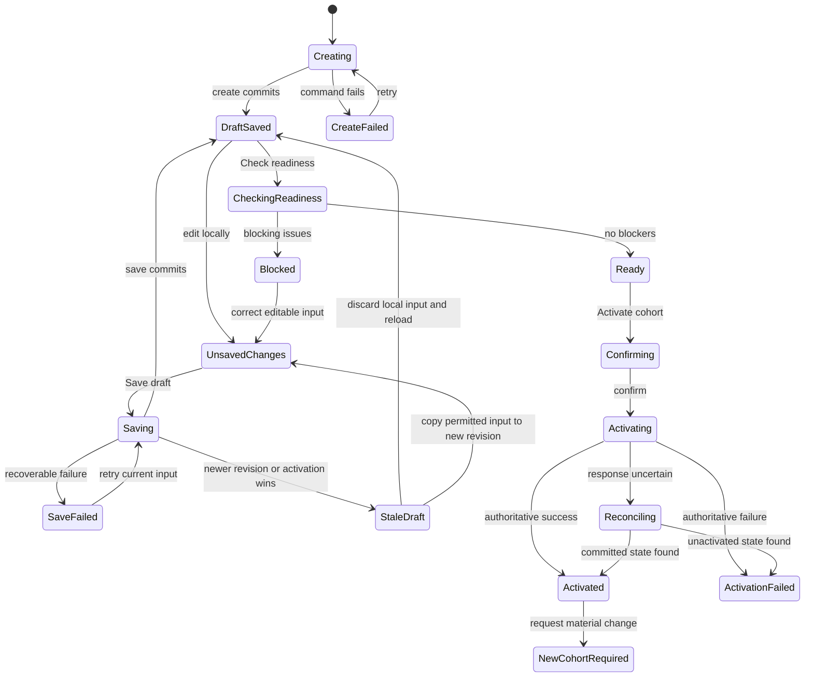

# Assessment Campaign setup interaction specification

## Document metadata

| Field | Value |
| --- | --- |
| **Status** | Approved |
| **Owner** | Product Lead |
| **Approvers** | Product Lead, UI/UX reviewer, Architecture Lead, Security/Privacy reviewer |
| **Version** | 0.1 |
| **Prepared date** | 2026-08-09 |
| **Approved date** | 2026-08-09 |
| **Approval reference** | Product decision confirmed on 2026-08-09 after business-analysis, UI/UX, architecture, security/privacy, traceability, and repository-consistency review; all `UI-ACT-DEC-*` decisions approved, including the clarified unsaved-navigation and Stable-memory behavior |
| **Audience** | Product, design, frontend, backend, security/privacy, QA, and implementation reviewers |
| **Governs** | Activity-administrator interaction for creating, saving, checking readiness, activating, and inspecting a P0 assessment Campaign and its cohort baseline |
| **Journey** | [`JRN-MVP-1`](activity-campaign-journey.md#jrn-mvp-1-configure-and-activate-assessment-campaign) |

This approved UI/UX contract is authoritative for assessment Campaign setup
interaction concerns. Approved product documents, feature specifications, and
ADRs remain authoritative within their respective areas of concern.

## Purpose and intended outcome

The setup experience helps an authorized Activity administrator prepare one
assessment Campaign and deliberately activate one cohort without obscuring the
fairness, authorization, or audit boundary.

The experience is successful when the administrator can:

- distinguish an unsaved local edit, saved Activity revision, readiness result,
  activation request, and activated cohort;
- select only permitted existing sources and understand their exact revisions
  without entering a reusable Agent or Harness authoring flow;
- find and correct every safely disclosable blocker while retaining recoverable
  work;
- understand which values will become immutable before activation;
- recover safely from stale state, lost permission, dependency failure,
  duplicate submission, or an uncertain activation response; and
- inspect an activated baseline in readable form before technical provenance,
  then continue to Participant assignment when authorized.

The system outcome remains the one defined by the approved
[assessment setup specification](../requirements/features/assessment-setup.md):
one immutable, verifiable baseline atomically bound to one activated cohort,
or a recoverable unactivated draft with an honest outcome.

## Authority and upstream sources

| Concern | Governing source |
| --- | --- |
| Product concepts and fairness | [Concept model](../product/concept-model.md), especially Activity, Campaign, effective configuration resolution, and assessment fairness |
| MVP boundary | [MVP scope](../product/mvp-scope.md#mvp-validation-slice) |
| Observable setup and activation behavior | [Assessment setup](../requirements/features/assessment-setup.md) |
| Authentication, authorization, isolation, and denial | [Authorization and resource isolation](../requirements/features/auth-resource-isolation.md) |
| Platform journey and information architecture | [Activity journey and Campaign information architecture](activity-campaign-journey.md) |
| Application-session defaults | [MVP operational defaults](../requirements/mvp-operational-defaults.md#oidc-and-application-session-defaults) |
| SPA/server authority boundary | [MVP architecture](../architecture/mvp-architecture.md#approved-mvp-realization-decisions), especially `AR-DEC-12` |
| Baseline identity, digest, atomicity, idempotency, and recovery | [ADR-004](../architecture/decisions/ADR-004-assessment-activation-baseline-and-atomicity.md) |

## Scope and boundaries

### In scope

- Create a P0 Activity whose form is `Campaign` and configured type/use case is
  `Assessment`.
- Create or resume a server-owned draft and save auditable Activity revisions.
- Select permitted existing Agent and Harness sources and other exact,
  versioned assessment bindings.
- Configure the single MVP Task, Submission requirements, timing and Attempt
  bounds, cohort rules, Stable-memory read choice, and required review policy.
- Inspect inherited and resolved values that setup may narrow but not edit or
  widen.
- Check readiness, correct blockers, review warnings, and inspect the candidate
  configuration.
- Deliberately confirm cohort activation and reconcile pending or uncertain
  outcomes from authoritative state.
- Inspect the immutable activated baseline and follow the authorized handoff to
  Participant assignment.
- Start a new Activity revision and cohort candidate when a material change is
  needed after activation.

### Out of scope

- General Agent, Harness, rubric, workflow, model, knowledge-source, or memory-
  snapshot creation and editing.
- Participant identity administration, Enrollment mutation, invitation
  delivery, accommodations, actual permitted Session timing, Attempt
  consumption, and Submission intake.
- Session execution, Evaluation, Human revision, Review decision, Result, and
  Release interaction.
- Voice, tools, Dynamic memory, shared Sessions, and non-Campaign Activity
  forms.
- A general Organization switcher, custom retention policy authoring, legal-
  hold administration, or raw audit export.
- Visual styling tokens and shared components that belong to the later design-
  system foundation. This document defines required behavior and hierarchy.

## Actors and visible capability boundaries

| Actor or service | Setup experience | Boundary shown in the interface |
| --- | --- | --- |
| Activity administrator | Create, edit, save, check readiness, inspect differences, and activate within current delegated scope | Membership or an administrator label does not imply source-content access, exception approval, history access, or activation authority |
| Organization administrator | May see permitted defaults, eligibility, or actions returned for the current resource | Organization membership does not expose every source or create an activation bypass |
| Assigned Reviewer | May open the permitted readable baseline summary for an assigned case | No draft editing, activation action, hidden source content, unrelated cohort, or secret value |
| Participant | No setup destination or setup-internal view | Only later participant-visible instructions and operational facts may appear |
| Activation service | Returns validation, activation, reconciliation, and safe reason categories | Browser values, prior readiness, role labels, and known identifiers are never authority |
| Audit/compliance reviewer | May open separately authorized history or provenance | Audit access does not imply raw source or Participant-content access |

Navigation and controls are based on current server-confirmed actions. Hiding a
control reduces confusion and disclosure risk; it is not an authorization
control.

## Approved interaction decision dispositions

The following decisions were approved on 2026-08-09. Stable IDs are retained
for traceability and future supersession.

| ID | Approved decision | Rationale and consequence |
| --- | --- | --- |
| `UI-ACT-DEC-1` | Use one sectioned **Setup and readiness** page with an adjacent or in-flow status/action summary, not a sequential wizard. | Administrators can revisit interdependent settings, see inherited constraints, and correct multiple readiness blockers without losing context. |
| `UI-ACT-DEC-2` | Use explicit **Save draft** and **Check readiness** actions; do not represent local editing as automatically saved. Warn before any in-app or browser navigation that would discard unsaved changes. | Makes the Activity revision boundary and recoverable local state clear while preventing accidental loss. |
| `UI-ACT-DEC-3` | Offer **Activate cohort** only for the current saved revision after readiness returns no blocking issue; activation still reauthorizes and revalidates everything. | Provides a deliberate UX sequence without treating readiness as commit authority. |
| `UI-ACT-DEC-4` | Confirm routine activation in one accessible confirmation dialog without a typed phrase or second-person approval. | Matches the approved single-administrator rule while keeping the immutable consequence explicit. |
| `UI-ACT-DEC-5` | Present a readable baseline summary before technical provenance, with protected identifiers and digest details available only to separately authorized actors. | Supports fairness review while minimizing disclosure and cognitive load. |
| `UI-ACT-DEC-6` | Treat an uncertain activation response as **Reconciling** and query authoritative state before offering another activation command. | Prevents blind duplicate activation and false failure or success. |

## Information architecture

### Entry points

An authorized administrator enters setup from one of these scoped locations:

- **Activities** → **Create assessment Campaign**;
- **Activities** → an existing assessment Campaign → **Setup and readiness**;
- **Home** → a Campaign-administration item such as **Continue setup**,
  **Resolve readiness blockers**, or **Activate cohort**; or
- an authorized deep link that resolves current access before protected content
  renders.

The create entry identifies both concepts before the command:

```text
Activity form: Campaign
Configured type: Assessment
```

P0 does not offer other forms or types, but the interface does not rename the
platform concept to “Assessment” or imply that all Activities are Campaigns.

### Campaign hierarchy

```text
Activities
└── Assessment Campaign
    ├── Overview
    ├── Setup and readiness
    ├── Cohorts
    │   └── Cohort
    │       ├── Baseline summary
    │       └── Participants and Enrollments
    └── History (when separately authorized)
```

The page breadcrumb and title preserve the authorized Activity and cohort
context. Opening an Activity does not imply permission for every child or
source.

### Setup page hierarchy

The main task follows this reading and keyboard order:

1. Breadcrumb and **Assessment Campaign** page title.
2. Server-confirmed Campaign, draft, readiness, and cohort statuses.
3. Primary explanation and next permitted action.
4. Error, conflict, or access-change summary when present.
5. Setup sections.
6. Readiness summary and material-value review.
7. Save, readiness, and activation actions.
8. Revision and baseline references that the actor may inspect.

The setup sections are:

1. **Task and Submission requirements**
2. **Agent and Harness**
3. **Assessment behavior**
4. **Timing and Attempts**
5. **Memory and capabilities**
6. **Review and Release requirements**
7. **Cohort**

The order starts with the administrator's assessment intent, then shows the
reusable sources and inherited constraints used to realize it. A section may
contain editable controls, read-only resolved values, or both. Read-only values
must say where they come from and must not look disabled because of an error.

## State model

The interface exposes four related state tracks rather than one overloaded
status.

### State tracks

| Track | States presented to the administrator | Meaning |
| --- | --- | --- |
| Local edit | No local changes; unsaved changes; local validation issue | Browser-held input that has not committed and is not an Activity revision |
| Draft revision | Creating; saving; saved revision; save failed; stale revision | Server-owned editable Activity state |
| Readiness | Not checked; checking; blockers found; ready with warnings; ready; result out of date | Advisory result for one exact saved revision |
| Cohort activation | Draft; confirmation open; activating; reconciling; activation failed; activated; new cohort required | Authoritative cohort lifecycle and pending UI states around it |

Any saved material change makes an earlier readiness result visibly **Out of
date**. Unsaved changes also prevent the interface from presenting that result
as current. A current ready state remains advisory; the confirmation and
pending state say that activation performs final checks again.

### State transitions



Text equivalent: a committed create produces a saved draft. Local edits remain
unsaved until **Save draft** commits. Readiness applies to one saved revision.
Only a current result without blockers proceeds to confirmation. The activation
request may resolve to activated, failed, or reconciling. Reconciliation reads
authoritative state. An activated cohort is immutable; a material change starts
a new revision and cohort candidate.

## Setup controls and field behavior

### Shared control rules

- Every editable field has a persistent visible label, concise instruction when
  the expected value is not obvious, and a programmatically associated error.
- Required fields are identified in text. A required marker is supplementary
  and never the only indication.
- Field-level client checks may help early, but only server responses establish
  a saved revision, readiness outcome, or valid activation candidate.
- The interface preserves safe local values on validation and transient failure
  and labels them **Unsaved changes** until committed.
- A source name, description, or other supplied label renders as inert text and
  cannot create trusted controls, links, or markup.
- Read-only inherited values use an **Inherited from …** or **Resolved from …**
  label. They are not rendered as editable disabled form controls.
- If a current upper-scope value narrows an administrator entry, the interface
  shows the requested value, effective value, source category, and safe
  explanation returned by the server. It never implies that a wider request
  became effective.

### Task and Submission requirements

The section binds exactly one versioned MVP Task and its versioned Submission
requirements. It shows:

- permitted Task name and exact revision;
- Submission requirement name and exact revision;
- whether either source is unavailable, mutable-only, stale, or incompatible;
  and
- an owning administrative route only when the actor is authorized to use it.

Setup does not expose reusable Task or Submission-requirement content editing.
Changing the selection marks local changes and makes the prior readiness result
out of date.

### Agent and Harness

Agent and Harness selectors list only sources returned in the current scoped
query. Each option exposes the minimum needed to choose safely:

- permitted human-readable name;
- exact revision or immutable snapshot label;
- current eligibility status; and
- Organization context when needed to disambiguate permitted choices.

Search, autocomplete, totals, pagination, and empty results use the authorized
set only. An empty state says, **No permitted Agent revisions are available** or
**No permitted Harness revisions are available**, followed by a safe owning
administrative action when one exists. It does not reveal that inaccessible
sources exist.

Setup may open a separately authorized read-only source summary. It does not
offer **Create**, **Edit**, **Publish**, **Restore**, or **Use latest** controls.
A mutable alias must resolve to an exact revision and that resolution must be
visible before activation.

### Assessment behavior

The section shows the exact or resolved bindings for:

- model deployment identity in permitted product language;
- knowledge-source versions;
- text workflow and completion policy;
- adaptive-follow-up fairness policy;
- rubric and Evaluation procedure; and
- Evidence requirements.

The administrator may select or narrow only values exposed as permitted by the
server. Provider endpoints, credentials, hidden prompts, raw knowledge, rubric
content, private deployment details, and unrestricted identifiers are absent.

### Timing and Attempts

The section presents Campaign and cohort timing rules, deadlines, permitted
Session-window bounds, positive Attempt limit, and positive per-Attempt duration
when configured.

- The named display timezone is visible beside all local date/time controls.
- A summary repeats each saved instant in the named timezone and provides UTC
  interpretation in provenance when permitted.
- Start/end and deadline ordering errors identify both affected fields.
- Nonexistent or ambiguous local times receive a field-specific explanation
  and require an explicit valid value; the browser must not silently normalize
  them.
- Participant-specific accommodations and actual permitted Session windows are
  labeled as later Enrollment/Attempt concerns and are not editable here.
- Client clocks do not determine validity or urgency.

### Memory and capabilities

**Stable memory** means the assessment interaction cannot create or update
long-term reusable memory. The Agent may still use its frozen instructions,
permitted versioned knowledge sources, the Participant's authorized Submission,
and temporary working context for the current Session. That temporary context
does not become reusable memory after the Session.

**Approved memory** is different from a knowledge source or current Session
context. It is previously retained information that passed the platform's
memory-governance process and is eligible for reuse under a defined scope and
policy. An Organization may have approved memory even when a particular
assessment is not permitted to retrieve it.

The default **Stable memory — do not read approved memory** therefore means:

- do not retrieve any previously approved reusable memory for this cohort;
- do not write new persistent memory from assessment interactions;
- do not learn across Participants; and
- continue using the explicitly frozen Agent, Harness, Task, knowledge,
  workflow, rubric, and current-Session inputs.

This is the safest fairness default because changing or Participant-specific
approved memory cannot influence different cohort members. It also reduces
unnecessary reuse of information from earlier interactions.

New drafts initialize with the selected option:

- **Stable memory — do not read approved memory** (default); or
- **Stable memory — read one approved memory snapshot**.

The second option still prohibits new persistent learning. It permits retrieval
only from one immutable, Organization-owned snapshot frozen for the cohort, so
all cohort Sessions use the same eligible memory state even though individual
retrieval results may depend on the current authorized Session context.

Selecting snapshot-backed reads reveals one required scoped selector. The
option shows the exact immutable snapshot identity and eligibility status. A
missing, mutable, unavailable, cross-scope, or unverifiable snapshot produces a
blocking issue and cannot be replaced silently.

The same section contains a read-only **MVP capability profile**:

| Capability | Required setup presentation |
| --- | --- |
| Text interaction | Enabled |
| Voice | Disabled for MVP |
| Tool execution | Disabled; no tools permitted |
| Dynamic memory writes | Disabled |
| Cross-Participant learning | Disabled |
| Shared Session | Disabled |
| Direct, embedded, or API Activity | Not available for this Campaign |

This summary is not a set of toggles. An attempted widening appears as a
blocking issue with the safe source category and resolution decision.

### Review and Release requirements

The section displays the selected or inherited human-review and Release gate.
It must not suggest that setup grants Review or Release permission, or that an
activated cohort permits automated Release.

### Cohort

The section identifies the draft cohort and its cohort-level rules. It states:

> You can activate this cohort before assigning Participants. Assignment does
> not change the activation baseline.

Participant names, counts, search, and assignment controls are absent from
setup unless the actor enters the separately governed **Participants and
Enrollments** surface after activation.

## Save and revision interactions

### Save draft

1. Editing any value sets **Unsaved changes** beside the draft status.
2. **Save draft** validates the local representation and submits the expected
   current revision.
3. While saving, the button is labelled **Saving…** and conflicting save or
   activation actions are unavailable. An attempted navigation that could
   discard the pending local state uses the unsaved-change warning defined
   below.
4. Success announces **Draft revision saved** and shows the new permitted
   revision label and save time.
5. Validation failure keeps the local input, focuses the error summary, and
   links each safely disclosable error to its field or section.
6. A transient failure says the draft was not saved and offers **Try saving
   again** without implying that no server outcome is possible when the result
   is uncertain.

### Leave with unsaved changes

Whenever the page has unsaved changes, the interface must warn before an action
would unload the page, switch Activities, open another Campaign, follow a shell
destination, reload, close the tab/window, or otherwise discard those changes.

For navigation controlled by the application, show:

- title: **Unsaved changes**;
- message: **Your latest changes have not been saved. Save them before leaving
  this page, or leave and discard them.**;
- primary action: **Save draft and leave**;
- safe secondary action: **Stay on page**; and
- destructive action: **Leave without saving**.

**Save draft and leave** navigates only after the server confirms the new draft
revision. A validation error, stale conflict, uncertain save outcome, access
change, or dependency failure keeps the administrator on the setup page and
uses the owning recovery state. **Leave without saving** discards only the
local unsaved values; it does not delete or alter the last saved revision.

For browser-controlled reload, close, or external navigation where a custom
dialog or asynchronous save cannot be guaranteed, use the browser's native
unsaved-change prompt. The interface must not claim that choosing to leave will
save the draft. The warning is removed immediately after a confirmed save or a
deliberate discard, and it must not expose setup values in its message.

If authorization expires or changes, protected content and prohibited controls
are removed before any save attempt. Local values may remain only when the same
actor and application context can retain them without privacy risk; otherwise
the page explains that the values cannot be retained rather than exposing them
to another actor.

### Stale revision

When another save or activation wins, the page shows **This draft changed** and
the current authoritative state before another mutation. The stale-state view:

- retains safe local values as **Your unsaved version**;
- summarizes changed categories without exposing protected values;
- offers **Reload current draft**; and
- offers **Copy my values to a new revision** only when the server returns that
  action as authorized and valid.

There is no automatic merge and no last-write-wins overwrite. If the cohort is
already activated, the recovery path becomes **View activated baseline** or
**Create new cohort**, not save to the original cohort.

## Readiness interaction

### Check readiness

**Check readiness** operates on the exact saved revision shown on the page.
Unsaved changes must be saved or deliberately discarded first.

While checking, the page:

- announces **Checking readiness** without replacing the saved draft status;
- keeps the prior protected summary hidden if current authorization has not yet
  resolved;
- prevents only conflicting readiness or activation commands; and
- does not imply that a passing result reserves sources or permission.

### Readiness result

The result starts with one of these headings:

- **Readiness blocked** — one or more blocking issues;
- **Ready with warnings** — no blocker and at least one warning; or
- **Ready to activate** — every required category passed and there is no
  warning.

The result groups material values by the setup sections and shows:

- the current saved revision the result applies to;
- checked time in the named timezone;
- category status using icon, text, and structure;
- all safely disclosable blocking categories before warnings;
- affected source or field label;
- safe reason and recovery action; and
- source exact-version status without raw protected content.

The first blocking issue receives focus through the linked summary only after
the administrator follows its link; initial result focus moves to the result
heading so the complete outcome is announced first. Warnings do not block
activation but remain visible in confirmation.

A save, authoritative source change, or permission change makes the result
**Out of date**. Activation still repeats current authorization and validation
at commit even if the displayed result is current.

### Exception state

An exception path appears only when a separately approved rule and a current
server-authorized action permit it. The UI never invents an override from a
generic administrator role.

When an exception is required, readiness shows:

- the bounded rule category and affected value;
- why ordinary activation is blocked;
- whether approval is missing, pending, approved, expired, or stale;
- the reason and scope fields required by the owning approved rule; and
- the additional approver and immutable reference only to actors authorized to
  see them.

**Activate cohort** remains unavailable until the server returns a current,
bounded, approved exception reference. No exception may widen a non-bypassable
Organization boundary.

## Activation interaction

### Open confirmation

The **Activate cohort** action is visually primary only when the current saved
revision is ready and activation is currently permitted. It opens an accessible
modal dialog on wide layouts and an equivalent full-width dialog surface when
space is constrained.

The dialog uses:

- title: **Activate cohort?**
- consequence: **Activation freezes this cohort's assessment configuration.
  Material changes will require a new Activity revision and cohort.**
- the saved revision and candidate cohort;
- a compact summary of Task, Agent, Harness, timing, Attempts, memory, disabled
  capabilities, rubric/Evaluation, and review/Release gate;
- any warnings and permitted approved exceptions;
- primary action: **Activate cohort**; and
- secondary action: **Cancel**.

The dialog does not use preselected consent, a typed phrase, a countdown, or a
second approver for routine activation. Initial focus goes to **Cancel**, with
the title and consequence programmatically associated; focus is contained,
Escape performs **Cancel**, and closing restores focus to the trigger.

### Activating

After confirmation:

- the dialog closes into an in-page **Activating cohort…** status;
- the duplicate activation action is unavailable;
- the page states that authorization and every source are being checked again;
- no success styling, Participant-assignment action, or activated label appears
  before authoritative success; and
- safe navigation remains possible because the request is reconciled by
  authoritative state, not the open browser connection.

### Uncertain response and reconciliation

If the response is lost or times out, the page shows:

> **Checking activation status**
>
> We have not confirmed whether activation completed. Do not activate again
> while we check the current cohort state.

The client queries the current authorized cohort state using the correlation or
idempotency context supplied by the server. It may use bounded polling when a
status stream is unavailable. Reconciliation ends in:

- **Cohort activated** with the existing baseline;
- **Activation did not complete** with a safe retry or administrator action; or
- **Status is still unavailable** with a stable support reference and no blind
  retry.

Connection loss is not shown as activation failure and does not imply that a
server operation paused.

### Activated success

Success focuses and announces **Cohort activated**. The page states the exact
committed outcome and shows:

- immutable baseline status;
- permitted baseline reference and digest verification status;
- Activity revision, cohort, actor, and activation time;
- readable frozen-value summary;
- memory state and disabled capabilities;
- warnings or approved exceptions that became part of the baseline;
- **Assign Participants** as the next permitted action; and
- **View baseline details** and **View history** only when separately
  authorized.

Success does not imply that a Participant is assigned, an Enrollment exists, a
Session can start, an Evaluation exists, or a Result is released.

### Activation failure

The interface uses stable, non-sensitive categories and names the consequence:
**The cohort was not activated. Participants cannot be assigned through this
cohort yet.**

| Failure category | Required recovery presentation |
| --- | --- |
| Current validation blocker | Link to affected setup category, preserve the saved draft, and offer **Review blockers** |
| Source changed or became unavailable | Identify the safe source category, mark readiness out of date, and offer **Check readiness again** after correction |
| Access changed | Remove protected values and prohibited controls; offer **Back to Activities** or a configured support route |
| Stale or competing activation | Show current authoritative cohort status and offer **Reload current state** |
| Integrity mismatch | State that a required version could not be verified; do not offer substitution or **Use latest** |
| Required audit or persistence unavailable | State that activation did not commit; offer a bounded retry only when returned as safe |
| Status unavailable after reconciliation | Show a stable support reference and keep the cohort unconfirmed; do not offer a blind second activation |

Failures never expose provider details, secret values, hidden prompts, raw
knowledge or rubric content, or inaccessible source identities.

## Activated baseline and material-change interaction

### Readable baseline summary

The default view uses this hierarchy:

1. **Cohort activated** status and activation time.
2. What the baseline means and whether its digest currently verifies.
3. Task, timing, Attempts, Agent/Harness, assessment behavior, memory,
   capabilities, and review/Release summaries.
4. Resolution labels: **Inherited**, **Activity supplied**, **Cohort supplied**,
   **Derived**, **Most restrictive**, or **Approved exception**.
5. Superseding relationship or degraded/unverifiable status when applicable.
6. Technical provenance, protected source references, and copyable identifiers
   for separately authorized actors.

Long source lists and provenance tables have a linear definition-list or card
alternative. A matching digest is described as content verification, not proof
of authorization, ownership, availability, or permission to disclose.

### Material change after activation

An activated cohort has no edit controls for fairness-sensitive baseline
values. **Change assessment configuration** opens an explanation:

> This cohort's baseline is immutable. To change a material value, create a new
> Activity revision and cohort. Existing Enrollments, Sessions, Evidence,
> Evaluations, and Results stay linked to this baseline.

The actions are **Create new cohort** and **Cancel**. The new candidate may be
prefilled from permitted values, but it receives a new draft revision and must
complete readiness and activation independently. The original baseline and a
later superseding link remain inspectable.

## Shared state and content contract

| State | Heading or label | Required next-action behavior |
| --- | --- | --- |
| Initial | **Create assessment Campaign** | Explain form/type and offer create only when currently permitted |
| Loading | **Loading Campaign setup** | Render structure without protected values; resolve authorization first |
| Empty selector | **No permitted … revisions are available** | Offer only a returned authorized owning action or contact route |
| Unsaved | **Unsaved changes** | Warn before leaving; offer **Save draft and leave**, **Stay on page**, and **Leave without saving** for in-app navigation |
| Saving | **Saving draft…** | Prevent conflicting save/activation; do not claim a new revision |
| Saved | **Draft revision saved** | Show current revision and **Check readiness** |
| Blocked | **Readiness blocked** | Focus result summary and link every safe blocker to correction |
| Ready | **Ready to activate** | Offer deliberate **Activate cohort** when still permitted |
| Activating | **Activating cohort…** | Prevent duplicate command and wait for authoritative outcome |
| Reconciling | **Checking activation status** | Query authoritative state; do not offer blind retry |
| Failed | **The cohort was not activated** | Preserve permitted draft and show bounded recovery |
| Conflict | **This draft changed** | Preserve safe local input and show current state before mutation |
| Access changed | **Your access changed** | Remove protected content and focus safe return/support action |
| Activated | **Cohort activated** | Show exact committed baseline and **Assign Participants** when permitted |
| Immutable change | **Create a new cohort to make this change** | Keep original baseline unchanged |

Messages name the owning object. The UI does not use generic **Complete**,
**Approved**, **Published**, **Available**, or **Released** for setup outcomes.

## Accessibility contract

WCAG 2.2 AA is the approved target inherited from the Activity journey.

### Structure and navigation

- Provide skip navigation to primary navigation, the page title/status, and the
  setup main region.
- Use one page-level heading, ordered section headings, landmarks, and a
  programmatically determinable current Activity and cohort.
- The section navigator follows document order and indicates the current
  section without relying on color.
- Keyboard users can reach every field, summary link, dialog, and next action
  without pointer, hover, drag, sound, motion, or timing-dependent gestures.

### Focus and announcements

| Event | Focus and announcement behavior |
| --- | --- |
| Save success | Keep focus on the initiating control and announce the new saved revision politely |
| Validation failure | Move focus to the error-summary heading; links move to and identify the affected field or section |
| Readiness completion | Move focus to the readiness-result heading and announce blocker/warning counts without repeating the full content |
| Activation dialog opens | Move focus inside the dialog, expose title and consequence, contain focus, and restore it on cancel |
| Activation begins | Move focus to or announce the in-page pending status once; do not repeatedly interrupt reading |
| Activation succeeds | Move focus to the success heading and expose the next permitted action |
| Conflict or permission loss | Move focus to the state heading or safe next action and prevent access to removed controls |
| Content refresh | Preserve focus and reading position unless the current control is no longer permitted; then move to the explanation |

Errors and statuses use text, headings, icons with accessible names where
needed, and structural grouping. Color may reinforce but never carry the only
meaning. Loading indicators have programmatic names; reduced motion preserves
state changes without required animation.

### Forms and time input

- Instructions and errors are programmatically associated with their fields.
- Source selectors expose option name, exact version, and status to assistive
  technology without an excessively verbose repeated announcement.
- Date/time controls expose the named timezone in the label or description.
- Error summaries identify counts and categories; they do not announce
  protected values.
- Read-only provenance uses semantic text or definition lists rather than
  disabled controls.

## Responsive behavior

At wide widths, the sectioned form may use a main column with a secondary
status/action summary. At narrow widths and 400 percent zoom:

1. Campaign identity and server status remain first.
2. The error or readiness summary follows when present.
3. Setup sections use one reading column.
4. Primary and secondary actions remain in document order and do not cover
   fields, messages, or the activation consequence.
5. Section navigation becomes a labeled menu or selector with equivalent names
   and order.
6. Tables become labeled cards or definition lists; horizontal clipping is not
   the only way to reach values.
7. The activation confirmation reflows as one column and remains fully
   operable without an internal two-direction scroll trap.

No content, action, state, consequence, or recovery path is removed solely
because the viewport is narrow.

## Security and privacy UX controls

- Protected setup content does not render from stale cache before current page
  authorization resolves.
- Lists, search, option counts, suggestions, pagination, and empty states derive
  only from the current authorized set.
- A deep link or known identifier is treated as a locator. Missing and
  inaccessible targets share the owning non-disclosing unavailable state.
- Client-provided Organization, Activity, cohort, source, revision, digest,
  role, or actor values are never presented as server-verified authority.
- Access change removes protected content and prohibited controls at the next
  protected read or mutation. Safe local input may remain only while the same
  actor and authorized application context can retain it without privacy risk.
- Source labels and descriptions render as inert untrusted text. They cannot
  execute code, load remote content, imitate trusted status, or issue a
  mutation.
- Raw prompts, knowledge and rubric content, credentials, tokens, private
  endpoints, unrestricted identifiers, Participant data, and hidden policy
  details do not appear in setup screenshots, errors, metrics, or client logs.
- Baseline and history links are independently authorized; page access does not
  grant export or raw-content access.
- A denial is side-effect free except for the required security audit and does
  not reveal whether an inaccessible resource exists.
- The Participant shell does not include setup routes, source selectors,
  baseline internals, rubric details, digests, or activation history.

## Failure and recovery matrix

| Scenario | Visible outcome | Preserved state | Verification focus |
| --- | --- | --- | --- |
| Create command rejected | Generic unavailable or actionable validation state | No false Activity card or protected data | `AC-ACT-1`, `AC-AUTH-5`, `AC-AUTH-13` |
| Required source missing | Readiness blocker at the owning section | Last saved draft and safe local values | `AC-ACT-4` |
| Wrong-Organization or forged source | Non-disclosing invalid/unavailable source state | No cross-scope option or baseline reference | `AC-ACT-3`, `AC-AUTH-4`, `AC-AUTH-9` |
| Capability widening | Requested/effective comparison and blocking or most-restrictive result | Saved draft without widened effective value | `AC-ACT-5`, `AC-AUTH-10` |
| Invalid memory choice | Blocking memory issue | Default no-read or last valid saved choice | `AC-ACT-9`, `AC-ACT-10`, `AC-ACT-26` |
| Invalid or ambiguous time | Field-specific error with timezone | Entered values remain local | `AC-ACT-19` |
| Stale save | Conflict state; no overwrite | Recoverable local version and current safe summary | `AC-ACT-18` |
| Source or permission changes after readiness | Activation blocked after commit-time revalidation | Saved draft remains when still authorized | `AC-ACT-6`, `AC-AUTH-11` |
| Concurrent activation | Existing result or current conflict state | Winning baseline unchanged | `AC-ACT-15` |
| Activation response lost | Reconciling, then authoritative success/failure/unknown | No duplicate command | `AC-ACT-15`, `AC-ACT-16` |
| Audit or persistence failure | Cohort not activated; bounded retry/support action | Last saved authorized draft | `AC-ACT-16`, `AC-ACT-17`, `AC-AUTH-22` |
| Permission lost while open | Protected values removed; safe return/support action | Local input only when safe for the same actor/context | `AC-ACT-21`, `AC-AUTH-20` |
| Material post-activation change | New-cohort-required explanation | Original baseline and relationships unchanged | `AC-ACT-13`, `AC-ACT-14` |
| Baseline later unverifiable | Honest degraded/unverifiable status | Original references and digest; no substitution | `AC-ACT-14`, `AC-ACT-20` |

## Traceability

| Interaction surface or state | Governing acceptance criteria | Repeatable verification after implementation | Playwright evidence after implementation |
| --- | --- | --- | --- |
| Create and resume scoped draft | `AC-ACT-1`–`AC-ACT-3`; `AC-AUTH-4`, `AC-AUTH-5`, `AC-AUTH-7`, `AC-AUTH-9`, `AC-AUTH-13` | Create, wrong scope, forged parent, source-list leakage, and resume contract tests | Empty and populated Activities; create success/failure; authorized deep link |
| Setup fields and exact source selection | `AC-ACT-2`–`AC-ACT-5`, `AC-ACT-19`, `AC-ACT-23` | Required category, exact revision, widening, timezone, and list/count tests | Each section; selector empty/loading/unavailable; field and summary validation |
| Draft save, leave warning, and concurrency | `AC-ACT-1`, `AC-ACT-16`, `AC-ACT-18` | Revision, optimistic concurrency, idempotent save, failed save-and-leave, in-app navigation interception, browser unload warning, deliberate discard, and failure-preservation tests | Unsaved, leave-confirmation, saving, saved, validation, transient failure, and stale two-tab states |
| Memory and MVP capability profile | `AC-ACT-9`–`AC-ACT-11`, `AC-ACT-26` | Default no-read, explicit snapshot, Dynamic/tool/voice/shared-session negative tests | Default and snapshot choice; invalid snapshot; read-only disabled-capability summary |
| Readiness | `AC-ACT-4`–`AC-ACT-6`, `AC-ACT-27` | Complete category matrix, stale source/permission, redaction, and p95 objective tests | Checking, blocked, warning, ready, out-of-date, and safe recovery states |
| Exception presentation | `AC-ACT-5`, `AC-ACT-25` | Missing/stale/unbounded/unauthorized exception and non-bypassable boundary tests | No-action default; required/pending/approved/stale exception states |
| Confirmation and activation | `AC-ACT-7`, `AC-ACT-8`, `AC-ACT-15`–`AC-ACT-17`, `AC-ACT-25`, `AC-AUTH-22` | Atomic fault injection, audit failure, retry, duplicate, concurrency, and commit-time reauthorization tests | Confirmation, activating, lost response, reconciliation, success, and each failure category |
| Activated baseline and new-cohort path | `AC-ACT-8`, `AC-ACT-12`–`AC-ACT-14`, `AC-ACT-20` | Immutability, digest verification, empty-cohort activation, later Enrollment, and supersession tests | Readable/technical summary, degraded status, assignment handoff, new-cohort explanation |
| Denial and protected-content behavior | `AC-ACT-3`, `AC-ACT-20`, `AC-ACT-21`, `AC-ACT-23`; `AC-AUTH-12`, `AC-AUTH-13`, `AC-AUTH-20` | Wrong actor/scope/deep-link, revocation, fail-closed dependency, and content-leakage tests | Loading without flash, unavailable, access changed, keyboard focus, narrow denial state |
| Accessibility and responsive behavior | `AC-ACT-22`, `AC-AUTH-20` | Component accessibility, focus order, live-region, dialog, reflow, and keyboard tests | Desktop and narrow screenshots; 400 percent zoom; keyboard-only; screen-reader snapshot; reduced motion |
| Feature delivery gate | `AC-ACT-24` | Complete negative setup suite remains a release gate | Evidence index links every applicable state and viewport |

## Verification notes

This documentation-only change does not have a meaningful red/green TDD phase.
After implementation exists, verification must include focused component tests,
server contract and negative-authorization tests, activation fault injection,
and the project Playwright MCP workflow through real interactions.

Playwright evidence must cover desktop and narrow layouts for at least:

- initial and empty create states;
- every setup section with empty, selected, unavailable, and validation states;
- unsaved, in-app leave confirmation, browser unload warning, saving, saved,
  stale, and save-failure states;
- checking, blocked, warnings, ready, and out-of-date readiness;
- activation confirmation, activating, uncertain/reconciling, success, and
  audit/persistence failure;
- permission denied and permission lost while open;
- activated baseline, degraded verification, and new-cohort-required states;
- keyboard focus, accessible names and structure, announcements, reduced
  motion, and 400 percent zoom/reflow.

Artifacts must use synthetic data and remain under `.playwright-mcp/`. No raw
Participant data, hidden prompts, rubric or knowledge content, credentials,
tokens, private endpoints, or unrestricted identifiers may appear.

## Open questions

None. The upstream assessment-setup questions and platform UI/UX questions are
approved and preserved in their governing documents. Any consequential new
ambiguity must be recorded here with an interim default and rationale rather
than implemented as an implicit choice.

## Approval record

- Product scope review confirmed that the document organizes approved behavior
  without adding assessment scope or redefining canonical concepts.
- UI/UX review confirmed the hierarchy, state tracks, content, focus, keyboard,
  responsive, 400 percent zoom, unsaved-navigation, and memory-explanation
  behavior.
- Architecture review confirmed that pending, reconciliation, idempotency, and
  server-authority behavior preserve `AR-DEC-12` and ADR-004.
- Security/Privacy review confirmed that scoped selectors, denials, loading,
  local input, memory, baseline inspection, and errors do not widen authority
  or disclose protected scope.
- Traceability review confirmed that every `AC-ACT-1`–`AC-ACT-27` criterion is
  represented. Implementation, automated verification, and Playwright evidence
  remain delivery gaps and are not implied by this approval.

## Related documents

- [UI/UX documentation](README.md)
- [Activity journey and Campaign information architecture](activity-campaign-journey.md)
- [Assessment setup requirements](../requirements/features/assessment-setup.md)
- [Authorization and resource isolation](../requirements/features/auth-resource-isolation.md)
- [MVP architecture](../architecture/mvp-architecture.md)
- [ADR-004: Assessment activation baseline and atomicity](../architecture/decisions/ADR-004-assessment-activation-baseline-and-atomicity.md)
