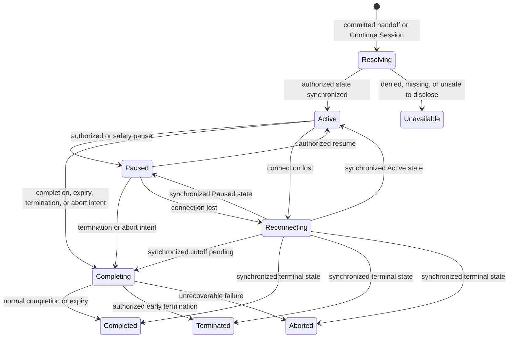
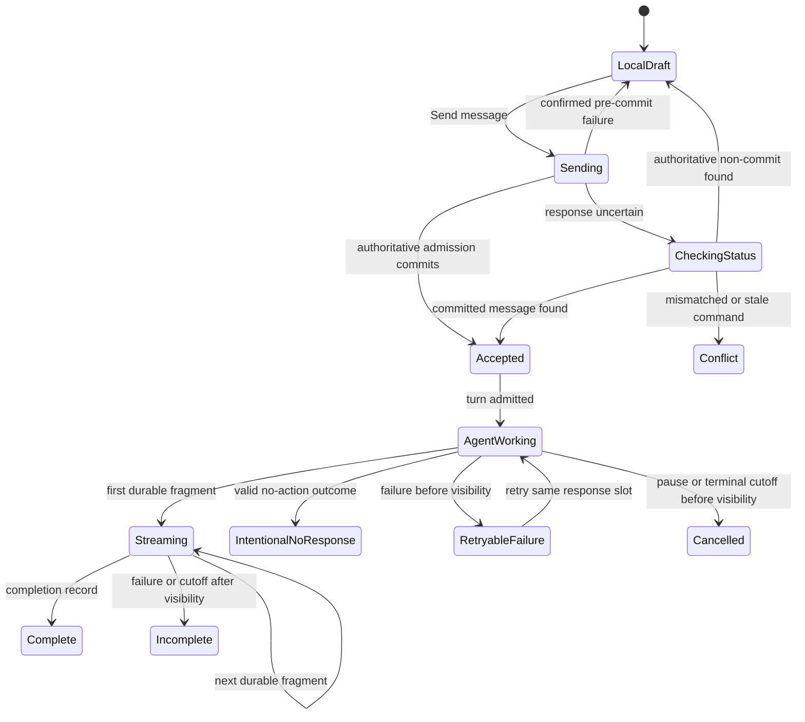

> **In review (Phase 3 preparation).** This file is the distinct representative-journey owner under `docs/ui-ux/flows/`. Until Phase 4 cutover, the Approved v1.0 original at [`docs/ui-ux/text-session.md`](../text-session.md) remains current UI/UX governance. Do not merge this journey with another flow file.

# Text Session interaction specification

## Document metadata

| Field | Value |
| --- | --- |
| **Status** | In review |
| **Owner** | Product Lead |
| **Approvers** | Product Lead, UI/UX Lead, Architecture Lead, Security/Privacy reviewer |
| **Version** | 1.0 |
| **Prepared date** | 2026-08-28 |
| **Approved date** | 2026-08-28 |
| **Approval reference** | Reconstructed and re-approved after the Shipboard production UX reset. Successor of retired v0.5 at Git `eb9c398`. `UI-SESS-DEC-1`–`UI-SESS-DEC-15` remain in force. Voice and the proposed text Interaction Controller are out of P0. |
| **Audience** | Product, design, frontend, backend, security/privacy, QA, and implementation reviewers |
| **Governs** | Participant text Session entry, live interaction, timing, recovery, pause, completion, terminal transcript access, and authorized administrative Session control for the P0 assessment Campaign |
| **Journey** | [`JRN-MVP-4`](activity-campaign-journey.md#jrn-mvp-4-conduct-text-session) |

Version 1.0 is **approved** and is the current Text Session interaction
authority. It reconstructs retired v0.5 subject matter from product and
requirements sources rather than from deleted production pages.

## Purpose and intended outcome

The Text Session experience begins only after the Attempt-start boundary has
committed one active Session. It gives one Participant a focused, recoverable
text examination without making the browser, connection, countdown, or model
output appear more authoritative than the server-confirmed Session record.

The experience is successful when:

- the Participant enters only the committed Session and can identify the Agent,
  current Session state, authoritative remaining time, exact bound Submission
  summary, transcript, composer state, and next permitted action;
- local drafts, sends awaiting an admission outcome, accepted Participant
  messages, incrementally streamed Agent answers, Agent work updates, incomplete
  stream outcomes, and trusted system notices remain visibly and
  programmatically distinct;
- accepted Participant input remains present when Agent processing fails, with
  recovery that does not ask the Participant to send the same answer blindly;
- connection loss preserves honest context and safe local work without claiming
  that the Session or its timer paused;
- warnings, pause, completion, expiry, termination, abort, permission change,
  and unavailable states state their timing effect, preserved content, and next
  safe action in accessible text;
- an authorized Activity administrator can inspect bounded operational state
  and deliberately pause, resume, or terminate without gaining transcript
  access, impersonating the Participant, or changing frozen Session inputs;
- terminal views preserve the exact participant-visible transcript when policy
  permits, while never implying an Evaluation, score, Result, or Release; and
- desktop, narrow, keyboard, screen-reader, reduced-motion, and 400 percent
  zoom experiences retain the same authority, ordering, and recovery meaning.

Observable Session behavior remains governed by the approved
[Text Session lifecycle specification](../../requirements/features/session-text-lifecycle.md).

## Authority and upstream sources

| Concern | Governing source |
| --- | --- |
| Product concepts, Session isolation, workflow, fairness, and outcome-chain separation | [Concept model](../../product/concept-model.md) |
| MVP text-only, one-Participant Session boundary | [MVP scope](../../product/mvp-scope.md#mvp-validation-slice) |
| Session states, messages, timing, pause, completion, transcript, privacy, and acceptance criteria | [Text Session lifecycle](../../requirements/features/session-text-lifecycle.md) |
| Authentication, authorization, isolation, revocation, denial, and historical access | [Authorization and resource isolation](../../requirements/features/auth-resource-isolation.md) |
| Frozen configuration, manifest provenance, disabled capabilities, and accessible resolution failure | [Resolved Session configuration](../../requirements/features/resolved-session-configuration.md) |
| Attempt entitlement, exact Submission binding, and committed Session handoff | [Submission and Attempts](../../requirements/features/submission-attempts.md) and the [Submission and Attempt interaction specification](submission-attempt.md) |
| Application-session and transcript lifecycle defaults | [MVP operational defaults](../../requirements/mvp-operational-defaults.md) |
| Platform journey, IA, content, accessibility, and responsive baseline | [Activity journey and Campaign information architecture](activity-campaign-journey.md) |
| Shared Agent presence, status semantics, interaction-state completeness, and accessibility behavior | [Agent presence](../design-system/product/agent-presence.md), [Status and feedback](../design-system/foundation/status.md), [Interaction states](../design-system/foundation/interaction-states.md), and [Accessibility](../design-system/foundation/accessibility.md) |
| Browser/server authority, request/response plus SSE, and protected-content boundaries | [MVP architecture](../../architecture/mvp-architecture.md) |
| Ordering, durable incremental publication, timing, reconnect, terminalization, and recovery realization | Approved version 0.5 of the [Text Session runtime contract](../../architecture/session-runtime-contract.md), [ADR-009](../../architecture/decisions/ADR-009-mvp-session-evaluation-review-contracts.md), superseding [ADR-011](../../architecture/decisions/ADR-011-participant-visible-agent-response-streaming.md), [ADR-012](../../architecture/decisions/ADR-012-structured-agent-invocation-and-decision-boundary.md), [ADR-013](../../architecture/decisions/ADR-013-agent-requested-next-timer-replacement.md), and [ADR-014](../../architecture/decisions/ADR-014-agent-output-envelope-and-p0-compatibility.md) |

## Scope and boundaries

### In scope

- Present the current participant-visible instructions, timing facts, Attempt
  consequence, completion behavior, data-use notice, and required deliberate
  acknowledgments before start.
- Accept the committed active Session handoff, restore an existing own Session,
  and reject or reconcile stale, duplicate, or uncertain entry state.
- Present one Participant's ordered transcript, Agent identity, exact bound
  Submission summary, Session status, remaining time, warning state, composer,
  Agent work state, and completion action.
- Compose a local text draft; send deliberately; distinguish pending,
  reconciling, accepted, rejected, and conflicting admission outcomes.
- Present Agent answers token by token from durable authoritative fragments,
  preserve complete or incomplete outcomes, and, when enabled by frozen policy,
  present participant-visible predefined work status, concise reasoning
  summaries, and a bounded final explanation.
- Recover from Agent timeout, validation or publication failure, lost command
  responses, duplicate/concurrent sends, multiple tabs/devices, stale state,
  SSE loss, offline state, authentication expiry, and authorization change.
- Present authoritative remaining time, configured warnings, pause timing,
  expiry, and timer reconciliation without making client time authoritative.
- Deliberately request completion; present `Completing`, `Completed`,
  `Terminated`, and `Aborted`; and preserve an immutable participant-visible
  transcript cutoff when current policy permits access.
- Give an authorized Activity administrator a bounded live-Session operations
  view with separately authorized pause, resume, and termination actions.
- Give an assigned Reviewer or other currently authorized actor a read-only
  terminal transcript entry point without defining Evaluation or review work.
- Define content, keyboard, focus, announcements, responsive behavior,
  untrusted-content rendering, privacy boundaries, and verification evidence.

### Out of scope

- Enrollment, Submission intake, accepted-version creation, Attempt entitlement,
  retry-entitlement approval, readiness resolution, or the atomic start command.
- Editing the frozen Agent, Harness, Activity, workflow, warning schedule,
  timing, adaptive-follow-up policy, exact Submission binding, configuration,
  manifest, or memory state.
- Evidence selection, Evaluation generation or inspection, Human revision,
  Review decision, Result construction, Release, appeal, or correction.
- Voice, playback, interruption, tool execution, external retrieval, Dynamic
  memory, calibration reuse, shared Sessions, video, proctoring, or biometric
  behavior.
- The proposed text Interaction Controller, including any composer, send, or
  timer control that the controller would own. P0 uses the approved Session
  lifecycle controls only.
- Participant message edit or deletion after acceptance, private messages to an
  administrator or Reviewer, administrator impersonation, Reviewer participation
  in the live examination, or offline message submission.
- A general transcript repository, unrestricted search, bulk Session control,
  custom audit/retention policy administration, or raw operational diagnostics.
- Shared visual tokens and implementation details owned by the later design-
  system foundation.

## Actors and visible capability boundaries

| Actor or service | Permitted interaction | Boundary shown in the interface |
| --- | --- | --- |
| Participant | Review required pre-start content; enter and restore an own active Session; draft and send text; view published content, time, warnings, pause, recovery, terminal state, and permitted history; request completion | Cannot choose Session ownership, author, order, time, configuration, Submission binding, pause, terminal reason, retry entitlement, or another Participant's data; cannot edit accepted history or reopen a terminal Session |
| Activity administrator | Within current delegated Session-control scope, inspect bounded operational state and deliberately pause, resume, or terminate; open raw transcript only with a separate sensitive-content capability | Organization membership or a role label does not imply control or transcript access; cannot send Participant messages, change frozen inputs, restore entitlement, or reopen a terminal Session |
| Assigned Reviewer | Within an active assignment and permitted workflow state, open the exact terminal transcript and lifecycle summary supplied to the case | Cannot join the live Session, send or edit messages, control lifecycle, browse unrelated Sessions, or release a Result through this surface |
| Session execution service | Return authoritative state, permitted actions, transcript deltas, timer facts, command outcomes, and bounded failure/recovery categories | Browser state, connection state, client time, cached controls, and model-authored text remain advisory or untrusted |
| Audit/compliance reviewer | Within separately delegated scope, inspect minimized lifecycle, ordering, timing, control, and access history | Audit access is not unrestricted transcript, hidden-prompt, credential, or export access |

## Approved interaction decisions

The following decisions were approved on 2026-08-09. Stable IDs are retained
for traceability and future supersession.

| ID | Decision | Rationale and consequence |
| --- | --- | --- |
| `UI-SESS-DEC-1` | Use one focused **Text Session** workspace entered only from a committed active Attempt or an authorized **Continue Session** action. | Prevents a readiness display, route transition, or local timer from being mistaken for Session start. |
| `UI-SESS-DEC-2` | Keep six independently labeled state tracks: access, Session lifecycle, connection, Participant message admission, Agent turn, and authoritative time. | Prevents connection, spinner, send, and countdown states from collapsing into a misleading generic status. |
| `UI-SESS-DEC-3` | Use a stable page hierarchy of Session header, urgent status, ordered transcript, turn-specific Agent activity, composer, completion action, and secondary Session details. | Keeps the live task and governing consequence visible while preserving one semantic order across wide and narrow layouts. |
| `UI-SESS-DEC-4` | Treat the multiline composer as local until deliberate **Send message**. `Enter` inserts a new line; `Ctrl+Enter` or `Command+Enter` may send as a documented shortcut, while the named button remains the primary action. | Reduces accidental assessment submission and gives keyboard users an explicit, testable send path. |
| `UI-SESS-DEC-5` | Represent a send awaiting admission as **Sending — not yet accepted** and a lost response as **Checking message status**. Replace it with the authoritative ordered message only after acceptance; never resend automatically. | Preserves the local/accepted boundary and makes idempotent reconciliation understandable. |
| `UI-SESS-DEC-6` | Stream Agent answers token by token from exact durable-before-display fragments within one stable transcript message. Show **Agent is responding** while the message grows; preserve `Complete`, `Incomplete`, or `Cancelled` outcome. When enabled, keep durable work status and concise summaries in a separate **Agent activity** region and distinguish an optional **Why this response?** explanation from hidden reasoning. | Establishes incremental streaming as an MVP and future foundation while keeping visible exposure replayable and distinct from work traces or raw chain-of-thought. |
| `UI-SESS-DEC-7` | Keep remaining time as persistent text and expose exact governing end facts in **Time details**. Announce configured warnings and expiry, not each countdown tick. | Makes authoritative timing perceivable without overwhelming screen readers or promoting client clocks. |
| `UI-SESS-DEC-8` | During reconnect or offline state, keep already authorized visible context and a safe local draft when same-actor retention is safe, disable sending and completion, state that time may continue, and reconcile before re-enabling commands. | Preserves work without turning connectivity into pause or risking duplicate/stale mutations. |
| `UI-SESS-DEC-9` | Present pause as a high-priority status that disables the composer and any action not returned as permitted while retaining permitted transcript context. Show completion only when the frozen workflow explicitly permits it. State active-time and absolute-deadline effects separately from server facts. | Protects fairness, preserves policy-controlled completion, and avoids the false claim that all time bounds stop. |
| `UI-SESS-DEC-10` | Use one deliberate **Complete Session** confirmation. After the authoritative terminal intent, replace live controls with **Finalizing Session** and then a distinct terminal view that contains no score or Result implication. | Makes the transcript cutoff consequential and separates Session completion from downstream outcome work. |
| `UI-SESS-DEC-11` | Use a separate **Session operations** surface for administrator controls. Raw transcript is closed by default and requires a separate sensitive-content action; pause, resume, and terminate each reconcile uncertain outcomes before another command. | Avoids combining operational control with content surveillance or allowing lost responses to produce duplicate control actions. |
| `UI-SESS-DEC-12` | Preserve a read-only participant-visible terminal transcript through the Assignment while current authorization, relationship, Session visibility, and lifecycle policy permit it. Show unavailable items honestly and never substitute later content. | Implements scoped historical access without leaking Evaluation, review, or unreleased Result content. |
| `UI-SESS-DEC-13` | When authoritative state reports intentional no-action, stop the working indicator, keep the accepted Participant message, publish no synthetic Agent Message, show no error, announce the resolved turn outcome once without moving focus, and expose a neutral persistent turn status only when the workflow says the Participant needs one. Never expose `no_action`, raw Agent Decision data, or hidden reasoning as participant copy. | Resolves pending state accessibly and honestly without turning internal control semantics into transcript content or a false failure. |
| `UI-SESS-DEC-14` | Keep the pending timer, Agent-requested delay, schedule revision, and scheduling rejection out of the Participant transcript and UI by default. When a trusted timer trigger admits visible Agent work, use the existing Agent queued/working and Agent-initiated message states without creating a synthetic Participant message; apply `UI-SESS-DEC-13` if it resolves as no-action. | Preserves a calm Session and avoids exposing internal orchestration while keeping participant-visible Agent activity honest and accessible. |
| `UI-SESS-DEC-15` | Keep Decision-envelope internals, output identifiers, requested-action collections, audience derivation, and deferred voice or rich-content channels out of Participant UI. Continue to render only the existing message-streaming and intentional-no-action states. Do not invent voice, shared-workspace, or reviewer-output surfaces in P0. | Prevents the successor contract from leaking control semantics or enabling deferred interaction. |

## Information architecture

### Participant entry and hierarchy

The Participant enters from:

- **My work** → Assignment → **Continue Session** for an active own Attempt;
- the successful committed handoff from **Start Attempt**; or
- an authorized deep link that authenticates, authorizes, and resolves the
  current Session before protected content renders.

```text
My work
└── Assignment
    ├── Attempt readiness and required acknowledgments (before start)
    ├── Text Session (after committed start)
    │   ├── Session header and authoritative time
    │   ├── Current status and recovery
    │   ├── Ordered transcript
    │   │   └── Turn-specific Agent activity (when enabled)
    │   ├── Message composer
    │   ├── Complete Session
    │   └── Session details
    └── Attempt history
        └── Participant-visible terminal transcript (when authorized)
```

Before the start commit, required instruction and acknowledgment interaction
appears in the Assignment's Attempt-readiness context. After commit, live
interaction appears only in the Text Session workspace. A stale acknowledgment
returns the Participant to the exact missing decision without consuming an
Attempt or exposing a live transcript.

### Administrator entry and hierarchy

An authorized Activity administrator enters from:

- **Activities** → assessment Campaign → cohort → **Sessions**;
- **Home** → an authorized operational item such as **Session needs attention**;
  or
- an authorized Session operations deep link.

```text
Activities
└── Assessment Campaign
    └── Cohort
        └── Sessions
            └── Session operations
                ├── Bounded operational summary
                ├── Time and lifecycle state
                ├── Pause or resume
                ├── Terminate Session
                ├── Control history (when authorized)
                └── Transcript (separate sensitive-content capability)
```

The list and summary must not expose transcript snippets, Submission content,
hidden configuration, internal Agent reasoning, Evaluation state, or another
Participant through counts, loading placeholders, or error copy.

### Participant page hierarchy

Wide and narrow layouts use the same reading and keyboard order:

1. **My work** return context, Assignment title, and **Text Session** heading.
2. Agent identity, Session state, Attempt ordinal, and persistent remaining time.
3. Urgent warning, connection, pause, permission, completing, or terminal status.
4. Ordered participant-visible transcript and the current turn's Agent activity.
5. Message-admission or Agent-turn recovery attached to the affected turn.
6. Message composer and **Send message** while permitted.
7. **Complete Session** and its concise consequence.
8. Secondary **Session details**: exact time boundary, bound Submission summary,
   configured support route, and participant-visible policy facts.

A wide layout may place **Session details** in a side region and keep a compact
time/status header visible. Those repetitions read from one state and do not
create duplicate controls or independent pending outcomes.

## State model

### Independent state tracks

| Track | Participant-facing states | Meaning |
| --- | --- | --- |
| Access | Checking; authorized; reauthentication required; suspended; revoked/expired; unavailable | Whether protected content and new actions remain permitted for the current Participant relationship |
| Session lifecycle | Starting handoff; Active; Paused; Completing; Completed; Terminated; Aborted | Server-authoritative workflow state; terminal states never reopen |
| Connection | Connecting; Connected; Reconnecting; Offline; synchronized | Delivery and recovery projection only; it does not itself change Session lifecycle or time |
| Participant message | Local draft; sending—not accepted; checking status; accepted; failed before acceptance; conflict; blocked | Whether one Participant-authored item is local, uncertain, or immutable transcript content |
| Agent turn | Idle; queued; working; streaming; complete; intentional no reply; incomplete; retryable-before-visibility; paused/cancelled; resolved without effect; terminal failure | Processing and exact visible or non-visible outcome for one accepted message; an accepted message can exist without an Agent answer and a visible answer can end incomplete |
| Authoritative time | Checking; active; configured warning; paused active-time; expired; reconciling; unavailable | Server-derived duration, warning, pause, and terminal facts; the visible countdown is a projection |

The page must not infer one track from another. For example:

- `Offline` does not imply `Paused`;
- a local **Sending** placeholder does not imply an accepted message;
- **Agent is working** does not imply that an answer fragment is published, and
  **Agent is responding** does not imply that the message is complete;
- a countdown reaching zero does not by itself prove terminal commit; and
- `Completed` does not imply that a Result exists or is released.

### Session interaction transition



Text equivalent: entry resolves current authoritative state before live controls
appear. Connection loss overlays recovery on the last permitted lifecycle
context; reconnection may return any current authoritative state. Only an
authorized Session transition moves between `Active`, `Paused`, `Completing`,
and a terminal state.

### Message and Agent-turn transition



Text equivalent: deliberate send changes local UI state, but only authoritative
admission creates the immutable Participant message and Agent turn. Lost
responses reconcile instead of resending. Before Agent visibility, a turn retry
reuses the accepted message and response slot. The first durable fragment claims
one visible Agent message. Later fragments append in order; a failure preserves
that prefix as incomplete and cannot restart or replace it in place. A valid
intentional no-action outcome ends the working state without creating an Agent
Message or error and does not restart on reconnect.

## Pre-start instructions and acknowledgment

The pre-start section appears immediately before **Start Attempt** in the
Assignment and remains visually separate from the live Session.

It presents, in this order:

1. participant-visible Task and text examination instructions;
2. effective duration, absolute end or start-window facts, and named Campaign
   timezone;
3. Attempt-consumption and completion consequence;
4. approved data-use or consent notice required by frozen policy;
5. each required acknowledgment, unchecked by default, with its specific
   consequence and exact visible version label or effective date; and
6. missing, declined, stale, withdrawn, or unavailable state with the next safe
   action.

Informational text is not an acknowledgment. Selecting a required control
records the decision through a separately pending state; it must not be treated
as durable merely because the checkbox changed locally. A declined decision
shows the consequence and return/support action without a Start control. If the
notice changes before start, focus moves to **Review updated requirement**, the
stale decision is not silently carried forward, and no Attempt is consumed.

## Session entry and restoration

### Committed handoff

After the Submission and Attempt surface confirms the atomic start commit:

- navigate to the stable Text Session route for that authoritative Session;
- announce **Attempt N started. Text Session active**;
- load current Session state, time, recent transcript, and bound Submission
  summary from the trusted Session binding;
- show the composer only when state is `Active`, access is current, time permits,
  and message policy allows another turn; and
- never replay the start command or create another Session because navigation,
  event delivery, or transcript loading fails.

### Resolving and loading

The initial skeleton exposes only public structure such as the page heading. It
must not reuse cached transcript snippets, Agent content, Participant identity,
or timing from another Session while authorization is unresolved.

After authorization succeeds, load current lifecycle and time before presenting
live controls. Recent transcript may load with current state while older
authorized history paginates. A loading gap or unavailable older page must not
reorder messages or imply a new terminal cutoff.

### Continue and deep-link recovery

**Continue Session** resolves the own active Attempt and current Session rather
than trusting a cached Session identifier. An authorized deep link returns the
same state as in-product navigation. A stale or inaccessible link shows the
neutral unavailable state and **Return to My work** without confirming whether
another protected Session exists.

## Live Session interaction

### Session header

The persistent header contains:

- **Text Session** and the participant-visible Agent name;
- the current Session lifecycle label;
- **Time remaining** as server-derived text;
- Attempt ordinal when permitted;
- connection or synchronization state only when it needs attention; and
- the Assignment return context when leaving is safe.

Agent identity content cannot resemble or replace trusted state. Hidden model,
provider, prompt, rubric, configuration, or reviewer details are absent.

### Bound Submission summary

**Session details** identifies the exact bound **Submission Version N**, its
item count, and whether each permitted item was available to the Agent when that
distinction is participant-visible. It does not offer replacement, upload,
mutable `latest` selection, or an implication that later versions affect this
Session. Exact content opens only through the separately authorized protected-
artifact behavior defined by the Submission and Attempt specification.

### Transcript structure

The transcript is one ordered semantic list or equivalent structure. Every
visible item exposes:

- author category: **You**, participant-visible Agent name, **Agent activity**,
  or **Session notice**;
- authoritative order;
- inert text/content;
- accepted, streaming, complete, incomplete, cancelled, warning, paused,
  unavailable, or other applicable visible status; and
- an authoritative timestamp through a semantic `time` representation when
  time is displayed.

Participant and Agent content cannot style itself as a Session notice, warning,
button, dialog, or administrator action. Code and long unbroken text wrap or use
a bounded content scroller without creating page-level horizontal overflow.
Links are inert text by default or use an approved safe-link interaction that
never fetches automatically and states the destination before navigation.

Ordinary incoming content appends in authoritative order without moving focus.
If the Participant is reading earlier content, do not force-scroll; present a
named **New Agent message** or **New Session update** control. If the Participant
is already at the current end, the viewport may follow the new item while
preserving focus in the composer.

### Composer

The composer includes:

- label **Your message**;
- multiline text entry;
- current policy limit or a count near the limit when useful;
- **Send message**; and
- concise shortcut help when the optional keyboard shortcut is enabled.

Draft text remains outside the transcript, Agent context, audit transcript,
Evidence, and other devices until deliberate send succeeds. The UI may preserve
the draft through a same-tab recoverable failure. Any cross-reload recovery must
follow the same-actor protected-retention rule; shared-device, logout, actor
change, revocation, or unsafe context clears or hides it.

While a send is pending, disable another conflicting send according to the
frozen concurrent-turn policy but keep the composer text readable. The pending
record says **Sending — not yet accepted**. It does not use the same styling or
semantic role as transcript content.

### Message admission outcomes

| Outcome | Required interaction |
| --- | --- |
| Accepted | Replace the pending record with the authoritative **You** message in its committed order; clear the matching draft; retain composer focus when another message is permitted |
| Confirmed pre-commit failure | Keep or restore the local draft, state **Message was not accepted**, identify a bounded correction or retry, and do not create an Agent-working state |
| Response uncertain | State **Checking message status**, disable blind resend, reconcile the scoped idempotent outcome, and retain the local text until acceptance or confirmed non-commit |
| Equivalent duplicate | Reconcile to the one accepted message and turn without adding a duplicate visual item |
| Mismatched conflict | Preserve the original authoritative item, state that the pending message could not be matched, and require a fresh deliberate action only after current state is synchronized |
| Limit or rate block | State the applicable Participant-facing limit and when or how a permitted retry may occur; do not reveal capacity, another Session, or security thresholds |
| Paused, expired, completing, terminal, or permission change | Do not send; preserve safe local text only under the same-actor rule; move focus to the lifecycle consequence and next safe action |

### Agent activity and streamed answers

After message acceptance, the associated turn may show a polite status such as
**Agent is preparing a response** only after that authoritative turn state or
committed work update is supplied. If frozen policy enables participant-visible
work updates:

- use only the returned predefined status labels or bounded participant-facing
  summaries;
- place them in a region named **Agent activity for your message** and associate
  them with the triggering accepted message;
- keep every displayed update in authoritative order and available in a
  disclosure after the final answer when policy exposes history;
- throttle visual and assistive-technology updates to the frozen rate bound;
- never label the region **Chain of thought**, **Internal reasoning**, or
  language that claims completeness; and
- suppress prohibited content in favor of a permitted generic status without
  repeating the prohibited text in an error.

The Agent answer appears as one stable transcript message after its first exact
fragment is durably published. Label the growing message **Agent is responding**
and append each returned authoritative fragment without replacing earlier text,
moving focus, or treating client-held text as authority. Do not display a
provider delta that has not crossed the durable publication boundary. Present
each provider text delta at the finest granularity the provider exposes; do not
add application batching. A provider may expose a multi-token delta, so the UI
must not claim a literal token boundary that the provider did not supply.

When the authoritative completion record arrives, remove the streaming label
and mark the message complete. Agent-activity history remains separate. If a
configured concise explanation is present, expose it through **Why this
response?** beneath the completed message and label it as a participant-facing
explanation, not complete internal reasoning.

When authoritative turn state instead reports intentional no-action, remove
**Agent is preparing a response** or **Agent is working** and publish no empty,
placeholder, or synthetic Agent transcript message. Do not show `no_action`, a
success toast, or a provider error. If the frozen workflow requires the
Participant to understand that the Turn resolved without an answer, show a
neutral status such as **No Agent reply for this turn** associated with the
accepted message; otherwise add no persistent turn-status content. In either
case, update the shared Agent presence from `Processing` to `Ready` while the
Session remains actively interactive, or to the lifecycle-appropriate state
such as `Dormant` after terminalization. Announce the resolved turn outcome once
through the associated status/live region at a useful rate, do not move focus
for this background state change, and do not rely on the disappearance of a
spinner as the only perceivable update. Reconnect restores this terminal turn
outcome and does not replay the Invocation.

### Timer-triggered Agent activity

Do not show a countdown, scheduled-task row, requested delay, schedule revision,
or rejection message for the internal Agent timer lane. Waiting for the next
timer is ordinary `Ready` Agent presence, not `Processing`. If a trusted timer
trigger later admits an Invocation whose work is participant-visible, transition
to the existing queued/working presentation without fabricating a Participant
message. A permitted Agent Message uses the existing Agent-initiated transcript
path and ADR-011 streaming states; intentional no-action follows the section
above. Announce only participant-relevant working or message state, not the
internal timer firing itself, and do not move focus.

### Agent-turn failure and retry

If Agent processing fails after Participant-message acceptance:

- keep the accepted **You** message immutable in the transcript;
- attach **The Agent could not finish this response** to that turn rather than
  showing a new general send failure;
- if no Agent fragment was visible, show **Retry Agent response** only when the
  current server state permits it and explain that retry uses the accepted
  message without sending it again;
- if fragments were visible, keep the exact prefix, label **Response
  incomplete**, and never restart or replace it in place;
- show **Continue Agent response** only when the frozen workflow returns a new
  explicitly linked continuation action; and
- never label a failed, cancelled, late, or incomplete stream as complete.

If no safe retry remains, present the returned paused, completing, or terminal
state. Protected provider, validation, prompt, manifest, and audit detail is not
shown to the Participant.

## Time, warnings, and expiry

### Persistent time presentation

The live header shows **Time remaining** in a stable text format appropriate to
the duration. **Time details** exposes:

- the server-confirmed start;
- remaining active-duration budget;
- current active or paused state;
- an absolute end when one applies; and
- the named Campaign timezone needed to interpret the wall-clock boundary.

The client may animate or tick between reconciliations, but it must correct to
server facts without suggesting entitlement changed. Do not announce each tick.
If time state is uncertain, label **Updating time**, retain the last confirmed
value as such, and block commands near a potentially crossed boundary until the
authoritative outcome returns.

### Configured warnings

Each configured warning appears at most once as:

- persistent text near the time display;
- an ordered participant-visible Session notice when supplied by the
  authoritative event; and
- one concise announcement, without repeated per-second urgency.

Warning presentation may use icon, color, or reduced motion as reinforcement,
but the remaining time and consequence remain in text. The UI must not invent
fixed warnings absent from the frozen schedule or imply that delayed delivery
extends time.

### Expiry

At the apparent boundary, show **Checking Session end** until the authoritative
state and message cutoff reconcile. After expiry wins, disable live commands,
show **Finalizing Session**, and retain only messages included before the
authoritative cutoff. A rejected late draft remains local only when safe and is
never added to the terminal transcript.

## Connection, multiple-device, and authorization recovery

### Reconnecting and offline

On real-time delivery loss:

- show **Reconnecting. Your Session and time have not been paused by this
  connection issue**;
- mark the transcript and time as last confirmed rather than current;
- disable send, retry, and completion while command state is uncertain;
- preserve a same-actor local draft without sending it;
- provide **Try reconnecting** when automatic retries are bounded or exhausted;
  and
- reconcile lifecycle, time, transcript delta, pending idempotency outcomes, and
  current authorization before restoring actions. A growing Agent message is
  rebuilt only from authoritative ordered fragments; local text is not used to
  infer the next fragment.

If the browser is fully offline, state that the Participant cannot continue
while disconnected. Do not provide an offline queue or auto-submit when the
connection returns.

### Multiple tabs or devices

Every tab displays server-authoritative order. When another tab or device
changes state, stale controls are removed and the current tab says **Session
updated elsewhere** with the synchronized consequence. Equivalent sends
collapse to the same message. Different concurrent sends follow the frozen
pending-turn policy and never use device clocks as order.

### Reauthentication and permission change

When the application session expires but current relationship may remain, hide
or protect live content as required, preserve a local draft only when the same-
actor recovery rule allows it, and show **Sign in to continue**. After sign-in,
reauthorize and reconcile before restoring protected content.

Enrollment suspension shows **Session paused — access changed** only after the
authoritative Session state confirms it. Revocation, expiration, ownership loss,
or other non-recoverable denial removes live controls and protected content and
shows the non-disclosing unavailable state. Focus moves to the status heading or
**Return to My work**.

## Pause and resume

### Participant paused state

When pause commits, place a high-priority **Session paused** status before the
transcript and disable the composer, retry, and every action not currently
returned as permitted. Show completion only when the frozen workflow explicitly
permits it. State:

- that new messages and Agent responses cannot begin;
- whether an in-flight response completed, was cancelled, or is being resolved;
- whether the active-duration budget is stopped;
- whether an absolute Campaign or Enrollment deadline still applies; and
- the configured support or wait action without exposing the controlling actor
  when that identity is not permitted.

Already authorized transcript content remains readable unless current access
policy removes it. A connection loss during pause still presents reconnection
separately from the paused lifecycle.

Resume reauthorizes and returns **Session active** with recalculated time. It
does not imply that configuration, Submission binding, transcript, or Attempt
entitlement changed.

## Completion and terminal interaction

### Participant completion confirmation

Selecting **Complete Session** opens one accessible confirmation dialog with:

- heading **Complete this Session?**;
- consequence **After completion begins, you cannot send more messages**;
- current pending-turn disposition in participant-facing terms when applicable;
- neutral statement **Completion does not show a score or Result**;
- **Complete Session** and **Continue Session** actions.

Focus enters at the heading, remains within the modal interaction, and returns
to the trigger on cancel. The completion action is visually separated from
**Send message** and is never activated by the composer shortcut.

### Completion pending and reconciliation

While the command response is pending, state **Requesting completion** and
temporarily disable new sends. If the response is uncertain, state **Checking
whether the Session is completing** and reconcile the idempotent outcome before
offering either live send or completion again.

After authoritative terminal intent, state **Finalizing Session**, remove live
commands, preserve the cutoff transcript, and explain that accepted pending work
is being resolved. Audit or manifest-seal failure remains an honest finalizing
or unavailable state; it must not show completion success or Evaluation
progress.

### Terminal views

| Terminal state | Heading and consequence | Permitted next action |
| --- | --- | --- |
| Completed by Participant/workflow | **Session completed**. No more messages are accepted. This confirmation does not include a score or Result. | **Return to assignment**; **View Session transcript** when currently permitted |
| Completed by time expiry | **Time ended. Session completed**. Only content accepted before the Session cutoff is included. | **Return to assignment**; permitted transcript access |
| Terminated | **Session ended by an authorized administrator** with a bounded participant-visible reason or neutral explanation. The Attempt remains consumed. | Configured support route; **Return to assignment**; permitted transcript access |
| Aborted | **Session could not continue safely** with a bounded non-technical reason. The Attempt remains consumed unless a separate retry entitlement is later authorized. | Configured support route; **Return to assignment**; permitted transcript access |

Terminal views never show or imply internal Evaluation state, reviewer activity,
score, pass/fail outcome, Result availability, or Release time. If participant-
facing Results are later released, their navigation and content belong to the
[Result and Release interaction specification](result-release.md).

### Read-only terminal transcript

When current authorization and lifecycle policy permit, the Participant may
open the exact participant-visible transcript from Attempt history. The view:

- states the terminal category and cutoff;
- contains accepted Participant messages, published Agent messages, exposed
  Agent activity, and participant-visible Session notices in authoritative
  order;
- omits drafts, unpublished generation, hidden prompts, internal failures,
  Evaluation/review content, and other Participants;
- marks lawfully unavailable or degraded content honestly while preserving its
  ordered reference; and
- has no composer, retry, pause, resume, termination, or reopening action.

## Administrator Session operations

### Operational summary

The default operations page shows only what the current control task needs:

- bounded Participant/Enrollment reference permitted for the actor;
- Activity, cohort, Attempt, and Session references in authorized context;
- lifecycle state, connection-health category, active/paused time facts, and
  warning/expiry status;
- pending-turn category without transcript content;
- current permitted control actions; and
- minimized control history when separately authorized.

Transcript content and Submission material remain behind separate sensitive-
content authorization and deliberate access. Opening the operations page does
not automatically load those payloads.

### Pause

**Pause Session** opens a confirmation with a bounded reason selection, optional
protected note only when policy permits it, current timing effect, and in-flight
turn consequence. The final action is **Pause Session**. Success shows the
authoritative pause boundary. A lost response becomes **Checking pause status**;
it never offers another pause command until reconciled.

### Resume

**Resume Session** shows current paused duration, remaining active-time budget,
applicable absolute deadline, and the requirement that Participant access still
be valid. Success shows **Session active** with the new authoritative time.
Failure leaves the Session paused and states the bounded next action.

### Terminate

**Terminate Session** is destructive and visually separated from pause/resume.
Its confirmation states:

- the Session will end and cannot reopen;
- no later messages will be accepted;
- the Attempt remains consumed and maps to aborted;
- prior transcript, configuration, Submission binding, and timing remain; and
- termination does not create or release a Result.

The administrator selects a bounded reason and confirms **Terminate Session**.
Success shows `Terminated`; uncertainty becomes **Checking termination status**;
required-audit failure remains prior or honest recoverable state without a
success claim.

### Stale or unauthorized control

If authorization, Session version, Participant relationship, timing, or
terminal state changes before commit, remove the stale action and present the
current bounded state. Wrong-scope or guessed Sessions return a generic
unavailable result without Participant, transcript, or existence detail.

## Shared content and feedback

### Required terms and labels

- Use **Text Session**, **Session active**, **Session paused**, **Finalizing
  Session**, **Session completed**, **Session terminated**, and **Session
  aborted** for the owning lifecycle state.
- Use **Your message**, **Send message**, **Sending — not yet accepted**,
  **Message accepted**, and **Checking message status** for admission state.
- Use **Agent activity**, **Agent is preparing a response**, **Retry Agent
  response**, and **Why this response?** for participant-visible turn state.
- Use **Time remaining**, **Time details**, and the exact named timezone for
  timing; do not use a generic **Paused** without naming what is paused.
- Use **Complete Session**, **Continue Session**, **Pause Session**, **Resume
  Session**, and **Terminate Session** for deliberate commands.
- Avoid **Submitted**, **Saved**, **Sent**, **Done**, **Failed**, or **Complete**
  when the owning message, turn, Attempt, or Session and its consequence are
  ambiguous.
- Do not mention score, pass/fail, Evaluation, review progress, or Result in a
  way that suggests completion made it visible.

### Example Participant copy

| Situation | Copy pattern |
| --- | --- |
| Committed entry | **Attempt 1 started. Your Text Session is active.** |
| Local draft | **Not sent. The Agent cannot see this draft.** |
| Send pending | **Sending — not yet accepted.** |
| Send uncertain | **Checking whether your message was accepted. Do not send it again.** |
| Accepted, Agent working | **Message accepted. The Agent is preparing a response.** |
| Agent failure | **Your message was accepted, but the Agent could not finish a response.** |
| Reconnecting | **Reconnecting. Your Session and time have not been paused by this connection issue.** |
| Paused active time with hard deadline | **Session active time is paused. The Campaign deadline at 4:00 PM ICT still applies.** |
| Completion confirmation | **After completion begins, you cannot send more messages. Completion does not show a score or Result.** |
| Completed | **Session completed. No more messages are accepted.** |
| Terminated | **This Session was ended by an authorized administrator. The Attempt remains consumed.** |
| Aborted | **This Session could not continue safely. The Attempt remains consumed unless a retry is separately authorized.** |
| Permission loss | **This Session is not available. Return to My work or use the provided support route.** |

Production names, times, limits, actions, and reasons come from current
authorized server state. Copy omits hidden configuration, provider names,
prompts, rubric details, expected answers, security controls, object keys,
internal identifiers, another Participant, and unrestricted diagnostics.

## Accessibility contract

WCAG 2.2 AA is the contractual target inherited from the approved platform
journey.

### Structure and reading order

- Use landmarks and headings for Session header, status, transcript, composer,
  completion, and details.
- Transcript semantic order matches authoritative Session order. Visual
  placement, CSS order, or narrow-layout rearrangement must not change it.
- Each message names its author in text or an accessible name; position, color,
  avatar, or alignment is not the only authorship cue.
- Agent activity, growing/completed/incomplete Agent message, and trusted Session
  notice use different programmatic labels and cannot be confused by assistive
  technology.
- Time and terminal facts use semantic text; icons and visual urgency are
  supplemental.

### Keyboard and focus

- All navigation, transcript paging, disclosures, composer entry, send, retry,
  reconnect, completion, pause/resume, termination, and safe-return actions work
  without pointer, drag, hover, sound, or motion.
- `Enter` creates a composer line break. If enabled, `Ctrl+Enter` and
  `Command+Enter` invoke the same guarded send action as **Send message**.
- Ordinary incoming messages and Agent activity do not steal focus.
- After accepted send, focus remains in the composer when another message is
  permitted. A confirmed pre-acceptance error moves focus to the associated
  error summary only when immediate correction is needed.
- Confirmation dialogs have accessible name and description, modal semantics,
  contained focus, safe Escape/cancel behavior, and trigger-focus restoration.
- Permission, pause, completing, and terminal changes move focus to the status
  heading or next safe action when the current focused control disappears.
- **New Agent message** and **New Session update** move reading position only on
  activation.

### Announcements

- Use polite announcements for connection recovery, message acceptance, Agent
  working milestones, and ordinary new-message availability.
- Use assertive announcement only for configured time warning, pause, permission
  loss, completion fence, terminal state, or an error requiring immediate action.
- Announce one concise Agent-work milestone at the frozen rate; do not read every
  replacement summary or repeat the full Agent message automatically.
- Do not announce every streamed response fragment. Keep the growing message
  available through normal reading navigation, announce rate-bounded progress,
  and announce the final complete or incomplete outcome once.
- Do not announce the countdown every second. Announce only configured warnings,
  pause/resume consequences, expiry, and material reconciliation changes.
- A newly started streamed Agent answer is announced as available with author
  and location; the Participant controls when the growing or completed content
  is read.

### Composer and errors

- The composer label, limit, shortcut, disabled reason, and error are
  programmatically associated.
- Error summaries link to the affected composer, pending message, turn, dialog,
  or recovery action.
- A disabled composer has visible text explaining the lifecycle, connection,
  timing, or permission reason; disabled styling alone is insufficient.
- Local draft recovery does not put protected content in an announcement,
  browser title, notification, or shared-device surface.

## Responsive behavior

- At narrow width and 400 percent zoom, Session state, time, urgent status,
  transcript, turn recovery, composer, and completion consequence appear before
  secondary details.
- A wide two-region layout collapses into one document order; Session details
  move to a labeled disclosure after live controls without disappearing.
- The time/status region may remain sticky only when it does not cover focused
  transcript content, composer text, the software keyboard, warnings, or browser
  zoom controls.
- The composer grows within bounded height and then uses an internal text scroll;
  **Send message** and its disabled reason remain reachable.
- Long messages, code, links, and unbroken strings wrap or use bounded content
  scrolling without forcing page-level horizontal scrolling.
- Transcript items, Agent activity, and Session notices do not depend on left/
  right alignment. Narrow layout retains explicit author labels.
- Administrator operation tables become labeled stacked records. Pause, resume,
  and termination confirmations retain reason, consequence, and final action.
- No protected content or required consequence is omitted solely because the
  viewport is narrow.
- Respect reduced motion; no timer, status, warning, or message meaning depends
  on animation.

## Security and privacy UX controls

- Authenticate and authorize every entry, state query, transcript page, send,
  retry, reconciliation, SSE subscription, timer query, completion, pause,
  resume, termination, historical access, and protected-artifact action on the
  server.
- Treat Session/message/turn identifiers, cursors, idempotency keys, authors,
  order, time, state versions, control visibility, and cached state as untrusted.
- Do not render cached protected content before current access resolves. On
  revocation or actor/context change, remove or protect transcript, Submission,
  and local-draft content according to approved lifecycle policy.
- Render Participant, Submission, Agent, work-update, and notice-like content as
  inert untrusted content. It cannot spoof trusted status, execute script,
  trigger retrieval, change lifecycle, authorize a tool or memory write, or
  reveal a hidden source.
- Keep raw transcript, drafts, Agent output, prompts, Participant attributes,
  credentials, provider payloads, private endpoints, and unrestricted IDs out of
  URLs, browser titles, notifications, analytics, logs, metrics, traces, errors,
  screenshots, and test artifacts.
- Do not fetch submitted links, remote images, previews, or embeds automatically.
  Exact protected content access uses current actor/action/resource scope.
- Keep administrator transcript access separate from control authority and
  Reviewer transcript access separate from assignment labels alone.
- Never offer text Session content for Dynamic memory, learning, calibration,
  another Participant, another Activity, harness modification, tools, or
  external retrieval in the MVP.
- Denials, loading, lists, counts, connection errors, and terminal history do not
  reveal inaccessible Session existence, Participant identity, transcript size,
  state, or outcome.

## Failure and recovery matrix

| Condition | Visible state | Preserved state | Prohibited claim or action | Recovery |
| --- | --- | --- | --- | --- |
| Committed start; route/event failure | Resolving or **Attempt in progress** | Consumed Attempt and exact Session binding | No second start or local timer authority | Resolve existing Session; **Continue Session** |
| Initial authorization unavailable | Session unavailable | No protected UI content | No cached transcript or permissive fallback | Retry authenticated resolution or return to My work |
| Send fails before commit | Message not accepted | Safe local draft | No transcript item or Agent work | Correct or deliberately retry |
| Send response lost after possible commit | Checking message status | Draft, idempotent command context, last confirmed transcript | No blind resend or duplicate placeholder | Reconcile authoritative message/turn |
| Duplicate or concurrent send | Synchronized message or bounded conflict | One authoritative order and accepted content | No duplicate turn or device-clock ordering | Reconcile and continue under frozen policy |
| Agent timeout/invalid output before first fragment | Agent response failed before visibility | Accepted Participant message and turn | No retyping, hidden diagnostics, or transcript answer | Retry same response slot when permitted; pause/terminal fallback |
| Intentional no-action | Working state ends; neutral persistent turn status only when workflow-required; resolved outcome announced once | Accepted Participant message and explicit terminal turn outcome | No empty Agent message, internal `no_action` label, error, focus movement, or automatic retry | Continue the Session under current workflow; reconnect preserves the resolved outcome |
| Agent Decision rejected by policy | Safe bounded failure or neutral suppressed state returned by the workflow | Accepted Participant message and protected decision provenance | No prohibited effect, raw decision payload, or provider-failure mislabel | Follow only the current permitted recovery action |
| Agent timeout/invalid output after fragments | Response incomplete | Accepted Participant message and exact durable Agent prefix | No restart, replacement, hidden diagnostics, or complete claim | Explicitly linked continuation only when frozen policy permits |
| Duplicate, gapped, or conflicting stream fragment | Checking Agent response | Last contiguous authoritative prefix | No duplicate append or client-side gap filling | Reconcile exact fragments; mark incomplete if continuity cannot be proven |
| SSE disconnect or gap | Reconnecting | Last authorized visible context and safe local draft | No pause, current-state, or time-stop claim | Reauthenticate and reconcile state/delta |
| Browser offline | Offline | Same-tab draft when safe | No offline queue or automatic send | Restore connection and reconcile |
| Timer projection disagrees | Updating time | Last confirmed server fact | No favorable local timer or invented warning | Query authoritative time/state |
| Pause during Agent turn | Session paused; turn resolving/cancelled | Accepted message, ordered activity, timer history | No new send/generation or ambiguous answer | Await governed turn outcome and authorized resume |
| Completion response lost | Checking completion status | Same completion command and current cutoff candidate | No second completion or continued blind send | Reconcile authoritative lifecycle |
| Audit or terminal seal unavailable | Finalizing or safely unavailable | Transcript cutoff intent and prior authoritative state | No false completion or Evaluation progress | Idempotent server recovery; bounded support action |
| Authorization suspended | Access changed; Session paused when confirmed | Protected history under policy | No new commands or stale stream access | Authorized restoration and resume |
| Authorization revoked/expired | Session unavailable or terminated | Minimized authoritative history | No protected content, existence detail, or reopening | Return to My work/support route |
| Terminal transcript item unavailable under policy | Content unavailable | Stable ordered reference and honest status | No newer-content substitution | Authorized lifecycle/support path |
| Administrator control response uncertain | Checking pause/resume/termination status | Command context and prior state | No repeated or conflicting control | Reconcile authoritative Session version |
| Required durable audit unavailable for control | Control not confirmed | Prior lifecycle state | No false pause/resume/termination success | Retry after recovery or bounded administrator action |

## Traceability matrix

| Interaction or state | Approved acceptance criteria | Implementation surface | Verification expected after implementation |
| --- | --- | --- | --- |
| Instructions, notices, acknowledgments, and committed entry | `AC-SESS-1`, `AC-SESS-2`; `AC-RSC-10`–`AC-RSC-14` | Assignment pre-start section, acknowledgment controls, Session resolver | Current/stale/declined/cross-scope acknowledgment, duplicate start, pre-commit failure, committed handoff, protected-loading tests; keyboard and narrow evidence |
| Local draft, message admission, idempotency, and ordering | `AC-SESS-3`, `AC-SESS-4`, `AC-SESS-8`; `AC-AUTH-19` | Composer, pending message, admission outcome, reconciliation | Equivalent/mismatched keys, lost response, concurrent tab/device, wrong Session, size/rate, pre-commit failure, focus tests |
| Agent work, intentional no-action, decision rejection, next-timer replacement, incremental publication, failure, and partial visibility | `AC-SESS-5`–`AC-SESS-7`, `AC-SESS-31`–`AC-SESS-48` | Turn region, Agent activity, intentional-no-response outcome, timer-triggered Agent activity, growing Agent message, complete/incomplete outcome, retry/continuation, explanation disclosure | No-action versus failure/rejection, hidden envelope/output-id/audience internals, hidden pending timer, default/accepted/rejected timer request, duplicate trigger, late decision, governed timer-triggered Agent publication, durable-before-display fragments, first-fragment slot claim, order/digest/duplicate/gap, timeout before/after visibility, reconnect replay, pause/cutoff race, prohibited streamed/work-trace content, announcement-rate tests |
| Reconnect, disconnection timing, warnings, pause, resume, and authorization loss | `AC-SESS-9`–`AC-SESS-14`; `AC-AUTH-11`, `AC-AUTH-12`, `AC-AUTH-20` | Status region, timer, warning notice, reconnect controls, paused state | SSE gap, offline, restart, stale cursor, client clock, configured warning, missed warning, pause interval, revocation within 60 seconds; desktop/narrow/focus evidence |
| Participant completion, expiry, termination, abort, and post-terminal safety | `AC-SESS-15`–`AC-SESS-20`, `AC-SESS-28` | Completion dialog, checking/finalizing state, terminal views, administrator controls | Idempotent completion, message/expiry/control races, Attempt mapping, audit/seal failure, late callback, stale post-terminal action; dialog/announcement evidence |
| Exact history, frozen sources, disabled capabilities, and scoped terminal access | `AC-SESS-21`–`AC-SESS-23`, `AC-SESS-30`; `AC-AUTH-6`, `AC-AUTH-8`, `AC-AUTH-23`; `AC-RSC-12`–`AC-RSC-17`, `AC-RSC-24`, `AC-RSC-25` | Transcript, Session details, bound Submission summary, assigned-review link | Immutable order/cutoff, changed source, exact binding, unavailable content, current relationship, wrong assignment, disabled voice/tools/memory/shared behavior, credential-failure tests |
| Accessibility, responsive behavior, and untrusted rendering | `AC-SESS-24`–`AC-SESS-26`; `AC-AUTH-20` | Every Participant and administrator surface in this document | Keyboard, focus, semantic order, live-region rate, reduced motion, 400 percent zoom, safe markup/link/code, spoofing, desktop and narrow Playwright evidence |
| Platform objectives and release-gating negative coverage | `AC-SESS-27`, `AC-SESS-29`, `AC-SESS-32`; `AC-AUTH-21` | Admission/reconnect/streaming feedback and full Session boundary | 2-second p95 admission/reconnect objectives under stated exclusions; streaming load/backpressure; full wrong-scope, replay, competing publisher, fragment order/digest/gap, injection, rate, provider, manifest, audit, and post-cutoff suite |

## Verification notes

The Participant live surface is implemented against the non-authoritative
synthetic browser adapter. Component tests, Runtime SSE tests, and Playwright
MCP journeys cover send, fragments, no-action, timer-triggered work, pause,
reconnect, complete confirmation, permission loss, and reconnecting at desktop
and narrow widths. That evidence does not satisfy production HTTP SSE,
OIDC application-session, administrator control, pre-start acknowledgment, or
the 60-second revocation target.

Remaining verification must still combine server contract tests, negative
authorization/isolation tests, concurrency and idempotency tests, fault
injection, accessibility checks, and Playwright through real interactions on
any newly hosted production path.

Playwright evidence must use synthetic data, remain under `.playwright-mcp/`,
and cover desktop and narrow layouts for at least:

- pre-start instructions, unchecked/accepted/declined/stale acknowledgment,
  resolving, active committed entry, and unavailable deep link;
- empty/current/long transcript, local draft, multiline keyboard behavior,
  sending, accepted, pre-acceptance failure, uncertain send, duplicate/conflict,
  message limit, and new-message navigation;
- Agent queued/working/status/summary, first fragment, growing answer, complete
  answer, incomplete answer, optional explanation, retry before visibility,
  linked continuation, duplicate/gap reconciliation, suppressed prohibited
  update, pause/cutoff cancellation, and exact partial-visibility record;
- current time, configured warnings, timer reconciliation, expiry, reconnecting,
  offline, multiple-device update, reauthentication, suspension, revocation, and
  permission loss;
- pause, resume, completion confirmation, checking completion, finalizing,
  completed, expired-completed, terminated, aborted, audit/seal failure, and
  read-only terminal transcript;
- administrator operations without transcript permission, separately authorized
  transcript access, pause/resume/termination confirmation, stale authority,
  uncertain response, and durable-audit failure; and
- keyboard order, logical focus, status/error association, announcement rate,
  reduced motion, 400 percent zoom/reflow, safe long content, code, links, and
  notice-spoofing attempts.

Artifacts must not contain real Participant data, raw credentials, hidden
prompts, reviewer content, private URLs, provider payloads, or unrestricted
identifiers.

## Open questions

None. Approved `UI-SESS-DEC-13` follows the approved Session requirements:
internal no-action is not participant copy; working state resolves without an
error; the resolution is announced once; and a neutral persistent status
appears only when the frozen workflow requires it. This is perceivable and
honest without exposing internal Agent Decision details or adding transcript
content.

Approved `UI-SESS-DEC-14` introduces no participant timer control or copy. The
timer remains internal unless its trusted trigger produces participant-relevant
Agent work or a permitted Agent Message.

Approved `UI-SESS-DEC-15` introduces no voice, shared-workspace, or reviewer
output surface. Envelope, output-id, audience, and requested-action internals
remain hidden; Participant-visible states stay the existing message and
no-action journeys.

## Downstream gaps and review needed

- Participant Text Session UI, browser-safe work/message contracts, focused
  tests, and Playwright MCP evidence exist on the synthetic adapter. Remaining
  delivery gaps are production HTTP SSE and ADR-002 kernel wiring, OIDC
  application-session, pre-start acknowledgment, administrator Session control,
  assigned-review terminal history, 60-second revocation, and warning-schedule
  presentation. This specification remains the interaction authority; synthetic
  coverage is not production release readiness.
- The approved [Evidence, Evaluation, and Human Review interaction specification](evidence-evaluation-human-review.md)
  consumes only the authorized immutable terminal transcript/cutoff and does
  not add live-Session controls or expose review state to the Participant.
- The approved [Result and Release interaction specification](result-release.md)
  keeps Session completion neutral until an independently authorized Release
  makes a Result visible.
- The [design-system foundation](../design-system/README.md) (Approved v1.0)
  defines repeated status, transcript, composer, warning, dialog,
  protected-content, and responsive-record patterns without weakening the
  authority or privacy boundaries in this specification. Visual presentation
  follows Shipboard Terminal; this specification still governs journey, copy
  meaning, and states.

## Approval record

- Product Lead approved `UI-SESS-DEC-1`–`UI-SESS-DEC-12` on 2026-08-09 and
  required `UI-SESS-DEC-6` to stream Agent responses token by token in the MVP
  as a foundation for future interaction behavior.
- The listed Product, UI/UX, Architecture, and Security/Privacy approvers made
  `UI-SESS-DEC-13` authoritative on 2026-08-11.
- The same listed approvers made `UI-SESS-DEC-14` authoritative on 2026-08-11.
- The same listed approvers made `UI-SESS-DEC-15` authoritative on 2026-08-14.

- Business-analysis review bounded the Participant, administrator, assigned-
  Reviewer, and service responsibilities; mapped happy, alternate, failure,
  timing, concurrency, terminal, and historical-access states to approved
  `AC-*` criteria; and introduced no new MVP capability.
- UI/UX review defined the information hierarchy, independent state tracks,
  composer, Agent activity, time, pause, completion, administrator-control,
  accessibility, content, and responsive behavior governed here.
- Architecture review preserved the primary-store Session authority,
  durable-before-display fragment publication, server time, Session and
  fragment sequence, request/response command, SSE/reconnect, idempotency,
  cutoff, and terminal-seal contracts through ADR-011.
- Security/privacy review preserved current server authorization, Organization/
  Activity/Participant/Attempt/Session isolation, fail-closed dependencies,
  separate control/content capabilities, inert rendering, disabled learning and
  tools, minimized errors, and protected-artifact boundaries.
- Traceability review covers `AC-SESS-1`–`AC-SESS-37` and the applicable
  `AC-AUTH-*`, `AC-RSC-*`, and `AC-OPS-4` lifecycle criteria. Implementation and
  verification evidence remain open.

## Related documents

- [UI/UX documentation](../README.md)
- [Activity journey and Campaign information architecture](activity-campaign-journey.md)
- [Submission and Attempt interaction specification](submission-attempt.md)
- [Text Session lifecycle requirements](../../requirements/features/session-text-lifecycle.md)
- [Authorization and resource isolation](../../requirements/features/auth-resource-isolation.md)
- [Resolved Session configuration](../../requirements/features/resolved-session-configuration.md)
- [MVP operational defaults](../../requirements/mvp-operational-defaults.md)
- [MVP architecture](../../architecture/mvp-architecture.md)
- [Text Session runtime contract](../../architecture/session-runtime-contract.md)
- [ADR-009: MVP Session, Evaluation, and Review/Release contracts](../../architecture/decisions/ADR-009-mvp-session-evaluation-review-contracts.md)
- [ADR-011: Participant-visible Agent-response streaming](../../architecture/decisions/ADR-011-participant-visible-agent-response-streaming.md)
