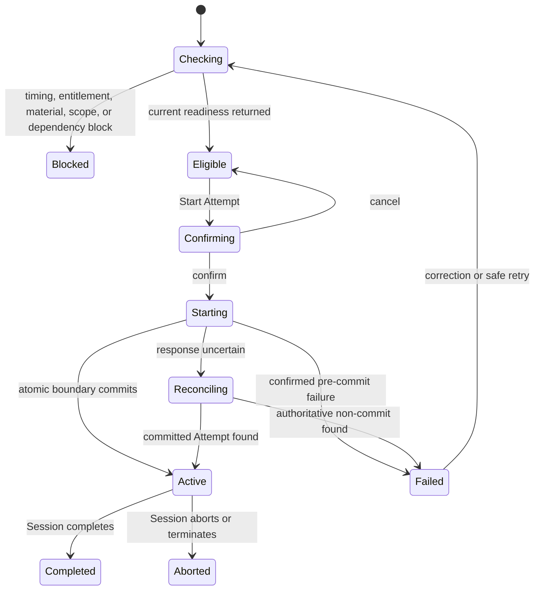

# Submission and Attempt interaction specification

## Document metadata

| Field | Value |
| --- | --- |
| **Status** | Approved |
| **Owner** | Product Lead |
| **Approvers** | Product Lead, UI/UX reviewer, Architecture Lead, Security/Privacy reviewer |
| **Version** | 0.1 |
| **Prepared date** | 2026-08-09 |
| **Approved date** | 2026-08-09 |
| **Approval reference** | Product decision confirmed in the authoring task on 2026-08-09 after business-analysis, UI/UX, architecture, security/privacy, traceability, and repository-consistency review; `UI-SUBM-DEC-1`–`UI-SUBM-DEC-10` and the Enrollment-based resolution of `Q-SUBM-UX-1` approved |
| **Audience** | Product, design, frontend, backend, security/privacy, QA, and implementation reviewers |
| **Governs** | Administrator Enrollment interaction and Participant Submission preparation, intake, accepted-version history, Attempt readiness, start, and recovery for a P0 assessment Campaign |
| **Journeys** | [`JRN-MVP-2`](activity-campaign-journey.md#jrn-mvp-2-assign-participant) and [`JRN-MVP-3`](activity-campaign-journey.md#jrn-mvp-3-submit-work-and-start-attempt) |

This approved UI/UX contract is authoritative for the governed Submission,
Enrollment, and Attempt interaction concerns. Approved product documents,
feature specifications, operational defaults, and ADRs remain authoritative
within their respective areas of concern.

## Purpose and intended outcome

The interaction bridges an activated assessment cohort and one isolated text
Session without hiding when work is local, when a Submission version is
accepted, or when an Attempt is consumed.

The experience is successful when:

- an authorized administrator can assign one Participant to an activated
  cohort, distinguish equivalent retry from conflict, and manage the resulting
  Enrollment without altering the cohort baseline;
- the Participant can discover only current own assignments and understand the
  Task, governing timezone and cutoff, effective timing, Attempt entitlement,
  Submission requirements, and next permitted action;
- direct text and attachments remain visibly local until deliberately submitted;
- receiving, validating, rejected, cancelled, and immutable accepted-version
  states remain distinct and recoverable where safe;
- the Participant understands which exact accepted material is ready, which
  material the Agent can inspect, and which version a started Attempt will bind;
- **Start Attempt** either commits one ready Session and consumes one
  entitlement atomically or produces an honest non-consuming or reconciling
  state; and
- denial, cutoff, dependency, concurrency, authorization-change, and
  post-commit failure states protect Participant work without disclosing
  protected scope or inventing a successful outcome.

The observable system outcomes remain those in the approved
[Submission and attempts specification](../requirements/features/submission-attempts.md).

## Authority and upstream sources

| Concern | Governing source |
| --- | --- |
| Product concepts, isolation, and fairness | [Concept model](../product/concept-model.md), especially Enrollment, Attempt, Submission, effective configuration resolution, and assessment fairness |
| MVP boundary | [MVP scope](../product/mvp-scope.md#mvp-validation-slice) |
| Enrollment, Submission, and Attempt behavior | [Submission and attempts](../requirements/features/submission-attempts.md) |
| Authentication, authorization, isolation, denial, and protected delivery | [Authorization and resource isolation](../requirements/features/auth-resource-isolation.md) |
| Session-start resolution and accessible failure | [Resolved session configuration](../requirements/features/resolved-session-configuration.md) |
| Intake values, download lifetime, and application-session behavior | [MVP operational defaults](../requirements/mvp-operational-defaults.md) |
| Platform journey, IA, shared states, content, and accessibility | [Activity journey and Campaign information architecture](activity-campaign-journey.md) |
| Browser/server authority and protected artifact boundary | [MVP architecture](../architecture/mvp-architecture.md), especially `AR-DEC-5`, `AR-DEC-12`, and `AR-DEC-19` |
| Atomic start, exact version binding, idempotency, and reconciliation | [ADR-005](../architecture/decisions/ADR-005-atomic-attempt-start-and-submission-binding.md) |

## Scope and boundaries

### In scope

- Assign an existing permitted Participant identity to one activated cohort and
  expose one current Enrollment or a safe duplicate/conflict result.
- Inspect and perform currently authorized Enrollment suspension, restoration,
  closure, or revocation while preserving history.
- Record a policy-bounded accommodation or retry entitlement, show its effective
  consequence, and represent separately required approval without bypassing it.
- Discover and open the Participant's own current assignments through **My
  work**.
- Present participant-visible Task instructions, Submission rules, named
  timezone, exclusive cutoff, effective accommodation, and Attempt entitlement.
- Prepare direct text and permitted `.txt` and `.md` attachments; show effective
  count, size, type, encoding, and validation limits.
- Submit one candidate material set, show per-item and whole-intake states,
  cancel before acceptance, recover safely, and confirm one immutable accepted
  Submission version.
- Inspect accepted-version history, exact Attempt bindings, integrity/readiness
  summaries, and honest unavailable-under-policy states.
- Deliberately start one eligible Attempt, reconcile duplicate or uncertain
  responses, and hand off only a committed ready Session to the text Session
  experience.
- Present participant, administrator, and assigned-reviewer summaries required
  by `AC-SUBM-1` through `AC-SUBM-32` without creating a general Submission
  repository.
- Define desktop, narrow, keyboard, screen-reader, 400 percent zoom, reduced-
  motion, validation, denial, offline, and recovery behavior for this surface.

### Out of scope

- Identity creation, identity-provider configuration, or a general Participant
  directory.
- Campaign setup, cohort activation, or editing the frozen Task, Submission,
  timing, Attempt, Agent, Harness, rubric, memory, review, or Release rules.
- Email, SMS, calendar, or other external assignment delivery; P0 discovery is
  in-product.
- General bulk Enrollment administration, workforce scheduling, or Participant
  self-service changes to identity, cohort, accommodation, cutoff, or Attempt
  entitlement.
- Live text Session interaction, Session timer behavior after committed start,
  pause/resume, transcript, completion, or administrative Session termination.
- Evidence, Evaluation, Human revision, Review decision, Result, Release, or
  participant appeal interaction.
- General file management, collaborative editing, repositories, external URL
  retrieval, archives, document/image/audio formats, code execution, malware-
  vendor selection, or custom parser administration.
- Dynamic memory, learning reuse, calibration reuse, tools, voice, shared
  Sessions, or non-Campaign Activity forms.
- Custom retention, legal-hold, export-policy, or audit-policy administration.
- Shared visual tokens and component implementation owned by the later design-
  system foundation.

## Actors and visible capability boundaries

| Actor or service | Permitted interaction | Boundary shown in the interface |
| --- | --- | --- |
| Activity administrator | Assign a permitted Participant; inspect and mutate an Enrollment; request bounded accommodations or retry entitlements when authorized | Organization membership does not imply assignment, exception, raw Submission, history, or Session-control authority |
| Fairness-exception approver | Within separately delegated scope, inspect and approve or reject a pending accommodation or retry exception from the owning Enrollment | Cannot approve without current exception authority, widen the request, bypass Organization bounds, or act as both requester and approver when governing policy requires separation |
| Participant | Discover an own visible assignment; prepare material; submit a version; inspect own accepted versions and Attempt facts; start or continue an eligible Attempt | Cannot choose owner, cohort, deadline, Attempt ordinal, entitlement, accommodation, exact binding, or another Participant's resource |
| Assigned Reviewer | Open exact versions and binding facts supplied by an active assigned case | No Submission mutation, entitlement grant, unassigned browsing, mutable `latest` evidence, or general repository |
| Enrollment/Attempt service | Return current scoped state, permitted actions, eligibility, commit outcome, and bounded failure categories | Browser role labels, identifiers, cached counts, clocks, and readiness displays are advisory only |
| Submission intake service | Return receiving, validation, cancellation, rejection, acceptance, and exact-version outcomes | A receipt, progress display, filename, or client validation is not acceptance |
| Audit/compliance reviewer | Inspect separately authorized minimized Enrollment, exception, Attempt, binding, and access history | Audit access does not imply raw material access or unrestricted export |

Navigation and controls reflect current server-confirmed actions. Hidden or
disabled controls reduce confusion and disclosure risk; they never replace
server authorization.

## Approved interaction decision dispositions

The following decisions were approved on 2026-08-09. Stable IDs are retained
for traceability and future supersession.

| ID | Approved decision | Rationale and consequence |
| --- | --- | --- |
| `UI-SUBM-DEC-1` | Use one **Assignment** workspace under **My work**, ordered as overview, Task and timing, Submission, Attempt readiness, and Attempt history. | Keeps the Participant's next safe action and governing consequence in one context without exposing administrative hierarchy. |
| `UI-SUBM-DEC-2` | Keep six independently labeled tracks: Enrollment access, local preparation, intake, accepted versions, Attempt eligibility, and start command. | Prevents an upload receipt, progress state, readiness check, or button click from being mistaken for acceptance or consumption. |
| `UI-SUBM-DEC-3` | Use explicit **Submit version**; do not autosave direct text or local attachments as accepted Submission material. Confirm when a new version will follow an existing accepted version. | Makes the immutable version boundary deliberate while preserving earlier versions. |
| `UI-SUBM-DEC-4` | Use one accessible **Start Attempt** confirmation showing ordinal, effective duration/window, entitlement consequence, exact Submission summary, and acknowledgments. | Makes the consumption boundary understandable without adding a second approver to a routine start. |
| `UI-SUBM-DEC-5` | On an uncertain start response, replace start actions with **Reconciling Attempt** until authoritative state returns. | Prevents blind duplicate starts and false claims about entitlement. |
| `UI-SUBM-DEC-6` | Lead with effective server-supplied limits and the exact governing date, time, and named Campaign timezone. Participant-local conversion and relative time may appear only as clearly labeled supplementary text and never as authority. | Keeps cutoff meaning testable across client-clock and daylight-saving differences while still helping Participants interpret the boundary. |
| `UI-SUBM-DEC-7` | Present accepted versions newest first for action, while preserving a clearly numbered chronological lineage and exact Attempt-binding badges. Older history may use an accessible disclosure but must remain reachable and must not imply replacement. | Supports the next action without suggesting older versions were overwritten. |
| `UI-SUBM-DEC-8` | Preview or download only after a deliberate exact-version action; render direct text and Markdown as inert content and identify unavailable or not-inspected material honestly. | Minimizes protected-content exposure and prevents participant content from spoofing trusted UI or enabling retrieval. |
| `UI-SUBM-DEC-9` | Keep routine assignment to one Participant at a time in P0. Treat bulk assignment as a separate future interaction contract. | Matches the approved single-Enrollment command and avoids inventing partial-success and notification behavior. |
| `UI-SUBM-DEC-10` | Own the P0 fairness-exception approval interaction in a bounded section on the Enrollment. Show a non-committed **Approval required** state to the requester; expose **Approve exception** and **Reject exception** only to a separately authorized approver; require requester/approver separation when governing policy requires it; and fail closed when no approved route or approver exists. | Preserves `REQ-ACT-42`, makes the exact baseline/request/effect visible in context, avoids an unnecessary governance destination, and prevents implicit self-approval or policy widening. This resolves `Q-SUBM-UX-1`. |

## Information architecture

### Administrator entry and hierarchy

An authorized administrator enters from:

- **Activities** → assessment Campaign → cohort → **Participants and
  Enrollments**;
- **Home** → an authorized Campaign-administration item such as **Assign
  Participant**, **Resolve Enrollment issue**, or **Review retry request**; or
- an authorized deep link that resolves current access before protected content
  renders.

```text
Activities
└── Assessment Campaign
    └── Cohort
        └── Participants and Enrollments
            ├── Assign Participant
            └── Enrollment
                ├── Status and effective rules
                ├── Attempts and exact bindings
                ├── Accommodations and retry entitlements
                │   └── Exception approval (when separately authorized)
                └── History (when separately authorized)
```

The page does not expose raw Submission content unless the current actor also
has the exact sensitive-content action and resource scope. Participant selection
returns only authorized candidates; unavailable identities do not affect totals,
suggestions, or empty-state copy.

### Participant entry and hierarchy

The Participant enters from:

- **My work** → a current assignment;
- **Home** → the highest-priority current action, such as **Continue upload**,
  **Submit version**, **Start Attempt**, or **Continue Attempt**; or
- an authorized assignment deep link.

```text
My work
└── Assignment
    ├── Overview and current status
    ├── Task and timing
    ├── Submission
    │   ├── Prepare version
    │   └── Accepted version history
    ├── Attempt readiness
    ├── Attempt history
    └── Text Session (only after committed start)
```

The Assignment workspace preserves one authorized Activity, cohort, Enrollment,
Task, and Participant context. It must not expose Campaign setup internals,
hidden configuration, another Participant, internal evaluation work, or an
unreleased Result.

### Participant page hierarchy

The wide and narrow layouts follow the same reading and keyboard order:

1. Breadcrumb or **My work** return path and assignment title.
2. Current Enrollment/Attempt status and primary next action.
3. Exact deadline or start-window consequence in its named timezone.
4. Changed-state, denial, conflict, or recovery summary when present.
5. Task and timing summary.
6. Submission requirements and preparation controls.
7. Accepted-version history.
8. Attempt readiness and start consequence.
9. Attempt history and permitted support route.

A sticky wide-layout summary may repeat status, timing, and the primary action,
but it must follow the same server state and must not create a second command
with an independent pending state.

## State model

### Independent state tracks

| Track | Participant-facing states | Meaning |
| --- | --- | --- |
| Enrollment access | Loading; Active; Suspended; Closed; Revoked; unavailable; permission lost | Whether the assignment remains visible and which new actions may be authorized |
| Local preparation | Empty; editing direct text; attachments selected; local issue; unsent changes | Browser-held material not received or accepted by the platform |
| Intake | Ready to submit; receiving; validating; cancelling; cancelled; rejected; failed; reconciling; accepted | One submitted candidate material set before or at accepted-version commit |
| Accepted versions | None; accepted; bound to Attempt; newer version available; superseded for future use; unavailable under policy | Immutable accepted lineage and exact consumer bindings |
| Attempt eligibility | Checking; eligible; too early; expired; exhausted; missing material; unsupported required material; active conflict; approval required; unavailable | Advisory current readiness for a new start |
| Start command | Confirmation open; starting; reconciling; pre-commit failed; active; aborted; completed | Pending and authoritative outcomes around the atomic start boundary |

The interface never collapses these tracks into one generic **Submitted** or
**Complete** status. For example, an attachment may be fully received while the
candidate version remains **Validating**, and an accepted Submission may exist
while the Attempt remains **Not eligible**.

### Submission intake transition

```mermaid
stateDiagram-v2
  [*] --> Local
  Local --> Receiving: Submit version
  Receiving --> Cancelling: Cancel intake
  Receiving --> Failed: transport or receipt failure
  Receiving --> Validating: complete payload received
  Cancelling --> Cancelled: authoritative cancellation
  Cancelling --> Reconciling: outcome uncertain
  Validating --> Rejected: policy, integrity, or safety failure
  Validating --> Accepted: immutable version commits
  Validating --> Reconciling: final response uncertain
  Failed --> Local: safe retry or correction
  Cancelled --> Local: revise or retry
  Rejected --> Local: correct material
  Reconciling --> Accepted: accepted version found
  Reconciling --> Local: no accepted version; retry permitted
  Accepted --> Local: prepare a later version
```



Text equivalent: **Submit version** moves local material into server receiving.
Only a completed validation and immutable accepted-version commit reaches
**Accepted**. Cancellation, failure, rejection, and unresolved transport do not
create acceptance. An uncertain final response reconciles before the interface
offers another finalization that might duplicate a version.

### Attempt start transition



Text equivalent: readiness is advisory. Confirmation sends one idempotent start
command. Only the atomic commit makes the Attempt **Active**, consumes one
entitlement, binds exact accepted versions, and exposes the Session. A confirmed
pre-commit failure leaves entitlement unconsumed. An uncertain response remains
**Reconciling** until the same authoritative outcome is found. A post-commit
abort remains consumed.

## Administrator Enrollment interaction

### Assign Participant

The assignment surface shows:

- Campaign and cohort names permitted for display, with **Activated** state;
- the frozen Task name/revision summary;
- a scoped Participant selector;
- the Enrollment consequence: one Participant, one activated cohort, unchanged
  baseline, and in-product discovery; and
- **Assign Participant** as the committing action.

The selector does not expose raw attributes unnecessary for disambiguation.
The server derives Organization, Activity, cohort, baseline, Task, and
Participant relationships. Hidden fields and URL parameters must not permit the
administrator to choose those authoritative relationships.

On command:

1. Disable only the duplicate assignment action and label it **Assigning
   Participant**.
2. Keep the current cohort context and safe navigation available.
3. On success, name the Participant using only permitted display identity, show
   **Enrollment active**, and link to the Enrollment detail.
4. On an equivalent retry, return the same Enrollment and state **Already
   assigned** without presenting duplicate work as a second success.
5. On conflict, show the current non-sensitive relationship and the safe next
   action; never overwrite or silently reassign it.
6. If an external delivery side effect is later configured, show delivery
   separately from Enrollment. P0 does not offer an external send action.

### Enrollment detail and mutations

The detail presents readable effective facts before protected provenance:

- `Active`, `Suspended`, `Closed`, or `Revoked` Enrollment state;
- governing cohort baseline and Task references permitted for display;
- effective Submission and Attempt windows with named timezone;
- attempts used, remaining baseline entitlement, active separately authorized
  retry entitlement, and current Attempt/Session state;
- current accommodation and its participant-visible consequence; and
- exact accepted-version and Attempt-binding summaries without raw material,
  unless a separate current sensitive-content action permits opening it.

**Suspend Enrollment**, **Restore Enrollment**, **Close Enrollment**, and
**Revoke Enrollment** appear only when individually authorized. Suspension is
described as a reversible restriction. Closure and revocation state that no new
Submission intake or Attempt start will be authorized and that history is
preserved. Destructive terminal changes require a confirmation with the exact
Enrollment, consequence, and required reason. The interface does not claim an
active Session was stopped; Session control belongs to its own policy and
surface.

Mutation pending, audit failure, stale revision, concurrent change, and
permission loss use the shared recovery contract. A failed durable-audit gate
must not show the new state.

### Accommodation or retry entitlement

When the actor has the exact action, the form shows:

- the immutable cohort baseline value;
- the current effective Participant value;
- only adjustment types and bounds returned as currently permitted;
- required reason, effective/expiry facts, and consequence;
- whether the request is policy-bounded or an exception requiring additional
  approval; and
- the original Attempt when a retry entitlement is requested.

A policy-bounded request commits only after confirmation, commit-time
reauthorization, validation, and durable audit acceptance. It creates a new
inspectable record and never edits the cohort baseline or an original Attempt.

If additional approval is required, the interface must not label the exception
active or change Participant eligibility. It shows **Approval required** to the
requester and keeps the immutable request inspectable with its baseline,
proposed bounded difference, scope, reason, requester, effective/expiry facts,
and current status.

The P0 approval interaction is a bounded section on the owning Enrollment. It
appears only when the server returns a current separately authorized approval
action. The approver sees the baseline, requested difference, Participant and
Attempt scope, fairness consequence, requester, reason, and required audit
consequence before selecting **Approve exception** or **Reject exception**.
The approver cannot edit or broaden the request; a change requires a new
request. When governing policy requires requester/approver separation, the
requester must not receive either approval action even if the requester holds
another administrative role.

Approval or rejection reauthorizes the actor and resource scope, revalidates
the unchanged request and Organization bounds, and accepts the required durable
audit state before showing success. An uncertain response becomes
**Checking exception decision** and reconciles authoritative state before
another command is offered. Rejection and failed approval preserve the request
history without changing Participant eligibility. If no approved route or
valid approver exists, the exception cannot be applied and the interface offers
only a permitted support path.

## Participant assignment discovery

### My work list

Each visible row contains only the minimum facts needed to choose the next task:

- assignment and Task name;
- current actionable status;
- exact nearest cutoff or window boundary with named timezone;
- attempts remaining or **Attempt in progress**;
- Submission readiness such as **No accepted version**, **Validating**, or
  **Version 2 accepted**; and
- one next action such as **Open assignment**, **Continue upload**, **Start
  Attempt**, or **Continue Attempt**.

The server supplies rows, ordering, current state, deadline facts, and actions.
Inaccessible assignments do not contribute rows, totals, filters, pagination,
or empty-state explanations. The empty state says **You have no current
assignments** and offers no inference about revoked, closed, other-Organization,
or other-Participant work.

### Loading, deep link, and access change

Loading reserves structure but renders no stale protected content. A deep link
is a locator, not access proof. If the Enrollment is suspended but remains
visible, the page explains which new actions are unavailable and the permitted
support route. If visibility is revoked or otherwise unavailable, protected
Task, Submission, and Attempt content is removed and focus moves to the safe
message or return action without confirming whether an inaccessible identifier
exists.

Local unsent material may be retained only when the same authenticated actor
can safely recover it in the same Assignment context. It must be cleared on
logout, actor or Organization-context change, or whenever retention would risk
disclosure. Submission content must not be written to URLs, analytics,
telemetry, test artifacts, or unapproved browser-persistent storage.

## Submission preparation and intake

### Task, timing, and requirements summary

Before the input controls, show:

- Task name, participant-visible instructions, and completion expectations;
- effective Submission cutoff as an exact date, time, and named timezone;
- explicit boundary copy such as **Your complete attachment must be received
  before 17:00 Asia/Ho_Chi_Minh**;
- any participant-visible accommodation and its effective consequence;
- permitted material categories and effective current limits;
- whether Agent inspection is required for each category and whether the
  configured Agent can inspect it; and
- current accepted version and whether a later version is still permitted.

The governing Campaign timezone leads. A Participant-local conversion may
appear as explicitly labeled supplementary text. Relative text such as **in 2
hours** is also supplementary and updates without changing the exact displayed
boundary. Client time never changes eligibility. When the server reports
conflicting, stale, or unavailable timing, the interface blocks finalization
and uses an honest unavailable state.

Under the approved default policy, the effective limits cannot exceed:

- 1 MiB direct text per Submission version;
- 10 attachments per version;
- 10 MiB per attachment and 25 MiB total attachments; and
- strictly validated UTF-8 plain text (`.txt`) and Markdown (`.md`).

The interface must display the stricter effective values returned for the
current Assignment, not hard-code the maxima as the current allowance.
Archives, executables, external retrieval, and other categories are not offered.

### Prepare version

Direct text uses a labeled multiline input with requirement and effective limit
instructions programmatically associated. Byte count may be shown as an early
aid but must be labeled approximate until server validation when character
encoding affects the result.

Attachments use a native or equivalently accessible file input. Drag and drop
may supplement it but cannot be the only method. Each selected item shows:

- a sanitized display filename when permitted;
- selected category, size, and local validation state;
- whether Agent reading is required, supported, optional, or not inspected;
- **Remove** before submit; and
- its item-specific error and correction guidance.

Changing direct text or attachment selection after an accepted version creates
local candidate work; it does not edit that version. The primary action remains
**Submit version**, not **Save** or **Replace**.

If an accepted version already exists, confirmation states:

> This creates Version N. Earlier accepted versions and Attempt bindings remain
> unchanged.

The confirmation names the candidate material summary and exact cutoff. It does
not imply validation has passed.

### Receiving

After **Submit version**:

- label the whole operation **Receiving version**;
- show determinate progress only when authoritative transferred bytes are
  available, otherwise use an indeterminate visual plus text status;
- expose item status without announcing every progress increment;
- preserve a clear distinction between local items, received items, and the
  unaccepted candidate version;
- offer **Cancel intake** until the service no longer permits cancellation; and
- keep the exact cutoff visible without claiming upload progress reserves it.

Only complete-payload server receipt before the exclusive cutoff can satisfy
the attachment receipt boundary. Starting an upload, selecting a file, or
reaching a client-reported percentage does not reserve the cutoff.

### Validating

After complete receipt, show **Validating version** and explain that the work is
not accepted yet. Per-item validation may use bounded categories such as
**Checking type and encoding**, **Checking limits**, and **Required safety check
unavailable**. Do not name internal scanners, parsers, object paths, or policy
implementation.

All required validation must finish within two minutes or leave the candidate
non-accepted with an explicit retry or failure state. When external scanning is
disabled by approved policy for the text categories, the UI may say **Validated
under the configured text policy**; it must not say **Malware-free** or imply a
scanner returned clean.

For an attachment completely received before the exclusive cutoff, validation
may finish afterward and the version may still be accepted only when every
required check passes and authorization remains current. The interface must
retain and explain the authoritative receipt time; it must not recalculate
lateness from validation completion or the client clock.

If the Participant requests cancellation during validation, enter
**Cancelling** until authoritative state confirms **Cancelled**, **Accepted**,
or a reconciled outcome. A disabled button or client abort alone must not claim
that server work stopped.

### Accepted version

Acceptance confirmation names the committed outcome:

> Submission Version N was accepted at 09 Aug 2026, 16:42
> Asia/Ho_Chi_Minh.

Show:

- stable readable version number and exact acceptance time;
- direct-text and attachment count/size/category summary;
- integrity status in participant-appropriate language;
- Agent inspection status for each required or optional item;
- whether the version is currently ready for a new Attempt; and
- next action: **Review Attempt readiness**, **Prepare new version**, or the
  current blocking action.

Do not display storage keys, unrestricted identifiers, signed access details,
scanner output, or raw integrity digests to the Participant.

### Rejection, failure, cancellation, and uncertainty

| State | Participant message intent | Safe actions |
| --- | --- | --- |
| Local validation issue | Identify the affected input and effective rule before transfer | Correct or remove the item |
| Receipt or network failure | State that no version was accepted and whether a scoped retry can resume or must restart | **Retry intake**, **Choose files again**, or **Return to assignment** |
| Validation rejection | Name a bounded category such as unsupported type, invalid UTF-8, count/size limit, integrity issue, unsafe material, or late receipt | Correct material and **Submit version** again when still permitted |
| Validation dependency unavailable or timed out | State that the version could not be accepted and whether retry is permitted | **Retry validation** only when the server contract permits it; otherwise resubmit or contact support |
| Cancelled | Confirm that no accepted version was created | Edit local material or start a new intake |
| Authorization lost before acceptance | Remove protected server content, state that the version was not accepted, and avoid existence details | Reauthenticate or use the permitted support route; retain local material only when safe |
| Final response uncertain | State **Checking whether your version was accepted** | No duplicate finalization; poll/reconnect authoritative intake state |
| Audit or persistence failure | State that acceptance did not complete; do not show Version N | Retry only after authoritative non-acceptance is established |

Errors identify the affected item and action, not internal infrastructure.
Recoverable local text and selections should remain available when safe.

## Accepted-version history and exact access

Each version entry shows:

- **Version N**, accepted time in the governing named timezone, and immutable
  status;
- material summary and participant-visible validation/integrity state;
- **Bound to Attempt N** when that relationship may be displayed;
- **Not bound**, **Newer version for future Attempt**, **Not inspected by
  Agent**, or **Unavailable under policy** where applicable; and
- exact-version **Preview** or **Download** only when currently authorized.

The action-oriented view lists newest first, but version numbers and a
chronological lineage statement must make order unambiguous. Older history may
be collapsed behind an accessible disclosure, but every retained entry remains
keyboard- and screen-reader-reachable. A newer version must never relabel an
earlier bound version as replaced, edit its metadata, or move its Attempt badge.

Preview and download reauthorize the exact version at use time. Any temporary
delivery capability expires no later than five minutes, is actor/action/artifact
bound, and is denied after revocation. The UI must not expose, persist, copy, or
encourage sharing the access mechanism.

Direct text and Markdown render as inert untrusted content in a visually bounded
viewer. Embedded links do not fetch automatically. Submitted content must not
imitate platform banners, dialogs, actions, or instructions; trusted controls
remain outside the content region and have an explicit platform label where
needed.

An assigned Reviewer reaches a version only from the exact assigned case. The
case shows exact binding and integrity state and may open the exact version when
current sensitive-content authorization permits. It does not offer global
Submission search, another Participant, unrelated versions, or mutable
**latest** navigation.

## Attempt readiness and start

### Readiness summary

Before start, the Participant sees one current server-supplied summary:

- proposed Attempt ordinal and remaining entitlement;
- effective start window and per-Attempt duration with named timezone;
- accepted Submission version and material items proposed for exact binding;
- required Agent-reading compatibility and any optional not-inspected item;
- required instructions, acknowledgments, or consent already governed by the
  frozen Activity; and
- current blockers and safe next action.

Readiness uses one of these participant-facing outcomes:

| Outcome | Required presentation |
| --- | --- |
| Eligible | Show **Start Attempt** and the exact consequence |
| Too early | Show the exact earliest start and no start action |
| Expired/late | Show the exact passed boundary and permitted support route |
| Exhausted | Show used Attempts, no remaining entitlement, and any separately authorized retry status |
| Missing accepted material | Link to **Prepare version** and identify the requirement |
| Required material not Agent-readable | Identify the unsupported required category and correction/support path; optional uninspected material is not a blocker |
| Active conflict | Offer **Continue Attempt** when the existing Session is the Participant's and currently accessible; never offer a competing start |
| Approval required | Show the pending or absent authorized exception without treating it as effective |
| Dependency/configuration unavailable | Use a non-technical unavailable state and retry/support action; do not expose hidden source or provider details |
| Permission or Enrollment change | Remove the start action and state only the safe current consequence |

Readiness is refreshed after version acceptance, Enrollment or exception change,
Attempt terminal state, reconnect, and return from another device. It is not a
reservation and is revalidated at commit.

### Start confirmation

Selecting **Start Attempt** opens one accessible confirmation dialog. It shows:

- **Attempt N of M**, including a separately authorized entitlement label when
  applicable;
- effective duration and exact start-window facts;
- **Submission Version N** and item/Agent-inspection summary;
- required acknowledgment state;
- consequence copy: **If start succeeds, this Attempt is consumed and the
  selected Submission version is fixed for this Session**; and
- **Start Attempt** and **Cancel** actions.

Focus enters at the dialog heading, remains within the modal interaction, and
returns to the trigger on cancel. The final action has a specific accessible
name such as **Start Attempt 1**. No typed phrase is required for a routine
start.

### Starting and Session handoff

After confirmation:

- close the dialog and announce **Starting Attempt**;
- disable duplicate start and Submission-finalization actions that conflict
  with the frozen inputs;
- preserve safe navigation and **Return to assignment** where leaving cannot
  create ambiguity;
- do not decrement entitlement, label the Attempt active, expose a Session, or
  begin a timer from client state; and
- wait for the authoritative atomic outcome.

On commit, show **Attempt N started** and enter the bound text Session. If route
navigation or event delivery fails after commit, the Assignment shows
**Attempt in progress** with **Continue Attempt**; it never offers another
start.

### Uncertain, failed, and aborted outcomes

**Reconciling Attempt** replaces start controls when a response is lost,
times out, or conflicts across tabs/devices. The page queries the same scoped
idempotent outcome and authoritative Attempt/Session binding. It may offer
**Check status again**, but not a new start command.

If authoritative state confirms pre-commit failure:

- state **Attempt did not start**;
- show that entitlement remains unchanged;
- identify the bounded blocker and correction or safe retry;
- move focus to the error summary or primary recovery action; and
- avoid Session, model, Evidence, or Evaluation implications.

If the start committed and the Session later aborts:

- state **Attempt N aborted after start**;
- show it as consumed and preserve its bound Submission version;
- show another **Start Attempt** only when remaining baseline allowance or a
  separately authorized retry entitlement currently permits it; and
- never label the original Attempt restored, reset, or unconsumed.

Concurrent tabs reconcile to the same active Attempt. A tab holding stale
eligibility must replace its start control when current state reports the active
Session, exhausted entitlement, changed Enrollment, or another authoritative
outcome.

## Shared content and feedback

### Required terms and labels

- Use **Assignment** in the Participant experience and retain **Activity**,
  **Campaign**, **Enrollment**, **Submission**, **Attempt**, and **Session** in
  administrative or explanatory contexts where their distinction matters.
- Use **Submit version**, **Cancel intake**, **Prepare new version**, **Review
  Attempt readiness**, **Start Attempt**, **Continue Attempt**, **Suspend
  Enrollment**, **Revoke Enrollment**, **Grant retry entitlement**, **Approve
  exception**, and **Reject exception**.
- Use **received** only for transfer receipt, **accepted** only for the immutable
  Submission-version commit, **started** only for the committed Attempt/Session
  boundary, and **consumed** only for entitlement after that commit.
- Avoid a generic **Submitted**, **Uploaded**, **Ready**, **Failed**, or
  **Complete** when the owning object and consequence are ambiguous.
- Do not mention Evaluation, review progress, score, or Result before the owning
  Release interaction permits it.

### Example participant copy

| Situation | Copy pattern |
| --- | --- |
| Local work | **Not submitted. Your text and selected files are only on this device.** |
| Receiving | **Receiving your files. No Submission version has been accepted yet.** |
| Validating | **Validating Version 2. You can start an Attempt only after acceptance.** |
| Accepted | **Submission Version 2 was accepted. Earlier versions remain unchanged.** |
| Optional unreadable material | **This file is preserved, but the Agent will not inspect it.** |
| Required capability block | **This assessment requires the Agent to inspect a supported text file. Replace the unsupported material before starting.** |
| Starting | **Starting Attempt 1. Your entitlement has not changed until start succeeds.** |
| Reconciling | **Checking whether Attempt 1 started. Do not start again.** |
| Pre-commit failure | **Attempt 1 did not start. No Attempt was consumed.** |
| Post-commit abort | **Attempt 1 started and was consumed, but the Session ended unexpectedly.** |
| Neutral permission loss | **This assignment is not available. Return to My work or contact the provided support route.** |

Names, times, ordinals, limits, and actions in production copy come from current
authorized server state. Error text omits hashes, storage paths, object keys,
provider/scanner names, hidden source categories, access mechanisms, and
inaccessible identifiers.

## Accessibility and responsive behavior

WCAG 2.2 AA is the contractual target inherited from the approved platform
journey.

### Keyboard and focus

- All navigation, text entry, native file selection, item removal, intake
  cancellation, preview/download, confirmation, retry, and start actions work
  without pointer, drag, hover, sound, or motion.
- Drag-and-drop feedback has an equivalent persistent file-input instruction.
- Page load places focus predictably at the page heading or retained task
  position. A submitted form with errors moves focus to an error-summary heading
  linked to every affected control or item.
- Adding or removing an attachment preserves a logical focus target. Removing
  the focused item moves focus to the next item, previous item, or **Choose
  files** control in that order.
- Confirmation dialogs use an accessible name, description, modal semantics,
  contained focus, Escape behavior where safe, and trigger-focus restoration.
- Permission loss or a terminal state removes prohibited controls and moves
  focus to the safe message or next action; it must not strand focus in removed
  protected content.

### Status and announcements

- Local, receiving, validating, cancelling, rejected, accepted, starting,
  reconciling, active, and failure states are present in visible text and
  programmatic status.
- Progress announcements are throttled to material milestones or coarse
  percentage changes; screen readers must not receive byte-by-byte updates.
- Acceptance, start success, denial, cutoff, and error summaries use assertive
  announcement only when immediate attention is required. Routine progress uses
  polite status.
- Countdown or relative-time text must not announce every second. Announce only
  configured meaningful thresholds and always retain the exact boundary.
- Color, icon, animation, position, filename, or progress visualization is never
  the only status cue.

### Reflow and narrow viewports

- At narrow width and 400 percent zoom, assignment status, exact time boundary,
  Attempt entitlement, Submission version, primary action, and recovery appear
  before secondary history.
- Requirement, attachment, version, and Attempt tables transform into labeled
  stacked records; horizontal scrolling is not the only path to content or
  action.
- Filenames and long Task text wrap without obscuring category, size, status,
  remove, error, preview, or download actions.
- The primary action remains reachable in document order. A sticky action area
  must not cover focused content, browser zoom controls, software keyboards, or
  status/error messages.
- No protected detail is omitted only because the viewport is narrow; detail may
  move into an explicitly labeled disclosure after the critical consequence.

### Motion, contrast, and touch

- Respect reduced-motion preference; progress and state change do not depend on
  animation.
- Status text, focus indicators, controls, dialogs, progress indicators, and
  content-viewer boundaries must meet the approved contrast criteria.
- Touch targets and spacing support the WCAG 2.2 AA target without causing
  adjacent destructive and primary actions to overlap.

## Security and privacy UX controls

- Authenticate and authorize every list, count, detail, intake, finalization,
  eligibility, start, reconciliation, preview, download, exception, history,
  and real-time/polling request on the server.
- Treat client identifiers, selected filenames, MIME declarations, extensions,
  Participant choice, clocks, entitlement counts, action visibility, and cached
  state as untrusted.
- Render direct text and Markdown as inert untrusted content. Embedded text,
  links, metadata, or instructions cannot change trusted labels, enable tools,
  trigger requests, approve an exception, or authorize an action.
- Do not expose protected content while loading, after permission loss, in
  errors, notifications, browser titles, URL parameters, analytics, logs,
  metrics, traces, screenshots, or test artifacts.
- Keep intake and temporary artifact access exact-Organization, Participant,
  Enrollment, Submission-version, actor, action, and lifetime scoped. Do not
  reveal the delivery mechanism or allow identifier substitution.
- Show raw Submission content to an administrator only with a separately
  confirmed sensitive-content capability, and to a Reviewer only through an
  active exact case assignment.
- Never offer Submission or Attempt content for memory, learning, calibration,
  cross-Participant reuse, repository retrieval, tool execution, or external
  fetching in the MVP.
- Clear or protect local unsent material on logout, actor/context change, shared-
  device risk, and authorization loss according to the same-actor recovery rule.
- Denials and empty states must not reveal inaccessible rows, totals, identity,
  version existence, Attempt state, or reason detail.

## Failure and recovery matrix

| Condition | Visible state | Preserved state | Prohibited claim or action | Recovery |
| --- | --- | --- | --- | --- |
| Assignment command lost response | Assigning/reconciling | Scoped command context | No second Enrollment or false failure | Query current Enrollment/idempotent outcome |
| Duplicate Enrollment | Already assigned | Existing Enrollment | No second entitlement or notification authority | Open existing Enrollment |
| Permission lost while editing | Assignment unavailable | Local work only when same-actor retention is safe | No protected content or stale mutation | Reauthenticate or return to My work |
| Upload connectivity loss | Intake failed or reconnecting | Local selection and verified received parts when safe | No acceptance from progress | Resume through approved scoped protocol or restart |
| Receipt at/after exclusive cutoff | Rejected as late | Bounded intake history | No validation retry that changes receipt time | Support route if configured |
| Validation timeout/dependency loss | Not accepted; retry or administrator action | Non-accepted candidate and safe local source | No clean/accepted claim | Retry only under current policy |
| Finalization lost response | Checking acceptance | Intake correlation | No duplicate finalization | Reconcile exact intake outcome |
| Accepted version later unavailable | Unavailable under policy | Version identity, lineage, binding, lawful reason summary | No substitution with newer version | Authorized support/history path |
| Exception decision lost response | Checking exception decision | Immutable request and prior Participant eligibility | No duplicate decision, self-approval bypass, or eligibility change inferred from the client | Reconcile the exact request and authoritative decision |
| Start blocked before commit | Attempt did not start | Accepted versions and unchanged entitlement | No Session, timer, model, or consumed claim | Correct blocker and check readiness |
| Start response uncertain | Reconciling Attempt | Same start-command context | No new start | Reconcile idempotency and authoritative binding |
| Start committed; navigation fails | Attempt in progress | Consumed Attempt and exact binding | No second start | Continue existing Session |
| Session aborts after start | Attempt aborted after start | Consumed Attempt, configuration, manifest, binding, terminal reason | No reset or automatic entitlement restoration | Remaining baseline allowance or authorized retry entitlement |
| Durable audit unavailable | Mutation/start not committed | Prior authoritative state | No false assignment, exception, start, or download success | Retry or administrator action after audit recovery |

## Traceability matrix

| Interaction or state | Approved acceptance criteria | Implementation surface | Verification expected after implementation |
| --- | --- | --- | --- |
| Assign one Participant; duplicate/conflict; activated cohort | `AC-SUBM-1`–`AC-SUBM-3`; `AC-AUTH-4`, `AC-AUTH-5`, `AC-AUTH-7`, `AC-AUTH-9`, `AC-AUTH-13`, `AC-AUTH-14` | Cohort Participants/Enrollments list, assignment form, Enrollment detail | Authorized, inactive cohort, cross-Organization, forged parent, equivalent/concurrent, conflict, audit-failure tests; empty/populated desktop and narrow evidence |
| Suspend, restore, close, revoke; in-product discovery | `AC-SUBM-4`, `AC-SUBM-19`, `AC-SUBM-29`; `AC-AUTH-2`, `AC-AUTH-3`, `AC-AUTH-7`, `AC-AUTH-11`, `AC-AUTH-20` | Enrollment actions, My work list/detail, denial state | Revocation propagation, stale cache, list/count leakage, active Session non-deletion, permission-loss keyboard/focus evidence |
| Accommodation and retry entitlement | `AC-SUBM-10`–`AC-SUBM-12`, `AC-SUBM-24`, `AC-SUBM-25`; `AC-AUTH-5`, `AC-AUTH-10`, `AC-AUTH-14`, `AC-AUTH-22` | Enrollment effective-rules, request, and exception-approval sections | Bounded value, wrong-scope approver, requester self-approval when separation is required, approve/reject, stale/concurrent/uncertain decision, missing approval, baseline immutability, and durable-audit failure tests; confirmation, approval-required, decision, and reconciliation evidence |
| Submission requirements and permitted material | `AC-SUBM-13`, `AC-SUBM-14`, `AC-SUBM-22`, `AC-SUBM-30`; `AC-OPS-1`–`AC-OPS-3` | Task/timing summary, direct-text input, attachment list | Exact boundary/DST, UTF-8/type/count/size/aggregate, inert URL/archive/executable tests; keyboard/file-input and narrow evidence |
| Receiving, validation, cancellation, finalization | `AC-SUBM-13`, `AC-SUBM-14`, `AC-SUBM-17`, `AC-SUBM-18`, `AC-SUBM-23`, `AC-SUBM-27` | Intake progress, per-item status, error summary, reconciliation | Network loss, cutoff receipt, timeout, dependency failure, cancellation race, duplicate/conflicting finalization, revocation, performance tests; announcements and recovery evidence |
| Accepted immutable history and exact access | `AC-SUBM-15`, `AC-SUBM-19`–`AC-SUBM-21`, `AC-SUBM-25`, `AC-SUBM-26`; `AC-AUTH-6`, `AC-AUTH-8`, `AC-AUTH-15`, `AC-AUTH-23`, `AC-AUTH-24` | Version history, inert viewer, exact preview/download, assigned-review link | Immutability, wrong version/parent/actor, signed-access reuse/expiry/revocation, assigned-review, learning-disabled, lawful-unavailability tests; scoped viewer evidence |
| Agent-readable, not-inspected, and required capability block | `AC-SUBM-30`–`AC-SUBM-32`; `AC-RSC-2`–`AC-RSC-9` | Requirement rows, version item status, readiness blocker | Precedence/restriction, permitted and rejected override, drift, mutable source, Stable memory, deployment identity, capability mismatch, participant-content capability injection, optional omission, required block, and hidden-source redaction tests; plain-language blocker evidence |
| Readiness, confirmation, and atomic start | `AC-SUBM-5`–`AC-SUBM-8`, `AC-SUBM-16`; `AC-RSC-1`, `AC-RSC-10`, `AC-RSC-13`, `AC-RSC-14`, `AC-RSC-22` | Attempt-readiness card, confirmation dialog, starting state, Session handoff | Limit/timing/readiness/current-auth, exact binding, pre-commit fault injection, no early Session/model side effects; keyboard/dialog/narrow evidence |
| Duplicate, concurrent, and uncertain start | `AC-SUBM-9`; `AC-RSC-11`; `AC-AUTH-17` | Reconciling state, status query, multiple-device/tab behavior | Same-key/mismatched-key, concurrent device, lost response, stale readiness, one Session/entitlement tests; reconciling evidence |
| Post-commit abort and retry path | `AC-SUBM-10`; `AC-RSC-12`, `AC-RSC-16` | Attempt history, aborted detail, retry-entitlement handoff | Consumed status, immutable configuration/manifest/binding, no reset, remaining allowance/authorized retry tests; aborted and no-entitlement evidence |
| Accessibility, responsive, denial, and protected-content behavior | `AC-SUBM-18`, `AC-SUBM-19`, `AC-SUBM-23`, `AC-SUBM-28`; `AC-AUTH-1`–`AC-AUTH-24` as applicable | Every surface and state in this document | Negative authorization/isolation suite; keyboard, focus, names, validation association, announcements, reduced motion, 400 percent zoom, desktop/narrow Playwright evidence |

## Verification notes

This documentation-only change does not have a meaningful red/green TDD phase.
After implementation exists, verification must combine component tests, server
contract tests, negative authorization/isolation tests, atomic fault injection,
concurrency tests, protected-artifact tests, and the project Playwright MCP
workflow through real interactions.

Playwright evidence must cover desktop and narrow layouts for at least:

- My work empty, loading, populated, suspended, revoked/unavailable, and active
  Session continuity;
- administrator assignment empty/selected, assigning, success, duplicate,
  conflict, inactive cohort, stale permission, and durable-audit failure;
- local direct text and attachment selection, local validation, file removal,
  new-version confirmation, and unsent-work recovery;
- receiving determinate/indeterminate, cancelling, validating, dependency
  timeout, rejected, accepted, final-response uncertainty, and permission loss;
- no accepted version, multiple accepted versions, exact Attempt binding,
  optional not-inspected material, exact preview/download denial, and lawful
  unavailability;
- eligible, too early, expired, exhausted, missing material, required capability
  block, active conflict, approval required, separately authorized exception
  approval/rejection/reconciliation, and dependency unavailable;
- start confirmation, starting, reconciling, pre-commit failure, active Session
  handoff, navigation recovery, post-commit abort, and separately authorized
  retry entitlement; and
- keyboard order, focus restoration, error association, announcements, reduced
  motion, 400 percent zoom/reflow, and sanitized untrusted-content rendering.

Artifacts must use synthetic data and remain under `.playwright-mcp/`. Raw
Participant material, hidden prompts, credentials, access URLs, object keys,
private endpoints, scanner/parser output, reviewer notes, and unrestricted
identifiers must not appear.

## Open questions

None.

## Resolved questions

| ID | Approved resolution | Consequence |
| --- | --- | --- |
| `Q-SUBM-UX-1` | Own additional approval for a permitted accommodation or retry fairness exception in a bounded section on the Enrollment. Expose decision actions only to a separately authorized approver, require requester/approver separation when governing policy requires it, and fail closed when no approved route or approver exists. | P0 does not add a general governance queue. Pending requests do not change Participant eligibility; approval/rejection cannot edit or widen the request and must reauthorize, revalidate, and durably audit before success. |

## Downstream gaps and review needed

- Frontend implementation, automated verification, and Playwright evidence
  remain delivery gaps; approval of this specification does not imply them.
- Frontend and backend contracts must map each state to bounded server reason
  categories without moving workflow authority into the SPA.
- The in-review [design-system foundation](design-system/README.md) defines
  repeated upload, status, confirmation, protected-content viewer,
  error-summary, and responsive-record patterns; approval must confirm that
  those shared patterns do not weaken this surface contract.
- The Text Session interaction specification must accept only the committed
  active Session handoff and exact bound Submission summary defined here.

## Approval record

- Product review approved `UI-SUBM-DEC-1`–`UI-SUBM-DEC-10`, including one
  Assignment workspace, independent state tracks, explicit version submission,
  deliberate Attempt confirmation, start reconciliation, server-authoritative
  timing, newest-first immutable history, deliberate exact-version access,
  one-at-a-time P0 assignment, and Enrollment-based fairness-exception
  approval.
- UI/UX review confirmed information hierarchy, terminology, local-versus-
  accepted state, intake and Attempt transitions, content, focus, keyboard,
  announcements, narrow layout, 400 percent zoom/reflow, and reduced-motion
  behavior.
- Architecture review confirmed that browser state remains transient and
  advisory, while timing, acceptance, exact version binding, entitlement
  consumption, idempotency, reconciliation, and Session readiness remain
  server-authoritative under `AR-DEC-12` and ADR-005.
- Security/Privacy review confirmed scoped Enrollment approval, requester/
  approver separation when required, upload and download isolation, inert
  untrusted content, minimized protected display, fail-closed dependencies,
  durable audit gates, and disabled learning/retrieval behavior.
- Traceability review confirmed coverage of `AC-SUBM-1`–`AC-SUBM-32`, the
  applicable `AC-AUTH-*`, `AC-RSC-*`, and `AC-OPS-*` criteria, and both
  `JRN-MVP-2` and `JRN-MVP-3`. Implementation and test evidence remain open.

## Related documents

- [UI/UX documentation](README.md)
- [Activity journey and Campaign information architecture](activity-campaign-journey.md)
- [Assessment Campaign setup interaction specification](assessment-campaign-setup.md)
- [Submission and attempts requirements](../requirements/features/submission-attempts.md)
- [Authorization and resource isolation](../requirements/features/auth-resource-isolation.md)
- [Resolved session configuration](../requirements/features/resolved-session-configuration.md)
- [MVP operational defaults](../requirements/mvp-operational-defaults.md)
- [MVP architecture](../architecture/mvp-architecture.md)
- [ADR-005: Atomic Attempt start and Submission binding](../architecture/decisions/ADR-005-atomic-attempt-start-and-submission-binding.md)
